# Property Intel — Data Map (audit of redundancies and antiquated steps)

**Stage 2 complete — all 33 processes mapped; final stage (audit view) pending.**
Prepared 2026-09-15. Interactive render: `DATA_MAP.html` (same folder), regenerated by `build_html.py`.

**Published redacted (2026-09-15, Jonah's decision).** This copy lives in the PUBLIC v1 repo so it can be read at a live link. Identifiers that are not already public in `CLAUDE.md` were replaced before publishing: the spreadsheet id → `<spreadsheet-id>`, the Apps Script web-app deployment id → `<web-app-deployment-id>`, the CHEKT gateway function-URL host → `<function-url-id>`, the OpenSearch domain suffix → `<domain-suffix>`, the Secrets Manager secret suffix → `<suffix>`, and three customer names → Customer A / B / C. The unredacted working copy stays local (`%TEMP%\pi-audit\full\`); nothing else was altered. Anything cited as `[src file:line]` still points at the real file.

---

## 0. Source ledger (read in the order the prompt required)

| # | Source | What was read | Provenance / state at read time |
|---|---|---|---|
| S1 | `property-intel-v2/docs/CONTEXT.md` | whole file, incl. SUPERSEDED table | dated 2026-08-03 |
| S1d | `property-intel-v2/docs/CONTEXT-2026-08-19-DRAFT.md` | whole file, incl. SUPERSEDED table | dated 2026-08-19; CLAUDE.md says adopt this one |
| S1x | `property-intel-v2/docs/CONTRACT_DELTAS_2026-08-19.md` | whole file | unapplied contract edits (they are already reflected in the checked-in `1-DELIVERY_CONTRACT.md`) |
| S2.1 | `1-ingest/1-DELIVERY_CONTRACT.md` (+ `1-RUNBOOK.md`) | whole | v1.2 |
| S2.2 | `2-parcels/2-PARCEL_CONTRACT.md` | whole | v1.0 2026-07-08 |
| S2.3 | `3-eligibility/3-ELIGIBILITY_CONTRACT.md` | whole | v1.0 2026-07-08 |
| S2.4 | `4-clip/4-CLIP_CONTRACT.md` | whole | v1.0 2026-07-09 |
| S2.5 | `5-render/5-RENDER_CONTRACT.md` | whole | production 2026-07-09 + 08-03/08-05 clauses |
| S2.6 | v1 `docs/RECORDS_CONTRACT.md` | whole | 2026-09-11 (Segment-6 clause, no number) |
| S2.7 | v1 `docs/INDEX_AND_CAMERAS_CONTRACT.md` | whole | hub 1.8.x (Segment-6 clause, no number) |
| S2.8 | v1 `docs/NEARMAP_CONTRACT.md` + `NEARMAP_RUNBOOK.md` | whole | 2026-09-07..14 (Segment-6 clause, no number) |
| S3 | **Source files** — every `.gs`, `.py`, `.js/.mjs`, `.html`, `.ps1`, `.yml`, `Dockerfile`, `counties.json` in both repos | scanned for functions, menu items, triggers, routes, URLs, bucket/prefix/Lambda names, sheet tabs, Script Properties, env vars; key files read in full (`menu.gs`, `config.gs`, `import accounts.gs`, `build.yml`, `counties.json`, `critique-api.gs` route dispatch, `chekt-viewer-gateway.py` header, `5-render/lambda_handler.py` header, `records.gs` header, `publish-records-static.py` header, `fetch_tx.py` header) | v1 = `C:\dev\property-intel` HEAD `144cfec` **with a dirty tree** (6 modified `.gs`, 5 untracked `.gs`, 4 modified viewers, untracked `tools/publish-records-static.py`, untracked `data/parcels/josephine_*`, `data/pins/`). v2 = private repo `master` `00b85ae` (2026-08-27), cloned read-only to `%TEMP%\pi-audit\` because no local v2 folder is connected to this workspace |
| S4 | `docs/HANDOFF.md` (v1 local copy, 85,909 B; v2 copy differs by 117 B), v1 `CLAUDE.md`, `docs/VYANET_VIEWER_NEXT_AGENT.md`, `docs/ops/{README,log.md,status.json}` | grep + targeted sections | narrative docs. Facts that appear **only** here are tagged `HANDOFF-only` / `CLAUDE-only`; they are not code and not contracts |
| S5 | Project memory / past chats | **not available** in this session | nothing below is sourced from memory. Where a doc says a fact came from memory (`(verify)` in S1d), it is carried as `[UNVERIFIED]` |

Notation used everywhere below:

- `[src …]` cites a file (and line when known). `[K1..K5]` = segment contracts 1–5. `[KR]` `[KI]` `[KN]` `[RN]` `[R1]` = the S2.6–S2.8 docs and runbooks. `[C]` = CONTEXT (S1), `[Cd]` = the 08-19 draft, `[H]` = HANDOFF, `[CL]` = CLAUDE.md.
- Status: **live** · **superseded-but-deployed** · **dead code** · **not built** · **[UNVERIFIED]** · **not found in sources**.
- "not found in sources" means exactly that: no file in S1–S4 states it.

---

## 1. Process inventory

Every process located, including the ones the prompt listed and the ones it did not. "Where found" is the file that proves the process exists. Steps are **not** expanded here (Stage 2+).

| Id | Process | Where found (proof) | Status | Notes / why it is on the list |
|---|---|---|---|---|
| P01 | **Plane capture ingest + promote** (Segment 1) | `1-ingest/ingest_capture.py`, `promote_capture.py`, `[K1]`, `[R1]`, `tools/audit_serving.py` | live | Operator CLI. `parcels_ref` hand-edit after promote is a documented manual step `[K1 §parcels_ref]`. |
| P02 | **County parcel publish** (Segment 2) — deschutes, lane | `2-parcels/publish_parcels.py`, `inspect_parcels.py`, `probe_parcels.py`, `migrate_registry_parcels.py`, `counties.json`, `tools/download_lane_taxlots.py`, `[K2]` | live | `counties.json` lists **only** `deschutes` and `lane` `[src 2-parcels/counties.json]`. |
| P03 | **Viewer lot-line tile publish** (`data/parcels/{county}_{lat}_{lng}.geojson`, 0.07° grid → git → tiles `parcels/`) | consumers: `nadir-geo.js`, `shared.gs getParcelFile/fetchParcelRing`, `element-review.html`, `viewer.html`, `responder-intel.html`, `nearmap-lot.js`, `lot_clip.py`; publisher: `tools/publish-records-static.py sync_parcels` `[KR §County parcel tiles]` | live (consumer side); **generator not found in sources** | 607 files in `data/parcels/` incl. **untracked `josephine_*`** (114 files). The script that cuts the 0.07° grid from a county GeoJSON is **not in either repo** (ops log 2026-08-27 says "Lane viewer tiles extracted", no file named). Josephine is not in `counties.json` (no pipeline layer). |
| P04 | **Eligibility** (Segment 3) | `3-eligibility/eligibility_check.py`, `lambda_handler.py`, `[K3]`; caller `plane.gs checkPlaneEligibility` → `PLANE_API_BASE + '/eligibility'` `[src plane.gs:169]` | live | Reads registry + county shards via CDN, geocodes via Google. |
| P05 | **Parcel clip / GLB ensure** (Segment 4) incl. `purge` | `4-clip/lambda_handler.py` (`purge_taxlot` :67, `lambda_handler` :211), `clip_parcel.py`, `Dockerfile`, `[K4]`; callers `plane.gs`/`drone-test.gs` `callV2_('/clip', …)` | live | Deploy script for the clip image: **not found in sources** (only `5-render/deploy-render.ps1` exists). |
| P06 | **Render stills + nadir + nadir-meta + storyboard/approach** (Segment 5) | `5-render/lambda_handler.py` (flags `probe` :855, `storyboard` :866, `async` :879 → self `Event` invoke :890, `invalidate_render_paths` :597), `render-viewer.html`, `Dockerfile`, `deploy-render.ps1`, `sync-render-viewer.ps1`, `render_sweep.py`, `[K5]` | live | Handler docstring: "**No Bedrock, no Sheets** — that's Segment 6's layer" `[src 5-render/lambda_handler.py:8]`. This contradicts `[CL]` "Plane render … → Bedrock descriptions → one batch Sheets write (cols F–O, R)", which describes the **stale v1** `lambda/lambda_handler.py`. `backfill_meta` path + `tools/backfill_nadir_meta.py` are in CHANGELOG 2026-08-27 but **not in v2 `master`**. |
| P07 | **Approach videos** (`plane-parcel-video`) | `5-render/video_render.py`, `render_sweep.py` (invokes `plane-parcel-video`), `[K5 §Video]`, `[Cd]` "Stage C3b deployed 2026-08-05 *(verify)*" | **[UNVERIFIED]** deployed; **no sheet caller found** | No `.gs` file invokes video; no API GW route for it found in sources. |
| P08 | **Plane sheet pipeline** (eligibility → 3D → images → Pass 1 → review → rerun → Pass 2 → storyboard → sync) | `apps scripts/plane.gs` (49 functions), `prompts.gs`, `menu.gs` "Plane Pipeline" | live | 1-minute polling triggers `pollClipV2_` / `imagesTickV2_` `[src plane.gs:372]`; job state in Script Properties `planeClipJobV2`/`planeImgJobV2`. |
| P09 | **Drone-test sheet pipeline** (mirror of P08 on tab `drone-test`, + Approach, + cameras JSON, + nadir-local) | `apps scripts/drone-test.gs` (50 functions), `menu.gs` "Drone Test" | live | `processApproachRowDT_` calls `/render` with `{storyboard:true}` `[src drone-test.gs:672]`. Writes `data/cameras/json/{hubId}.json` via `camerasFileForSync_` `[KI]`. |
| P10 | **Drone / Terra capture onboarding** (Customer A `captures/drone/`, Eugene via OBJ adapter) | `tools/adapt_obj_delivery.py`, `docs/EUGENE_CAPTURE_RUNBOOK.md`, `docs/DRONE_CAPTURE_CONTRACT-DRAFT.md` (SUPERSEDED banner pending `[S1x]`), `[Cd §Open questions]` | live (shared code path with P01/P05/P06) with **superseded-but-deployed** artifacts | `captures/drone/customer-a-residence-2026-06-16` was a **manual S3 copy** `[Cd]`; `promote_capture.py` hardcodes `captures/plane/` `[Cd]`. `load_captures()` plane/drone edit **not deployed** `[Cd]`, `[ops status bug 15]`. |
| P11 | **Satellite two-pass pin pipeline** (Static-Maps nadir → Pass 1 → review → rerun → Pass 2 FR/WF → sync) | `apps scripts/satellite.gs` (64 fn), `prompts.gs`, `shared.gs` (`callBedrock`, `queryKnowledgeBase`), `menu.gs` "Satellite Pipeline (v2)" | live | 5-minute auto triggers `generateSatElementPinsAutoRun` / `generateSatElementRerunAutoRun` `[src satellite.gs:1146,1173,1479,1504]`. |
| P12 | **Element critique loop** (review page ↔ Apps Script web app, rounds, inline re-pin) | `element-review.html` (v6.8.x), `nadir-geo.js` (1.3.2), `apps scripts/critique-api.gs` (`doGet`/`doPost` :1853, routes :1768–1811, POST routes :1832–1843), tab `element-critique` | live | Web app URL `script.google.com/macros/s/<web-app-deployment-id>…/exec` `[src element-review.html]`. Also serves `golf-*`, `nearmap-elements`, `nearmap-save`, `rounds`, `pin-freq`, `ping`. |
| P13 | **Satellite Sandbox** (copy of Satellite tab + own critique tab, own triggers) | `apps scripts/satellite-sandbox.gs` (**untracked**), tabs `Satellite Sandbox`, `Element Critique Sandbox` `[src config.gs:111-112]` | live (test space) | Duplicates P11 + P12 flows against sandbox tabs. |
| P14 | **Responder Directions** (guidance routes via Bedrock, review on element-review `&route=`) | `apps scripts/responder-directions.gs`, tab `responder-directions`, `prompts.gs responderDirectionsPrompt_` | live | Joined to drone-test by property name `[src responder-directions.gs rdFindProperty_]`. |
| P15 | **Sheet → GitHub sync** (historic primary publisher; now a trampoline with drone/drone-test dual-write) | `shared.gs pushAllToGitHub` :201 → `records.gs pushAllToRecords_`; `recordsIsPagesGithubPath_` :195; `upsertIndexEntry_`, `pinsFileForSync_`, `gisFileForSync_`, `camerasFileForSync_`; `menu.gs` Sync items | live, **scope-reduced 2026-09-11** `[KR changelog]` | GitHub still receives `data/responder-drone/`, `data/drone/`, and drone-test `data/drone-test/`+`data/index/`. Satellite/plane/nearmap JSON **no longer** go to GitHub — yet live viewers still read GitHub `data/` `[KR]`. |
| P16 | **Responder Intel (client) publish** | `apps scripts/responder intel.gs` (**untracked**, `RI v1.0.0`), tab `Drone`, `RI_DATA_DIR='data/responder-drone'` | live | Separate GitHub writer for the frozen `responder-drone/{name-hash}.json` `[KI §Identity]`. |
| P17 | **Records (S3) mothership publish** (sheet → `property-intel-records`, overnight trigger, retry) | `apps scripts/records.gs` (84 fn), `menu.gs` "Records (S3)", `[KR]` | live (2026-09-10/11) | 5-min trigger `recordsSheetAutoTick_` `[src records.gs:1902]`; phases `satellite, plane, drone, drone-test, nearmap, retry, hoa` `[src records.gs:1123]`. Also a leftover "GitHub hub copy" path `publishRecordsAllHubs` `[src records.gs:20]`. |
| P18 | **Static publish git → AWS** (parcels, camera stills, cameras JSON, GIS facts) | `tools/publish-records-static.py` (**untracked**), `records.gs publishRecordsSidecarsFromGithub` | live (operator, one-shot 2026-09-11 `[KR]`) | Two writers for the same cameras/GIS keys (laptop script vs Apps Script sidecar). |
| P19 | **Nearmap trial pipeline** (zip/API → canonical → promote → sheet → regions/pins editors → Pass 3 → sync → viewer) | `tools/nearmap/{normalize,pack_tx_folder,fetch_tx,seed_regions,lot_clip,mesh_to_glb,promote,review_server}.py`, `apps scripts/nearmap.gs` (89 fn), `nearmap-review.html` v1.7.18, `nearmap-viewer.html` v1.1.16, `js/vyanet-viewer/nearmap-lot.js`, tab `Nearmap`, `[KN]`, `[RN]`, `docs/NEARMAP_CHANGELOG.md` | live (trial, isolated) | Nearmap **Pass 1** code exists (`runNearmapElementPinsCall_`, `generateNearmapElementPinsBatch`) but has **no menu item** `[src menu.gs]` → candidate dead code. |
| P20 | **Golf pipeline** (geocode-only Pass 1 + manual pins) | `apps scripts/golf.gs`, `golf-review.html` v1.0.4, tabs `Golf`, `Golf Pins`, routes `golf-catalog/golf-elements/golf-save` | live | No Bedrock, no GitHub `[src menu.gs:29]`. |
| P21 | **KB / Bedrock / OpenSearch** | `shared.gs queryKnowledgeBase` :82 (`bedrock-agent-runtime …/knowledgebases/{kbId}/retrieve`), `callBedrock` :108 (`bedrock-runtime`), `createKbVectorIndex` :980 (OpenSearch domain, index `property-intel-index`) | live (retrieve + invoke); **KB document ingest: not found in sources** | Which S3 bucket/prefix is the KB data source, and how `KB_*.md` documents get there, is stated nowhere in S1–S3. `[H §5.7]` names the two source docs (Downloads scratch) — HANDOFF-only. |
| P22 | **Viewer data loads** (hub + plugins) | `vyanet-viewer.html` + `js/vyanet-viewer/property.js` (hub 1.8.22), `model-viewer.html`, `viewer.html` v2.10.9, `live-viewer.html` 1.1.4, `hoa-viewer.html` v2.5.1, `responder-intel.html` v2.5.3, `nearmap-viewer.html`, `plane-viewer.html` v1.0.0, `plane-test.html` v0.5.0, `model-viewer-test.html`, `cesium-viewer.html`, `dashboard.js`, `gis-facts.js`, `[KI §Viewer resolution]` | live (hub set); `plane-viewer/plane-test/model-viewer-test/cesium-viewer` **[UNVERIFIED] whether any process links to them** | All read GitHub Pages `data/`; none read `d1h1on7f1v1lpy` yet `[KR "Live Pages HTML still reads GitHub"]`. |
| P23 | **Live video (CHEKT)** | v2 `chekt-viewer-gateway.py` (`/live`, `/clips`), `tools/deploy_chekt_gateway.py`, `update_chekt_property_map.py`, `verify_chekt_*.py`; viewers `live-viewer.html`, `model-viewer.html`, `property.js` (`gwLiveQuery`) | live | Function URL `<function-url-id>.lambda-url.us-east-1.on.aws` `[src property.js]`. Dealer key in Lambda env, Secrets Manager blocked `[ops bug 13]`. |
| P24 | **Technician photo intake** | `docs/PHOTO_INTAKE_DECISION.md`, `[Cd §Blocked]`, `[KI §Cameras]`; superseded SurveySparrow embed in `element-review.html` :4515–4560 | **blocked / not built** (transport) | Image-processing code `prep_camera_photos.py` is referenced by `[Cd invariant 8]` and `[H]` but is **in neither repo** (Downloads scratch). Zoho Creator probe 2: HANDOFF-only → `[UNVERIFIED]`. |
| P25 | **Zoho CRM account import** (one-shot: sheet col B → CRM `PI_Accounts`) | `apps scripts/import accounts.gs` (**untracked**) | dead code / one-shot; **not runnable as exported** | Calls `getZohoAccessToken_()` which is **defined in no exported file** `[src import accounts.gs:54]`. Not on the menu. |
| P26 | **`config.js` build** (GitHub Actions) | `.github/workflows/build.yml` | live | `secrets.GEOCODE_API_KEY` → `config.js` commit on push to `main`. |
| P27 | **Ops dashboard daily automation** ("7pm Cursor Automation") | `docs/ops/README.md`, `log.md`, `status.json`, `status.js`, `index.html`; branch `cursor/ops-daily-log-status-4756` | **[UNVERIFIED]** whether the automation exists/runs | `log.md` last entry 2026-08-27; `status.json as_of 2026-08-25`. Nothing in-repo defines the schedule. |
| P28 | **Drone / Interior legacy sync** (`processSheet(DRONE_SHEET,'drone')`, `processSheet(INTERIOR_SHEET,'interior')`) | `menu.gs` :183–190 (`Sync Drone`, `Sync Interior`, `Sync Now (All)`) | **function `processSheet` not found in sources** | If the deployed project lacks it, three menu items throw. `VIEW_ORDER` still lists `interior` `[src config.gs:130]`; `RECORDS_FILES_PREFIX.interior` exists `[src records.gs:47]`; `data/interior/` does not exist in v1. |
| P29 | **Satellite v2 migration** (one-shot 19→20-col rekey) | `apps scripts/satellite migration v2.gs` (**untracked**) | dead code (one-shot, done 2026-08-13 per `[H]`) | Also deletes the legacy `generateNadirAutoRun` trigger `[src :123]`. |
| P30 | **Deploy tooling** | `5-render/deploy-render.ps1` (crane, ECR `plane-render`), `sync-render-viewer.ps1`, `tools/deploy_chekt_gateway.py`, `4-clip/Dockerfile` | live | Eligibility zip build/deploy script, clip image push script, API GW definition: **not found in sources** (contracts describe them in prose only). |
| P31 | **Local referees / tests** | v2 `probe_parcels.py`, `compare_glb.py`, `compare_footprints.py`, `locate_missing.py`, `probe_point.py`, `audit_serving.py`; v1 `test-nadir-geo.mjs`, `test-nearmap-lot.mjs`, `test-vyanet-viewer.py`; gitignored `tmp/*.mjs|*.py` (35 check/probe scripts) | live (manual) | Maintenance, not data flow. Listed so the audit can see what exists. |
| P32 | **Tetherow capture (scratch)** | gitignored `tmp/tetherow-local-capture.json`, `tmp/watch-tetherow-promote.py`, `tmp/tetherow-progress.*`; `plane-test.html` fetches `tmp/tetherow-local-capture.json` | **[UNVERIFIED]** status | Found only in gitignored scratch; no doc mentions it. |
| P33 | **Legacy Cloudinary imagery** | 299 files under `data/` reference `res.cloudinary.com/dtqswjo5v` `[grep]`; `[H §2.1]` "pre-AWS records only" | superseded-but-deployed | No script in either repo writes to Cloudinary; published records still point there. |

Not found as processes (expected from the prompt): **BotPress sync** — the word appears only in `[C §Segment 6]` / `[Cd]` roadmap ("BotPress/Zoho path… NOT built"). No code, no resource. **Mapping/tile publish** as a separate process — tile generation is inside P01 (`generate_highres_tiles`) and Nearmap stills inside P19; there is no standalone tile-publish job. **Scheduled AWS jobs** (EventBridge/cron) — none in sources.

---

## 1b. Process hand-offs (the home map)

The home page of `DATA_MAP.html` places the 33 processes in stage columns and draws an arrow wherever one process's output is another's input. Every arrow below cites the step (in the process tables) it was read from; nothing is drawn that a step does not say. Status: `cited` solid · `unverified` dashed · `dead` red · `no reader` dashed grey (an output nothing consumes).

### Stages (columns, left to right)

| Stage | Meaning | Processes (top to bottom) |
|---|---|---|
| 1 Source & capture | where imagery and geometry enter | P02, P03, P01, P10, P24 |
| 2 AWS services | Lambdas + Bedrock the sheets call | P04, P05, P06, P07, P21 |
| 3 Sheet pipelines | Apps Script work per tab | P08, P09, P14, P11, P13, P19, P20 |
| 4 Review | human QA surfaces | P12 |
| 5 Publish | sheet → S3 records / GitHub | P15, P17, P16, P18 |
| 6 Serve | what responders load | P22, P23, P26, P33 |
| 7 Ops · one-shot · dead | deploys, tests, leftovers | P30, P31, P29, P25, P28, P32, P27 |

### Hand-offs

| From | To | What moves | Cited step | Status |
|---|---|---|---|---|
| P01 | P04 | `reference/captures.json` + z19 tiles | P04 S04, S06 | cited |
| P01 | P05 | registry + `captures/plane/{id}/model/` OBJ package | P05 S02, S05 | cited |
| P01 | P06 | registry + tiles for coverage gate and nadir crop | P06 S03, S04, S09 | cited |
| P10 | P01 | Terra-shaped delivery from `adapt_obj_delivery.py` | P10 S02–S03 | cited |
| P10 | P05 | `type: drone` entries visible only after the `load_captures` filter deploys | P10 S06 | unverified |
| P10 | P09 | drone-test row (column E expected capture) | P10 S07 | cited |
| P02 | P04 | `reference/parcels/{county}/index.json` + shards | P04 S05 | cited |
| P02 | P05 | county shards for `find_parcel_geoms` | P05 S04 | cited |
| P02 | P06 | county shards for `prepare_render` | P06 S03 | cited |
| P03 | P11 | `deschutes_*.geojson` ring for the parcel-fitted nadir | P11 S02 | cited |
| P03 | P12 | lot lines on `element-review.html` | P12 S02 | cited |
| P03 | P22 | lot lines in `viewer.html`, `responder-intel.html`, `nearmap-viewer.html` | P03 S04, P22 S03 | cited |
| P03 | P19 | taxlot ring for `lot_clip.py` | P19 S04 | cited |
| P03 | P18 | `data/parcels` → `aws s3 sync` to `tiles/parcels/` | P18 S01 | cited |
| P24 | P18 | hand-committed camera stills + cameras JSON | P24 S07, P18 S07 | cited |
| P04 | P08 | eligibility verdicts → new Plane rows / taxlots | P08 S02, S04 | cited |
| P04 | P09 | eligibility verdicts → drone-test taxlot | P09 S03 | cited |
| P05 | P08 | `clipped.glb` URL → O `360 View URL` | P08 S04–S06 | cited |
| P05 | P09 | `clipped.glb` URL → drone-test row | P09 S07–S08 | cited |
| P06 | P08 | 5 renders + nadir bounds + storyboard → I–N, J, AB | P08 S08–S09 | cited |
| P06 | P09 | 5 renders + nadir bounds + approach → drone-test row | P09 S12–S18 | cited |
| P06 | P07 | shared `prepare_render` gates + frontage | P07 S02 | cited |
| P06 | P22 | `viewer_url` string pointing at `model-viewer-test.html` | P06 response, P22 S09 | cited |
| P21 | P08 | KB context + model calls (Pass 1, rerun, Pass 2) | P08 S10, S12, S13 | cited |
| P21 | P09 | KB context + model calls | P09 S20, S26, S29 | cited |
| P21 | P11 | KB context + model calls (Pass 1, rerun, Pass 2 ×2) | P11 S05, S06, S10, S12 | cited |
| P21 | P13 | same calls against sandbox rows | P13 S03, S05, S06 | cited |
| P21 | P14 | route generation | P14 S03, S06 | cited |
| P21 | P19 | Pass 3 halves | P19 S13 | cited |
| P21 | P12 | inline re-pin inside the critique POST | P12 S06 | cited |
| P11 | P08 | Satellite rows are the eligibility-intake candidates; site_no is the plane hub key | P08 S01, S15 | cited |
| P11 | P13 | Satellite rows copied into the sandbox | P13 S02 | cited |
| P11 | P12 | review URL → element-review | P11 S08 | cited |
| P12 | P11 | critique row, K `Nadir Fixes`, inline re-pin of I | P11 S09, P12 S05–S06 | cited |
| P09 | P12 | review URL (`view=drone-test&key=`) | P09 S24 | cited |
| P12 | P09 | critique, T `Nadir Fixes`, inline re-pin | P12 S05–S06 | cited |
| P08 | P12 | review URL for a Plane row | P08 S11 | cited |
| P12 | P08 | which row a Plane critique files against is undetermined | P08 S11 | unverified |
| P13 | P12 | sandbox review (`view=sandbox`) → `Element Critique Sandbox` | P13 S04, P12 S04 | cited |
| P14 | P12 | route review on `element-review.html?route=` | P14 S04 | cited |
| P14 | P09 | reviewed routes → `directions[]` in the drone-test record | P14 S07, P09 S30 | cited |
| P19 | P12 | `nearmap-elements` / `nearmap-save` routes on the web app | P19 S10–S11, P12 summary | cited |
| P20 | P12 | `golf-catalog` / `golf-elements` / `golf-save` routes on the web app | P20 S04–S05 | cited |
| P08 | P15 | `files[]` label Plane → `pushAllToGitHub` | P08 S16 | cited |
| P09 | P15 | `files[]` label drone-test | P09 S32 | cited |
| P11 | P15 | `files[]` label Satellite | P11 S15 | cited |
| P19 | P15 | `files[]` label Nearmap | P19 S14 | cited |
| P08 | P17 | Plane tab rows walked by the mothership | P17 S03–S04 | cited |
| P09 | P17 | drone-test tab rows walked | P17 S03–S04 | cited |
| P11 | P17 | Satellite tab rows + HOA map | P17 S03–S04, S06 | cited |
| P16 | P17 | Drone tab rows walked (`RI_C` columns) | P17 S04 | cited |
| P19 | P17 | Nearmap tab rows walked | P17 S04 | cited |
| P15 | P22 | GitHub commits of drone / responder-drone / drone-test / index → Pages | P15 S04–S05, P22 S02 | cited |
| P15 | P22 | satellite / plane / nearmap / hoa / pins no longer reach Pages, viewers still read them | P08 S17, P11 S16 | dead |
| P17 | P22 | records CloudFront `d1h1on7f1v1lpy` — no viewer reads it | P17 S09 | no reader |
| P16 | P22 | `data/responder-drone/{id}.json` → `responder-intel.html` | P16 S04, S06 | cited |
| P18 | P22 | git cameras / GIS JSON read by `model-viewer.html`, `viewer.html` | P22 S02–S03 | cited |
| P19 | P22 | `nearmap-viewer.html` from CloudFront + hub redirect | P19 S15, P22 S06 | cited |
| P22 | P23 | `/live`, `/clips` with `x-viewer-key` | P22 S01, S04, P23 S01 | cited |
| P26 | P22 | `config.js` `GEOCODE_KEY` | P26 S04, P22 S07 | cited |
| P33 | P22 | Cloudinary image URLs inside 299 records | P33 S02 | dead |
| P30 | P06 | `deploy-render.ps1` image → `plane-parcel-render` | P30 S01 | cited |
| P30 | P07 | same image, `-FunctionName plane-parcel-video` | P30 S01 | unverified |
| P30 | P05 | clip image push — script not found | P30 S03 | unverified |
| P30 | P04 | eligibility zip — script not found | P30 S04 | unverified |
| P30 | P23 | `deploy_chekt_gateway.py` | P30 S02 | cited |
| P31 | P06 | row-3 oracle via `render_sweep.py` | P31 S05 | cited |
| P31 | P02 | `probe_parcels.py` referee | P31 S01 | cited |
| P29 | P11 | one-shot 17→19 column rewrite of the Satellite tab | P29 S02 | dead |
| P11 | P25 | column B names read for the Zoho import | P25 S01 | dead |
| P28 | P22 | `processSheet` would have written `data/drone/` + `data/interior/` | P28 S02 | unverified |
| P32 | P22 | `tmp/tetherow-local-capture.json` into `plane-test.html` | P32 S02 | unverified |

---

## 2. Resource inventory, grouped by layer

Lane order below is **fixed** and will be reused unchanged in every Stage 2+ diagram and the system-wide map. Two lanes were added to the prompt's list because resources exist that fit nowhere else: **CloudFront** (the read path in front of S3) and **Vendor / external** (CHEKT, Nearmap, Cloudinary, SurveySparrow, public data APIs, county GIS). Say if you want them folded into S3 / Zoho instead.

Node ids in the right-hand column are the ids used in the Mermaid skeleton (§3) and will be reused verbatim in every later diagram.

### L01 — Local machine (PowerShell / Python / operator CLI)

| Resource (exact) | Role | Cited by | Status | Node id |
|---|---|---|---|---|
| `1-ingest/ingest_capture.py` (`ingest`, `upload`) | validate 5 gates, generate z12–21+ pyramid, upload to ingest bucket | `[K1]` `[R1]` | live | LC_ingest |
| `1-ingest/promote_capture.py` (`review`, `promote`) | copy `processed/` → tiles, merge `reference/captures.json`, invalidate | `[K1]` `[R1]` | live (hardcodes `captures/plane/`) | LC_promote |
| `aws s3 cp … reference/captures.json` hand edit (`parcels_ref`) | operator step after every promote | `[K1 §parcels_ref]` | live (manual) | LC_parcelsref |
| `tools/audit_serving.py` | byte-compare staging vs serving (plane prefix only) | `[R1 §6]` | live | LC_audit |
| `tools/adapt_obj_delivery.py` | adapt a non-Terra OBJ delivery into the Terra shape for P01 | `[Cd]`, `docs/EUGENE_CAPTURE_RUNBOOK.md` | live | LC_adaptobj |
| `2-parcels/inspect_parcels.py`, `publish_parcels.py` (`report`/`publish [dry]`), `probe_parcels.py`, `migrate_registry_parcels.py` | county layer build/publish/referee; one-shot registry `parcels_key`→`parcels_ref` migration | `[K2]` | live; migrate = one-shot | LC_parcels |
| `tools/download_lane_taxlots.py` | pull Lane taxlots from ArcGIS FeatureServer | `counties.json.source` | live | LC_lanedl |
| `2-parcels/counties.json` (`deschutes`, `lane`) | county config (join field, keep_properties) | `[K2]` | live | LC_counties |
| `3-eligibility/eligibility_check.py report` local referee; fixtures `highlands_addresses.txt`, `highlands_coords.txt` | | `[K3]` | live | LC_eligref |
| `4-clip/clip_parcel.py clip`, `compare_glb.py` | local clip referee | `[K4]` | live | LC_clipref |
| `5-render/deploy-render.ps1` (v5.1; crane → ECR `plane-render`, git-SHA tag, updates `plane-parcel-render`) | render/video image deploy | `[K5 §Deploy method]` | live | LC_deployrender |
| `5-render/sync-render-viewer.ps1` (v5.1) | sync bundled viewer into image | `[C §In flight]` | live | LC_syncviewer |
| `5-render/render_sweep.py` (`--storyboard`, video shard runner; `retries={"max_attempts":0}`) | roster sweep, direct Lambda invoke | `[K5]` | live | LC_sweep |
| `tools/probe_point.py`, `compare_footprints.py`, `locate_missing.py` | tile/footprint referees | `[K3 punch list]`, `[Cd]` | live | LC_probes |
| `tools/deploy_chekt_gateway.py`, `update_chekt_property_map.py`, `verify_chekt_property_map.py`, `verify_chekt_uncap.py` | zip-deploy + env update + probes for the gateway | v2 CHANGELOG 2026-08-27 | live | LC_chektdeploy |
| `tools/nearmap/normalize.py`, `pack_tx_folder.py`, `fetch_tx.py` (`api.nearmap.com`, `NEARMAP_API_KEY`), `seed_regions.py`, `lot_clip.py`, `mesh_to_glb.py` (Draco via `npx gltf-pipeline`), `promote.py`, `review_server.py :8899` | Nearmap canonical tree, stills, mesh GLB, promote, local review server | `[KN]` `[RN]` | live (trial) | LC_nearmaptools |
| `tools/publish-records-static.py` (**untracked**) | `data/parcels` → tiles `parcels/`; `data/cameras/images` → tiles `cameras/{hubId}/`; cameras/GIS JSON → records | `[KR §Writers]` | live (operator) | LC_pubstatic |
| `python -m http.server 8899` / `tools/nearmap/review_server.py` | local viewer serving for tests | `[KI §Verification]`, `[RN]` | live (dev) | LC_httpserver |
| `test-nadir-geo.mjs`, `test-nearmap-lot.mjs`, `test-vyanet-viewer.py` (Playwright) | viewer referees | `[KI]`, `[CL]` | live (manual) | LC_tests |
| gitignored `tmp/` (35 check/probe scripts, `nearmap-canonical/`, `nearmap-serve/`, `tetherow-*`) | scratch | `.gitignore` | scratch | LC_tmp |
| `Downloads\property-intel-v2` scratch (`.gs.txt` exports, `CAMERA_LAYER_DESIGN.md`, `LIVE_VIDEO_DESIGN.md`, `KB_*.md`, `prep_camera_photos.py`, `camera_exif_probe.py`) | design docs + repo-less code | `[Cd §Where things live]`, `[H §3.3]` | **[UNVERIFIED]** — folder not accessible in this session | LC_downloads |
| `OneDrive - Baylor University\Desktop\property-intel-v2` (the working v2 clone) | v2 working tree | `[Cd]` | **[UNVERIFIED]** — not connected; v2 read from GitHub `master` instead | LC_onedrive |
| crane (go-containerregistry), Docker Desktop classic image store, AWS CLI, `aws-lambda-rie` | deploy/test tooling | `[K5]` | live | LC_toolchain |

### L02 — Google Sheets (one spreadsheet; tabs)

| Resource (exact) | Role | Cited by | Status | Node id |
|---|---|---|---|---|
| Spreadsheet id `<spreadsheet-id>` | the mothership workbook (`CRITIQUE_SPREADSHEET_ID`; self-test requires it to equal the bound sheet) | `[src critique-api.gs:98, 1944-1954]` | live; **[UNVERIFIED]** that it is the bound workbook | SH_book |
| tab `Satellite` (20 cols `SAT_COL_*`; A = `site_no`) | satellite operational state | `[src config.gs:108,201-220]` | live | SH_satellite |
| tab `Plane` (29 cols `PLANE_COL_*`) | plane state | `[src config.gs:113,300-328]` | live | SH_plane |
| tab `drone-test` (31 cols `DT_COL_*`, incl. AE Nadir Local) | drone-test state | `[src drone-test.gs DT_SHEET]` | live | SH_dronetest |
| tab `Drone` | responder-intel client publish source; legacy `processSheet` target | `[src config.gs:114, responder intel.gs RI_SHEET]` | live | SH_drone |
| tab `Interior` | legacy `processSheet` target | `[src config.gs:115]` | **writer not found in sources** | SH_interior |
| tab `Intel Links` | link register written by `updateIntelLinksSheet` (satellite/plane sync) | `[src shared.gs:728; satellite.gs:785,899; plane.gs:1748]` | live | SH_intellinks |
| tab `element-critique` (+ `CRITIQUE_PIN_SLOTS` wide layout) | critique audit log | `[src critique-api.gs:102-176]` | live | SH_critique |
| tabs `Satellite Sandbox`, `Element Critique Sandbox` | review-bot test space | `[src config.gs:111-112]` | live (test) | SH_sandbox |
| tab `responder-directions` | one row = one route | `[src responder-directions.gs RD_SHEET]` | live | SH_directions |
| tab `Nearmap` (29 cols `NM_COL_*`, appended X–AC) | Nearmap trial state | `[src config.gs:119,247-285]` | live (trial) | SH_nearmap |
| tabs `Golf`, `Golf Pins` | golf state + independent catalog | `[src config.gs:117-118,227-242]` | live | SH_golf |
| tab `cameras` (18 cols, designed) | camera registry | `[H §5.6]` CAMERA_LAYER_DESIGN §5 | **not built** (HANDOFF-only) | SH_cameras |
| Script Properties: `GITHUB_TOKEN`, `MAPS_KEY`, `AWS_ACCESS_KEY_ID`, `AWS_SECRET_ACCESS_KEY`, `AWS_REGION`, `BEDROCK_KB_ID`, `BEDROCK_MODEL_ID`, `HASH_SALT`, `planeClipJobV2`, `planeImgJobV2`, `dtClipJob`, `dtImgJob`, `RECORDS_MASS_STATE`, `RECORDS_SHEET_MASS_STATE` | credentials + job state | `[src config.gs:103-106,342-358; plane.gs; drone-test.gs; records.gs:886,1121]` | live | SH_props |
| Installed time triggers (created by code): `generateSatElementPinsAutoRun` 5 min, `generateSatElementRerunAutoRun` 5 min, `generateSbElementPinsAutoRun` 5 min, `generateSbElementRerunAutoRun` 5 min, `pollClipV2_`/`imagesTickV2_` 1 min, `pollClipDT_`/`imagesTickDT_` 1 min, `recordsSheetAutoTick_` 5 min; legacy `generateNadirAutoRun` (deleted by migration) | scheduling | `[src satellite.gs:1173,1504; satellite-sandbox.gs:340,487; plane.gs:373; drone-test.gs:250; records.gs:1902; satellite migration v2.gs:123]` | live (self-installed on demand); **which are installed right now: [UNVERIFIED]** | SH_triggers |

### L03 — Google Apps Script (project "GitHub Property Intel Automation")

Exports in v1 `apps scripts/` (17 files). **Deployed versions are not observable from here**; every row below is "as exported on the date shown". Menu header says `v5.28`; `config.gs` header says `v5.24`; `menu.gs` notes run to `v5.37`.

| File (exported date, size) | Key functions / entry points | Cited by | Status | Node id |
|---|---|---|---|---|
| `config.gs` (09-11, 21 KB) | constants, column maps, `getCredentials`, `normalizeAccountType` | file | live | AS_config |
| `menu.gs` (09-11, 12 KB) | `onOpen` (all menus), `syncNow`, `generateFor*` | file | live; **calls undefined `processSheet`** | AS_menu |
| `shared.gs` (09-14, 46 KB) | `callBedrock`, `queryKnowledgeBase`, `buildAwsHeaders` (SigV4), `pushGithubDataFiles_`, `pushAllToGitHub` (trampoline), `upsertIndexEntry_`, `camerasFileForSync_`, `pinsFileForSync_`, `gisFileForSync_`, `fetchHoaMap`, `updateIntelLinksSheet`, `getParcelFile`/`fetchParcelRing`, `geocodeAddress`, `hashId`, `slugify`, `createKbVectorIndex`, `clampCoords` | file | live; `clampCoords` = known defect `[CL]`; `pixelToLatLng` dead `[H §4.4]` | AS_shared |
| `prompts.gs` (09-07, 65 KB) | 9 prompt builders (plane/satellite/school/FR/WF/directions) | file | live | AS_prompts |
| `satellite.gs` (09-11, 91 KB) | `processSatelliteSheet`, `syncActiveRow`, `prepareSatNadir_`, `runSatElementPinsCall_`, `rerunSatElementPinsRow_`, `runSatPass2Half_`, auto-run start/stop, `satFetchPinCatalog_`, `satValidateElementPins_` | file | live | AS_satellite |
| `plane.gs` (09-11, 88 KB) | `checkPlaneEligibility`, `callV2_`, `generate3DModelsV2`, `pollClipV2_`, `generateImagesV2`, `imagesTickV2_`, `generateStoryboardV2`, `generateElementPinsV2`, `rerunElementPins*`, `generatePass2V2`, `processPlaneSheet`, `fetchPinCatalog_`, `validateElementPins_`, `validateConcernPins_` | file | live | AS_plane |
| `drone interior.gs` (08-27, 89 KB, **untracked**) | **same 49 function names as `plane.gs`** (header says Plane pipeline) | scan | **duplicate of plane.gs** — if both are in the editor, Apps Script global collision; CHANGELOG 08-27 "and drone interior.gs if that copy is deployed" | AS_droneinterior |
| `drone-test.gs` (09-14, 79 KB) | `setupDroneTestSheet`, `generate3DModelsDT`, `generateImagesDT`, `generateApproachDT`, `generateElementPinsDT`, `rerun*DT`, `generatePass2DT`, `processDroneTestSheet`, `dtAttachLocalXY_` | file | live | AS_dronetest |
| `responder-directions.gs` (08-25, 30 KB) | `setupDirectionsSheet`, `generateDirectionsRD`, `rerunDirections*`, `rdDirectionsForProperty_` | file | live | AS_directions |
| `critique-api.gs` (09-11, 107 KB; `CRITIQUE_BUILD v6.8.6`) | `doGet`/`doPost`, routes `elements` `rounds` `pin-freq` `ping` `golf-*` `nearmap-elements`; POST `golf-save` `nearmap-save` default critique; inline rerun (`CRITIQUE_RERUN_MODE='inline'`) | file | live | AS_critique |
| `records.gs` (09-14, 79 KB) | `pushAllToRecords_`, `recordsS3PutObject_`, `publishRecordsFromSheets`, `startRecordsSheetAuto`, `retryRecordsFailedSheetRows`, `publishRecordsSidecarsFromGithub`, `publishRecordsAllHubs` (leftover GitHub-hub copy) | file, `[KR]` | live | AS_records |
| `nearmap.gs` (09-14, 88 KB) | `setupNearmapSheet`, `importNearmapRegistry`, `runNearmapElementPinsCall_` (Pass 1, **no menu item**), `runNearmapPass3Half_`, `nmSavePins_` (SigV4 PUT to tiles `ai/edits/regions.json`), `processNearmapSheet`, `nmGetElements_`, `checkS3EditsWrite`, `checkGitHubToken` | file, `[KN]` | live (trial) | AS_nearmap |
| `golf.gs` (09-01, 38 KB) | `setupGolfSheet`, `generateGolfGeocode*`, `golfGetElements_`, `golfSavePins_` | file | live | AS_golf |
| `responder intel.gs` (09-11, 15 KB, **untracked**, `RI v1.0.0`) | `publishResponderIntel`, `publishResponderIntelThisRow`, `riPush_` (GitHub Contents API) | file | live | AS_responderintel |
| `satellite-sandbox.gs` (09-02, 27 KB, **untracked**) | `setupSatelliteSandbox`, `copySatelliteIntoSandbox`, `generateSb*`, auto-run start/stop | file | live (test) | AS_sandbox |
| `satellite migration v2.gs` (08-24, 6 KB, **untracked**) | `migrateSatelliteSheetV2` | file | dead code (one-shot) | AS_satmigration |
| `import accounts.gs` (08-24, 5 KB, **untracked**) | `importAccountsToPI`, `fetchExistingAccountNames_` → Zoho CRM v7 | file | dead code (missing `getZohoAccessToken_`) | AS_importaccounts |
| Web app deployment `https://script.google.com/macros/s/<web-app-deployment-id>/exec` | critique / golf / nearmap API endpoint | `[src element-review.html, golf-review.html, nearmap-review.html, nearmap-viewer.html]` | live; **deployed version [UNVERIFIED]** | AS_webapp |
| Files named in docs but **not in the export**: `drone-storyboards.gs` `[Cd]`, `plane-migration-v1.gs` `[src config.gs:288]`, `sync.gs`/whatever defines `processSheet` | | | **not found in sources** | — |

### L04 — Google Maps / other Google APIs

| Resource (exact) | Role | Cited by | Status | Node id |
|---|---|---|---|---|
| Static Maps API `maps.googleapis.com/maps/api/staticmap` (`MAPS_KEY`) | satellite nadir (parcel-fitted) | `[src satellite.gs buildParcelFittedNadirUrl]` | live | GG_staticmaps |
| Geocoding API `maps.googleapis.com/maps/api/geocode/json` | Apps Script `geocodeAddress`; eligibility Lambda (`MAPS_API_KEY_SECRET_ARN`); render Lambda ROAD tier; browsers (`config.js` `GEOCODE_KEY`) | `[src shared.gs:892; eligibility_check.py; 5-render/lambda_handler.py:372; viewers]` | live — **four independent callers** | GG_geocode |
| Directions API `maps.googleapis.com/maps/api/directions/json` | render ENTRANCE tier | `[src 5-render/lambda_handler.py:342]`, `[K5]` | live | GG_directions |
| Maps JavaScript API (`maps/api/js`) | basemap in `element-review`, `viewer`, `hoa-viewer`, `responder-intel`, `nearmap-*`, `golf-review`, `plane-*` | scan | live | GG_mapsjs |
| GCP project `property-intelligence-498118` | owns the Maps key | `[K5 tier 1]` | live | GG_project |
| Google Earth web search links (`earth.google.com/web/search/`) | review-page deep links | `[src shared.gs googleEarthSearchUrl_, element-review.html]` | live | GG_earth |
| Sheets API v4 via Workload Identity Federation (`WORKLOAD_IDENTITY_CONFIG_PATH`, `/var/task/aws-credential-config.json`) | Lambda → Sheet write-back | `[src lambda/lambda_handler.py]` (v1 stale copy) `[H §2.4]` `[CL]` | **superseded-but-possibly-deployed**: present only in the stale v1 Lambda copy; v2 render handler has no Sheets code. Whether any deployed Lambda still has it: **[UNVERIFIED]** | GG_sheetsapi |

### L05 — API Gateway

| Resource (exact) | Role | Cited by | Status | Node id |
|---|---|---|---|---|
| REST API `cdq6a4v125` "plane-pipeline-api", stage `prod`, base `https://cdq6a4v125.execute-api.us-east-1.amazonaws.com/prod` | Apps Script → Lambda | `[src config.gs:136]`, `[K3 §Deployment]` | live | AG_api |
| `POST /eligibility` → `plane-eligibility-check-v2` | | `[src plane.gs:169]`, `[K3]` | live | AG_eligibility |
| `POST /clip` → `plane-parcel-clip` (incl. `{purge:true}`) | | `[src plane.gs:505,637; drone-test.gs:419]` | live | AG_clip |
| `POST /render` → `plane-parcel-render` (`{probe}`, `{storyboard}`, `{async}`, `{backfill_meta}`) | | `[src plane.gs:237,737; drone-test.gs:568,672]` | live | AG_render |
| any route for `plane-parcel-video` | | — | **not found in sources** | — |
| `/trigger` async pattern | | `[K4 punch list]` | not built (the `{async:true}` self-invoke on `/render` is what shipped) | — |

### L06 — Lambda

| Resource (exact) | Role | Cited by | Status | Node id |
|---|---|---|---|---|
| `plane-eligibility-check-v2` (zip: `3-eligibility/lambda_handler.py` + `eligibility_check.py`; layer `pillow-p312:3`; role `property-intel-lambda-eligibility`; env `MAPS_API_KEY_SECRET_ARN`; 1769 MB / 120 s) | Segment 3 | `[K3 §Deployment]` | live | LM_elig |
| `plane-parcel-clip` (ECR `plane-clip`; role `property-intel-lambda-plane-pipeline`; 2048 MB / 900 s; env `OUTPUT_BUCKET`, `CF_DISTRIBUTION_ID`) | Segment 4 | `[K4 §Config]`, `[src 4-clip/lambda_handler.py]` | live | LM_clip |
| `plane-parcel-render` (ECR `plane-render`; 3008 MB / 900 s; env `MAPS_API_KEY_SECRET_ARN`, `OUTPUT_BUCKET`, `CF_DISTRIBUTION_ID`, `PUBLIC_VIEWER_URL`, render dials) | Segment 5 stills + nadir-meta + storyboard | `[K5 §Deployment record]`, `[src 5-render/lambda_handler.py]` | live | LM_render |
| `plane-parcel-video` (same image, `ImageConfig.Command` override → `video_render.lambda_handler`) | approach videos, sharded per view | `[K5 §Video extension]`, `[src render_sweep.py]` | **[UNVERIFIED]** deployed (`[Cd]` marks it *(verify)*) | LM_video |
| `chekt-viewer-gateway` (function URL `<function-url-id>.lambda-url.us-east-1.on.aws`; env `CHEKT_API_KEY`, `VIEWER_PASSCODE`, `ALLOWED_ORIGINS`, `PROPERTY_MAP`, `CLIP_CATEGORIES`; timeout 15 s) | `/live`, `/clips` | `[src chekt-viewer-gateway.py]`, v2 CHANGELOG 08-27 | live | LM_chekt |
| `plane-eligibility-check` (v1) | | `[C SUPERSEDED]`, `[K3 punch list: retire]` | **superseded — still deployed? [UNVERIFIED]** | LM_elig_v1 |
| `plane-capture`, `plane-image` | | names appear only in comments / v1 stale `lambda/lambda_handler.py` | **not found as live resources** | — |
| Secrets Manager `arn:aws:secretsmanager:us-east-1:719781265739:secret:plane-pipeline/maps-api-key-<suffix>` | Maps key for Lambdas | `[K5]` | live | LM_secret |
| IAM: `property-intel-lambda-plane-pipeline`, `property-intel-lambda-eligibility`, orphan `plane-eligibility-check-v2-role-l676dqjf`; Apps Script IAM user behind `AWS_ACCESS_KEY_ID` (Bedrock invoke/retrieve, `es`, S3 PUT records + tiles `nearmap/*/ai/edits/regions.json`) | | `[K3]` `[K4]` `[KR]` `[KN]` | live; orphan role = delete-me `[K3]` | LM_iam |
| ECR repositories `plane-clip`, `plane-render` | images | `[K4]`, `[src deploy-render.ps1]` | live | LM_ecr |

### L07 — AWS Bedrock

| Resource (exact) | Role | Cited by | Status | Node id |
|---|---|---|---|---|
| Model `us.anthropic.claude-sonnet-4-6` via `bedrock-runtime.us-east-1.amazonaws.com` (`anthropic_version bedrock-2023-05-31`) | all vision/text passes from Apps Script (`callBedrock`) | `[src shared.gs:108-150]`, `[src config.gs:355]` | live | BR_model |
| Knowledge Base `2USE5KFEJ6` ("property-intel-kb") via `bedrock-agent-runtime …/knowledgebases/{kbId}/retrieve` (`numberOfResults: 3`) | concern/element definitions for prompts | `[src shared.gs:82-100]`, `[C]` | live | BR_kb |
| KB data source (bucket/prefix) and sync job | how `KB_*.md` reach the KB | — | **not found in sources** | BR_kbsource |
| `describe_image` in v1 stale `lambda/lambda_handler.py` | Lambda-side Bedrock | `[src lambda/lambda_handler.py]` | superseded (v2 render has no Bedrock) | — |

### L08 — OpenSearch

| Resource (exact) | Role | Cited by | Status | Node id |
|---|---|---|---|---|
| Domain `search-property-intel-vectors-<domain-suffix>.us-east-1.es.amazonaws.com` (provisioned `t3.small.search` `[C SUPERSEDED]`), index `property-intel-index` (knn, fields `bedrock-knowledge-base-default-vector`, `AMAZON_BEDROCK_TEXT`, `AMAZON_BEDROCK_METADATA`) | KB vector store | `[src shared.gs:978-1000]` | live (index created once by `createKbVectorIndex`) | OS_domain |

### L09 — S3 (bucket + prefix)

| Resource (exact) | Writer(s) | Cited by | Status | Node id |
|---|---|---|---|---|
| `property-intel-ingest` / `captures/{capture-id}/raw/…`, `processed/tiles/{z}/{x}/{y}.png`, `processed/model/BlockR.*`, `manifest.json` | `ingest_capture.py upload` | `[K1 §S3 layout]` | live | S3_ingest_captures |
| `property-intel-ingest` / `nearmap/{delivery}/raw/`, `nearmap/{delivery}/canonical/` | operator `aws s3 cp/sync` | `[KN §Writers]` `[RN]` | live (trial) | S3_ingest_nearmap |
| `property-intel-ingest` / `cameras/{propertyId}/` (raw technician photos) | designed | `[KI §Cameras]` | not built (transport blocked) | S3_ingest_cameras |
| `property-intel-ingest` / `camera-uploads/…` | | `[H §4.10]` | HANDOFF-only → **[UNVERIFIED]** | — |
| `property-intel-tiles` / `captures/plane/{capture}/tiles/…`, `model/…` | `promote_capture.py` | `[K1]` `[R1 §5]` | live | S3_tiles_capture |
| `property-intel-tiles` / `captures/drone/customer-a-residence-2026-06-16/…` | manual server-side copy | `[Cd §Open questions]` | superseded-but-deployed (drone prefix not produced by any script) | S3_tiles_drone |
| `property-intel-tiles` / `captures/plane/{capture}/parcels/{taxlot}/clipped.glb` | `plane-parcel-clip` | `[K4]` | live | S3_tiles_glb |
| `…/parcels/{taxlot}/renders/{view}.jpg`, `renders/nadir-meta.json` | `plane-parcel-render` | `[K5]`, `[src 5-render/lambda_handler.py:64-67]` | live | S3_tiles_renders |
| `…/parcels/{taxlot}/storyboard.json` | `plane-parcel-render {storyboard:true}` | `[K5 §Storyboard]` | live | S3_tiles_storyboard |
| `…/parcels/{taxlot}/videos/{view}-{hash}.mp4` | `plane-parcel-video` | `[K5 §Video output keys]` | [UNVERIFIED] populated | S3_tiles_videos |
| `property-intel-tiles` / `reference/captures.json` (+ `reference/backups/`) | `promote_capture.py` + operator hand edit | `[K1]` `[K2 §Registry linkage]` | live | S3_ref_captures |
| `property-intel-tiles` / `reference/parcels/{county}/index.json`, `shards/{z}-{x}-{y}.geojson`, `reference/backups/parcels-{county}-{ts}.json` | `publish_parcels.py` | `[K2 §Layout]` | live (deschutes, lane) | S3_ref_parcels |
| `property-intel-tiles` / `reference/parcels/bend-5-21-26-parcels.geojson` (179 parcels) | v1-era | `[K2 §Deprecated]` `[C SUPERSEDED]` | superseded — **still present? [UNVERIFIED]** | S3_ref_bendparcels |
| `property-intel-tiles` / `reference/nearmap.json` | `tools/nearmap/promote.py` | `[KN]` | live (trial) | S3_ref_nearmap |
| `property-intel-tiles` / `nearmap/{delivery_id}/vert.jpg`, `vert-p1.jpg`, `vert-lot*.jpg`, `north|east|south|west.jpg`, `ai/features.json`, `ai/hints.json`, `ai/firerisk.json`, `ai/original/regions.json`, `ai/edits/regions.json`, `observed.json`, `lot.json`, `mesh/model.glb`, `mesh/mesh.json`, `manifest.json`, `nearmap/_probe/*` | `promote.py`; `nearmap.gs nmSavePins_` (edits only) | `[KN §Serving keys, §Regions]` | live (trial) | S3_tiles_nearmap |
| `property-intel-tiles` / `parcels/{county}_{lat}_{lng}.geojson` | `publish-records-static.py` | `[KR §County parcel tiles]` | live (506 synced 09-11) | S3_tiles_parcels |
| `property-intel-tiles` / `cameras/{hubId}/cam-NN.jpg` | `publish-records-static.py` | `[KR]` | live | S3_tiles_cameras |
| `property-intel-records` / `index/{hubId}.json`, `satellite/`, `plane/`, `responder-drone/`, `drone/`, `drone-test/`, `nearmap/`, `interior/`, `cameras/{hubId}.json`, `gis/{hubId}.json`, `pins/{hubId}.json`, `hoa/{slug}.json`, `_probe/` | `records.gs`; `publish-records-static.py` (cameras/gis) | `[KR §Key layout]`, `[src records.gs:28-52]` | live (2026-09-10+) | S3_records |
| `property-intel-records` name-hash hub objects from the first 110-hub GitHub copy | `publishRecordsAllHubs` | `[KR changelog 09-10]` | superseded-but-deployed ("not the mothership layout") | S3_records_legacy |

### L10 — CloudFront (added lane)

| Resource (exact) | Origin | Cited by | Status | Node id |
|---|---|---|---|---|
| `EQJBJ6X237VQF` = `d3fg47bqswi0rr.cloudfront.net` | `property-intel-tiles` | `[C]` `[K2]` `[K5]` | live | CF_tiles |
| `E2GZ8OZSJKL173` = `d1h1on7f1v1lpy.cloudfront.net` (OAC `E2T7PZUADL625G`, CachingDisabled) | `property-intel-records` | `[KR §CloudFront]`, `[src config.gs:125]` | live; **no viewer reads it yet** `[KR]` | CF_records |

### L11 — CloudWatch

| Resource (exact) | Cited by | Status | Node id |
|---|---|---|---|
| Log groups of `plane-parcel-render` (tier names), `plane-parcel-clip`, `plane-eligibility-check-v2`, `chekt-viewer-gateway` (implied by Lambda) | `[H §4.1 Debug]`, `[K5 §Frontage]` "every render logs its tier" | live (implied) | CW_logs |
| Alarms, EventBridge schedules, dashboards | — | **not found in sources** | — |

### L12 — GitHub

| Resource (exact) | Role | Cited by | Status | Node id |
|---|---|---|---|---|
| repo `jonahbourgeois1/property-intel` (PUBLIC), branch `main`, GitHub Pages, `CNAME` → `responder-intel.vyanet.com` | viewers + published `data/` | `[src config.gs:120-121, CNAME]` | live | GH_v1 |
| `data/index/{id}.json` (152), `data/satellite/` (506), `data/plane/` (22), `data/drone/` (128), `data/responder-drone/` (137), `data/drone-test/` (3), `data/nearmap/` (1), `data/hoa/` (5), `data/pins/` (0 + .gitkeep, untracked), `data/gis/` (3), `data/cameras/json/` (3) + `images/`, `data/parcels/` (607), `data/pin-catalog/pins-catalog.json` + `fr-residential.json` | published records | file counts | live; sync-owned (`[CL]`) but **satellite/plane/nearmap no longer written here** `[KR]` | GH_data |
| `raw.githubusercontent.com/jonahbourgeois1/property-intel/main/data/parcels/` (`PARCEL_BASE`) | parcel tile read path for Apps Script + some viewers | `[src config.gs:170; responder-intel.html; viewer.html]` | live | GH_raw_parcels |
| Contents API `api.github.com/repos/{GITHUB_REPO}/contents/…` (`GITHUB_TOKEN`) | Apps Script PUT | `[src shared.gs:152; responder intel.gs; nearmap.gs]` | live | GH_contents |
| `.github/workflows/build.yml` → `config.js` (`secrets.GEOCODE_API_KEY`) | CI | file | live | GH_build |
| viewers served by Pages: `vyanet-viewer.html` + `js/vyanet-viewer/{property,dashboard,gis-facts,nearmap-lot}.js`, `model-viewer.html`, `viewer.html`, `live-viewer.html`, `hoa-viewer.html`, `responder-intel.html`, `element-review.html` + `nadir-geo.js`, `nearmap-review.html`, `nearmap-viewer.html`, `golf-review.html`, `plane-viewer.html`, `plane-test.html`, `model-viewer-test.html`, `cesium-viewer.html` | product + review surfaces | files | live (hub set); `cesium-viewer.html` = **superseded** (`[C]` Cesium→Three.js) but still in repo; `model-viewer-test.html` is `PUBLIC_VIEWER_URL` default in render Lambda `[src 5-render/lambda_handler.py:71]` | GH_viewers |
| `lambda/lambda_handler.py`, `lambda/eligibility_check_lambda.py` | v1 stale copies | `[C SUPERSEDED]` | **dead code / stale reference** | GH_lambda_stale |
| `apps scripts/*.gs` exports (13 tracked, 4 untracked, 6 modified) | point-in-time copies | git status | reference copies; **editor is the source** `[CL]` | GH_gsexports |
| `fixtures/001/` | GIS-facts fixture | `[KI]` | live (test) | GH_fixtures |
| `docs/` (RECORDS/INDEX/NEARMAP contracts, runbook, changelog, next-agent prompt; `HANDOFF.md` gitignored) | contracts for Segment-6-shaped work | files | live | GH_v1docs |
| repo `jonahbourgeois1/property-intel-v2` (PRIVATE), branch `master` `00b85ae`, branch `cursor/ops-daily-log-status-4756` | pipeline source | `git ls-remote` | live; **local OneDrive clone may be ahead of `master`** (CHANGELOG cites `tools/backfill_nadir_meta.py`, absent from `master`) | GH_v2 |
| v2 `element-review.html` (11.5 KB early copy) | | `[Cd]` "not the live v6.2" | dead code | GH_v2_er_stale |

### L13 — Zoho

| Resource (exact) | Role | Cited by | Status | Node id |
|---|---|---|---|---|
| Zoho CRM v7 `https://www.zohoapis.com/crm/v7/PI_Accounts` (field `Account_ID`) | one-shot account import | `[src import accounts.gs:16-20]` | dead code (token helper missing) | ZO_crm |
| Zoho Forms (photo upload) | intake transport | `docs/PHOTO_INTAKE_DECISION.md` | **closed** — 7 routes tested, do not re-litigate `[CL]` | ZO_forms |
| Zoho Creator app "Vyanet PD Portal" (probe 2 pending) | candidate transport | `[H §4.10]` | HANDOFF-only → **[UNVERIFIED]** | ZO_creator |
| Zoho Survey `https://survey.zohopublic.com/zs/U4C5oA` (iframe "Client Assessment Page") | client survey embed | `[src responder-intel.html:1013,1043]` | live | ZO_survey |
| Zoho Flow S3 connector / webhooks / OAuth API | | `docs/PHOTO_INTAKE_DECISION.md` | closed | — |

### L14 — BotPress

| Resource | Cited by | Status | Node id |
|---|---|---|---|
| any BotPress bot/flow/webhook | `[C §Segment 6]` "publishing … via BotPress/Zoho" (roadmap) | **not built; not found in sources** | BP_none |

### L15 — Vendor / external (added lane)

| Resource (exact) | Role | Cited by | Status | Node id |
|---|---|---|---|---|
| CHEKT dealer API `https://api.chekt.com/ext/v1` (`/sites`, `/sites/{id}/cameras`, activity-log search, `POST /events-video-urls`) | live video / clips | `[src chekt-viewer-gateway.py:27,80,190]`, `[H §4.9]` | live | EX_chekt |
| `https://api.chekt.com/api/v1/snapshots/…` | camera snapshot URLs in viewer | `[src model-viewer.html]` | live | EX_chekt_snap |
| Nearmap `https://api.nearmap.com` (coverage v2 tx, Transactional Content, AI Feature API; `NEARMAP_API_KEY`) | trial imagery pull | `[src tools/nearmap/fetch_tx.py:39-40]`, `[RN §Columbia]` | live (trial) | EX_nearmap_api |
| Nearmap manual exports `customer-c.zip` (Transactional API folder + MapBrowser 3D zips) | trial input | `[KN]` `[RN]` | live (trial) | EX_nearmap_zip |
| DJI Terra delivery folder (`map/`, `models/pc/0/terra_obj/`, `AT/`) | capture input | `[K1]` | live | EX_terra |
| Deschutes County GIS `data.deschutes.org` Taxlots layer 0; Lane County ArcGIS `lcmaps.lanecounty.org/…/AddressParcel/MapServer/2` | parcel sources | `[src counties.json]` | live | EX_countygis |
| Cloudinary `res.cloudinary.com/dtqswjo5v` | legacy image host in 299 published records | grep `data/`; `[H §2.1]` | superseded-but-deployed | EX_cloudinary |
| SurveySparrow `ahartsolutions.surveysparrow.com/s/Vyanet-Property-Intake/tt-WN-rXqQWpoz` | property-intake embed (element-review v3) | `[src element-review.html:4515-4560]` | superseded (kept as comment) | EX_surveysparrow |
| Public data APIs: `api.weather.gov`, `earthquake.usgs.gov`, `services3.arcgis.com/T4QMspbfLg3qTGWY` (NIFC WFIGS), `www.fema.gov/api/open/v2`, `services.swpc.noaa.gov`, `server.arcgisonline.com` | community dashboard cards | `[src js/vyanet-viewer/dashboard.js; model-viewer.html]` | live | EX_publicapis |
| CDNs: `cdnjs.cloudflare.com` three.js r128, `cdn.jsdelivr.net/npm/three`, `www.gstatic.com/draco/…/1.5.6`, `fonts.googleapis.com` | viewer + render-viewer dependencies | scan | live (render container loads three.js from CDN inside Lambda — `[src 5-render/render-viewer.html]`) | EX_cdn |
| EagleView (30-day eval) | candidate imagery vendor | `[CL]`, `[ops status]` "access not granted" | not started; no code | — |

---

## 3. Web skeleton (layers + named nodes, NO data-flow edges yet)

**Layout (settled 2026-09-15 after four iterations — swimlane, radial web, bubble grid, then the bubble map with hand-offs — at Jonah's request).** `DATA_MAP.html` is a single bubble-map view; the earlier Flow and Full-map tabs were removed 2026-09-15. Everything on the canvas is a bubble or an arrow; all detail lives in the right panel.

1. **Home — the process map.** The 33 processes as bubbles in seven **stage columns** (§1b Stages table: Source & capture → AWS services → Sheet pipelines → Review → Publish → Serve → Ops · one-shot · dead), ordered top-to-bottom within a column as listed there. Every **arrow is one hand-off** from the §1b Hand-offs table — a process whose output a step of another process consumes — coloured by its status (solid blue cited · dashed amber `[UNVERIFIED]` · red superseded/dead · dashed grey "no reader"). Bubble rim: red = dead / one-shot, dashed amber = `[UNVERIFIED]` or not built. **Hover a bubble** → only its arrows stay lit, each labelled with what moves (preview; clears on mouse-out). **Click a bubble** → pins that view (thick black rim) and the panel lists its hand-offs as *Feeds into* / *Fed by* with what moves, cited step and status; click the bubble again or the empty canvas to release. **Click an arrow** → pins on that hand-off and shows its citation. **Double-click a bubble** → its route.
2. **Route — one straight line per process, START → FINISH.** One stop per **phase**, arrows forward only. Phases come from the `%% …` section comments in the process's Mermaid block; under each stop: its step range and the applications it touches in order (Operator = L01 · Google = L02–L04 · AWS Lambda = L05–L06 · AWS Bedrock = L07–L08 · AWS S3 = L09–L10 · CloudWatch = L11 · GitHub = L12 · Zoho · BotPress · Vendors = L15 — a presentation roll-up of the layers only). **Click a stop** → the canvas does not change; the stop is highlighted and the panel lists its sub-path: the steps in order, each as `Sxx function/prompt/script` + its layer chain, expandable to trigger, input → output, source, status and what moves.
3. **Receipt finder** (top right, any level) → the panel lists who produces and who consumes a chosen resource, with step ids and the function behind each; click a name to follow the chain.

- Constants: **node ids and labels** are the exact resource names from §2, reused verbatim across every Mermaid block; **edge styling** in the Mermaid: solid = cited in a source, dashed (`-.->` or label containing `[UNVERIFIED]`) = memory/doc-only, red (label containing `[SUPERSEDED]` or `[DEAD]`) = superseded-but-deployed or dead code; **every edge label starts with its step id** so the table and the diagram can be reconciled mechanically.
- The **tables and Mermaid blocks in this file are the editable source of truth** — the §1b Stages + Hand-offs tables for the home map, the per-process step table + Mermaid block for each route. `build_html.py` parses them (node lines `id["label"]:::class`, `subgraph Lxx[...]` for layer membership, `A -->|"Sxx label"| B` for flows, `%% phase` comments for stops), prints the table↔edge reconciliation and the home-map checks (every process placed in exactly one stage; every hand-off endpoint known), and writes the HTML. Each Mermaid block is kept in the HTML as collapsed raw source (no Mermaid render; the bubble map is the render).
- The `A01…A15` nodes and the `~~~` chain exist only so an external Mermaid renderer keeps lane order; the builder ignores them. They are not resources and never carry a labelled edge.

Nothing below has data-flow edges yet — that is Stage 2+.

```mermaid
flowchart TB
  classDef live fill:#eef6ee,stroke:#2e7d32,color:#111;
  classDef dead fill:#fdecea,stroke:#c62828,color:#111;
  classDef unver fill:#fff8e1,stroke:#f9a825,color:#111,stroke-dasharray:4 3;
  classDef notfound fill:#f3f3f3,stroke:#9e9e9e,color:#555,stroke-dasharray:2 2;
  classDef anchor fill:none,stroke:none,color:transparent,font-size:1px;

  subgraph L01["L01 Local machine (PowerShell / Python / operator CLI)"]
    direction LR
    A01[" "]:::anchor
    LC_ingest["1-ingest/ingest_capture.py"]:::live
    LC_promote["1-ingest/promote_capture.py"]:::live
    LC_parcelsref["aws s3 cp reference/captures.json (hand-set parcels_ref)"]:::live
    LC_audit["tools/audit_serving.py"]:::live
    LC_adaptobj["tools/adapt_obj_delivery.py"]:::live
    LC_parcels["2-parcels/publish_parcels.py + inspect / probe / migrate_registry_parcels.py"]:::live
    LC_lanedl["tools/download_lane_taxlots.py"]:::live
    LC_counties["2-parcels/counties.json (deschutes, lane)"]:::live
    LC_eligref["3-eligibility/eligibility_check.py report"]:::live
    LC_clipref["4-clip/clip_parcel.py clip + compare_glb.py"]:::live
    LC_deployrender["5-render/deploy-render.ps1 (crane)"]:::live
    LC_syncviewer["5-render/sync-render-viewer.ps1"]:::live
    LC_sweep["5-render/render_sweep.py"]:::live
    LC_probes["tools/probe_point.py + compare_footprints.py + locate_missing.py"]:::live
    LC_chektdeploy["tools/deploy_chekt_gateway.py + update/verify_chekt_*.py"]:::live
    LC_nearmaptools["tools/nearmap/{normalize, pack_tx_folder, fetch_tx, seed_regions, lot_clip, mesh_to_glb, promote, review_server}.py"]:::live
    LC_pubstatic["tools/publish-records-static.py (untracked)"]:::live
    LC_httpserver["python -m http.server 8899 / review_server.py"]:::live
    LC_tests["test-nadir-geo.mjs · test-nearmap-lot.mjs · test-vyanet-viewer.py"]:::live
    LC_tmp["tmp/ scratch (gitignored: 35 probes, nearmap-serve, tetherow-*)"]:::unver
    LC_downloads["Downloads\\property-intel-v2 scratch [UNVERIFIED]"]:::unver
    LC_onedrive["OneDrive v2 working clone [UNVERIFIED]"]:::unver
    LC_toolchain["crane · Docker classic store · AWS CLI · aws-lambda-rie"]:::live
  end

  subgraph L02["L02 Google Sheets (spreadsheet <spreadsheet-id>)"]
    direction LR
    A02[" "]:::anchor
    SH_satellite["tab Satellite"]:::live
    SH_plane["tab Plane"]:::live
    SH_dronetest["tab drone-test"]:::live
    SH_drone["tab Drone"]:::live
    SH_interior["tab Interior (writer not found)"]:::notfound
    SH_intellinks["tab Intel Links"]:::live
    SH_critique["tab element-critique"]:::live
    SH_sandbox["tabs Satellite Sandbox · Element Critique Sandbox"]:::live
    SH_directions["tab responder-directions"]:::live
    SH_nearmap["tab Nearmap"]:::live
    SH_golf["tabs Golf · Golf Pins"]:::live
    SH_cameras["tab cameras (designed, not built)"]:::notfound
    SH_props["Script Properties (GITHUB_TOKEN, MAPS_KEY, AWS_*, BEDROCK_*, HASH_SALT, job keys)"]:::live
    SH_triggers["time triggers: *AutoRun 5 min · pollClip/imagesTick 1 min · recordsSheetAutoTick_ 5 min [installed set UNVERIFIED]"]:::unver
  end

  subgraph L03["L03 Google Apps Script — project 'GitHub Property Intel Automation'"]
    direction LR
    A03[" "]:::anchor
    AS_config["config.gs"]:::live
    AS_menu["menu.gs (onOpen)"]:::live
    AS_shared["shared.gs"]:::live
    AS_prompts["prompts.gs"]:::live
    AS_satellite["satellite.gs"]:::live
    AS_plane["plane.gs"]:::live
    AS_droneinterior["drone interior.gs (duplicate of plane.gs, untracked)"]:::dead
    AS_dronetest["drone-test.gs"]:::live
    AS_directions["responder-directions.gs"]:::live
    AS_critique["critique-api.gs (doGet/doPost)"]:::live
    AS_records["records.gs"]:::live
    AS_nearmap["nearmap.gs"]:::live
    AS_golf["golf.gs"]:::live
    AS_responderintel["responder intel.gs (untracked)"]:::live
    AS_sandbox["satellite-sandbox.gs (untracked)"]:::live
    AS_satmigration["satellite migration v2.gs (one-shot, untracked)"]:::dead
    AS_importaccounts["import accounts.gs (getZohoAccessToken_ missing, untracked)"]:::dead
    AS_webapp["web app /macros/s/<web-app-deployment-id>…/exec"]:::live
    AS_processSheet["processSheet() — not found in sources"]:::notfound
  end

  subgraph L04["L04 Google Maps / other Google APIs"]
    direction LR
    A04[" "]:::anchor
    GG_staticmaps["Static Maps API"]:::live
    GG_geocode["Geocoding API"]:::live
    GG_directions["Directions API"]:::live
    GG_mapsjs["Maps JavaScript API"]:::live
    GG_project["GCP project property-intelligence-498118"]:::live
    GG_earth["Google Earth web links"]:::live
    GG_sheetsapi["Sheets API v4 via WIF (only in stale v1 lambda copy) [UNVERIFIED deployed]"]:::dead
  end

  subgraph L05["L05 API Gateway"]
    direction LR
    A05[" "]:::anchor
    AG_api["REST cdq6a4v125 plane-pipeline-api / prod"]:::live
    AG_eligibility["POST /eligibility"]:::live
    AG_clip["POST /clip"]:::live
    AG_render["POST /render (probe · storyboard · async · backfill_meta)"]:::live
  end

  subgraph L06["L06 Lambda (719781265739 us-east-1)"]
    direction LR
    A06[" "]:::anchor
    LM_elig["plane-eligibility-check-v2 (zip)"]:::live
    LM_clip["plane-parcel-clip (ECR plane-clip)"]:::live
    LM_render["plane-parcel-render (ECR plane-render)"]:::live
    LM_video["plane-parcel-video (same image) [UNVERIFIED deployed]"]:::unver
    LM_chekt["chekt-viewer-gateway (function URL <function-url-id>.lambda-url)"]:::live
    LM_elig_v1["plane-eligibility-check (v1) [superseded; deployed? UNVERIFIED]"]:::dead
    LM_secret["Secrets Manager plane-pipeline/maps-api-key-<suffix>"]:::live
    LM_iam["IAM roles property-intel-lambda-plane-pipeline · property-intel-lambda-eligibility · orphan plane-eligibility-check-v2-role-l676dqjf"]:::live
    LM_ecr["ECR plane-clip · plane-render"]:::live
  end

  subgraph L07["L07 AWS Bedrock"]
    direction LR
    A07[" "]:::anchor
    BR_model["model us.anthropic.claude-sonnet-4-6 (bedrock-runtime)"]:::live
    BR_kb["Knowledge Base 2USE5KFEJ6 property-intel-kb (bedrock-agent-runtime retrieve)"]:::live
    BR_kbsource["KB data source bucket/prefix + sync — not found in sources"]:::notfound
  end

  subgraph L08["L08 OpenSearch"]
    direction LR
    A08[" "]:::anchor
    OS_domain["domain search-property-intel-vectors-<domain-suffix> / index property-intel-index"]:::live
  end

  subgraph L09["L09 S3 (bucket / prefix)"]
    direction LR
    A09[" "]:::anchor
    S3_ingest_captures["property-intel-ingest / captures/{capture-id}/raw|processed|manifest.json"]:::live
    S3_ingest_nearmap["property-intel-ingest / nearmap/{delivery}/raw|canonical"]:::live
    S3_ingest_cameras["property-intel-ingest / cameras/{propertyId}/ (not built)"]:::notfound
    S3_tiles_capture["property-intel-tiles / captures/plane/{capture}/tiles|model"]:::live
    S3_tiles_drone["property-intel-tiles / captures/drone/customer-a-residence-2026-06-16 (manual copy)"]:::dead
    S3_tiles_glb["property-intel-tiles / captures/plane/{capture}/parcels/{taxlot}/clipped.glb"]:::live
    S3_tiles_renders["…/parcels/{taxlot}/renders/{view}.jpg + nadir-meta.json"]:::live
    S3_tiles_storyboard["…/parcels/{taxlot}/storyboard.json"]:::live
    S3_tiles_videos["…/parcels/{taxlot}/videos/{view}-{hash}.mp4 [UNVERIFIED]"]:::unver
    S3_ref_captures["property-intel-tiles / reference/captures.json (+ reference/backups/)"]:::live
    S3_ref_parcels["property-intel-tiles / reference/parcels/{county}/index.json + shards/"]:::live
    S3_ref_bendparcels["property-intel-tiles / reference/parcels/bend-5-21-26-parcels.geojson (deprecated)"]:::dead
    S3_ref_nearmap["property-intel-tiles / reference/nearmap.json"]:::live
    S3_tiles_nearmap["property-intel-tiles / nearmap/{delivery_id}/ (vert*.jpg, N/E/S/W, ai/*, mesh/*, manifest.json)"]:::live
    S3_tiles_parcels["property-intel-tiles / parcels/{county}_{lat}_{lng}.geojson"]:::live
    S3_tiles_cameras["property-intel-tiles / cameras/{hubId}/cam-NN.jpg"]:::live
    S3_records["property-intel-records / index|satellite|plane|responder-drone|drone|drone-test|nearmap|interior|cameras|gis|pins|hoa/*.json"]:::live
    S3_records_legacy["property-intel-records / name-hash hub objects (first GitHub copy)"]:::dead
  end

  subgraph L10["L10 CloudFront"]
    direction LR
    A10[" "]:::anchor
    CF_tiles["EQJBJ6X237VQF = d3fg47bqswi0rr.cloudfront.net (tiles)"]:::live
    CF_records["E2GZ8OZSJKL173 = d1h1on7f1v1lpy.cloudfront.net (records, no reader yet)"]:::live
  end

  subgraph L11["L11 CloudWatch"]
    direction LR
    A11[" "]:::anchor
    CW_logs["Lambda log groups (render tier names, clip, eligibility, gateway)"]:::live
    CW_none["alarms / EventBridge schedules — not found in sources"]:::notfound
  end

  subgraph L12["L12 GitHub"]
    direction LR
    A12[" "]:::anchor
    GH_v1["repo jonahbourgeois1/property-intel main → Pages responder-intel.vyanet.com"]:::live
    GH_data["data/{index,satellite,plane,drone,responder-drone,drone-test,nearmap,hoa,pins,gis,cameras,parcels,pin-catalog}"]:::live
    GH_raw_parcels["raw.githubusercontent.com/…/main/data/parcels/ (PARCEL_BASE)"]:::live
    GH_contents["Contents API api.github.com/repos/…/contents (GITHUB_TOKEN)"]:::live
    GH_build[".github/workflows/build.yml → config.js"]:::live
    GH_viewers["Pages viewers: vyanet-viewer + js/vyanet-viewer/* · model-viewer · viewer · live-viewer · hoa-viewer · responder-intel · element-review + nadir-geo.js · nearmap-review · nearmap-viewer · golf-review · plane-viewer · plane-test · model-viewer-test · cesium-viewer"]:::live
    GH_lambda_stale["lambda/lambda_handler.py · lambda/eligibility_check_lambda.py (stale v1)"]:::dead
    GH_gsexports["apps scripts/*.gs exports (reference copies)"]:::live
    GH_fixtures["fixtures/001/"]:::live
    GH_v1docs["docs/ RECORDS · INDEX_AND_CAMERAS · NEARMAP contracts + runbook"]:::live
    GH_v2["repo jonahbourgeois1/property-intel-v2 master 00b85ae (+ branch cursor/ops-daily-log-status-4756)"]:::live
    GH_v2_er_stale["v2 element-review.html (11.5 KB early copy)"]:::dead
  end

  subgraph L13["L13 Zoho"]
    direction LR
    A13[" "]:::anchor
    ZO_crm["Zoho CRM v7 PI_Accounts (import accounts.gs)"]:::dead
    ZO_forms["Zoho Forms photo upload (closed transport)"]:::dead
    ZO_creator["Zoho Creator 'Vyanet PD Portal' probe [UNVERIFIED]"]:::unver
    ZO_survey["Zoho Survey survey.zohopublic.com/zs/U4C5oA (responder-intel.html iframe)"]:::live
  end

  subgraph L14["L14 BotPress"]
    direction LR
    A14[" "]:::anchor
    BP_none["no BotPress resource found in sources (roadmap only)"]:::notfound
  end

  subgraph L15["L15 Vendor / external"]
    direction LR
    A15[" "]:::anchor
    EX_chekt["CHEKT api.chekt.com/ext/v1"]:::live
    EX_chekt_snap["CHEKT api.chekt.com/api/v1/snapshots"]:::live
    EX_nearmap_api["Nearmap api.nearmap.com (fetch_tx.py)"]:::live
    EX_nearmap_zip["Nearmap manual exports (customer-c.zip)"]:::live
    EX_terra["DJI Terra delivery folder"]:::live
    EX_countygis["Deschutes GIS data.deschutes.org · Lane ArcGIS lcmaps.lanecounty.org"]:::live
    EX_cloudinary["Cloudinary res.cloudinary.com/dtqswjo5v (299 legacy records)"]:::dead
    EX_surveysparrow["SurveySparrow Vyanet-Property-Intake (superseded embed)"]:::dead
    EX_publicapis["NWS · USGS · NIFC WFIGS · OpenFEMA · NOAA SWPC · ArcGIS Online"]:::live
    EX_cdn["cdnjs three.js r128 · jsdelivr · gstatic draco · fonts"]:::live
  end

  %% invisible anchor chain pins lane order top-to-bottom (L01 first). Keep it in every diagram.
  A01 ~~~ A02 ~~~ A03 ~~~ A04 ~~~ A05 ~~~ A06 ~~~ A07 ~~~ A08 ~~~ A09 ~~~ A10 ~~~ A11 ~~~ A12 ~~~ A13 ~~~ A14 ~~~ A15
```

Node status classes: `live` (border in the layer colour) · `dead` = superseded-but-deployed / dead code (red) · `unver` = [UNVERIFIED] (amber dashed) · `notfound` = not found in sources / not built (grey dotted).

Render check (2026-09-15): `docs/audit/DATA_MAP.html` built from this block. Web view (d3 v7 from jsDelivr): 129 resources, 15 layer hubs, 144 spokes, 0 data-flow edges, no console errors; drag/zoom/pan/hover verified in the Cursor browser. Swimlane fallback (Mermaid 11): no parse error, 15 lanes L01→L15, labels with `{}` and `|` verbatim.

---

## P09 — Drone-test sheet pipeline (Stage 2, mapped 2026-09-15)

**Summary (facts only).** One row on tab `drone-test` = one property. Every step is a manual menu action in `drone-test.gs` except three self-installed 1-minute pollers and the inline re-pin fired by the critique web app. Reads: the row itself, `reference/captures.json` + county parcel shards + tiles (all via CloudFront, inside the Lambdas), the pin catalog and existing `data/index`/`data/cameras` files (GitHub), `pins/{hubId}.json` (records bucket). Writes: sheet cells; `clipped.glb` and five render JPGs under `captures/plane/{capture}/parcels/{taxlot}/` (S3 tiles); `drone-test/{viewId}.json`, `index/{hubId}.json`, `pins/{hubId}.json`, `cameras/{hubId}.json` (S3 records); `data/drone-test/{viewId}.json` + `data/index/{hubId}.json` (GitHub, so `model-viewer.html` on Pages can load the GLB). The viewer reads GitHub Pages `data/` and CloudFront; nothing reads the records bucket yet.

Identity: `viewId = hashId(slug(name)+'-drone-test')`; `hubId = droneTestHubId_` (existing index by name → address → unique Satellite `site_no` → mint `hashId(slug(name))`) `[src drone-test.gs:1366-1373, 1539-1546]`.

Fine-grained node ids introduced here (children of §2 nodes; the system map will use these): `GH_data_dronetest`, `GH_data_index`, `GH_data_pins`, `GH_data_cameras`, `GH_data_pincatalog`, `GH_data_parcels`, `GH_viewers_mv` (model-viewer.html), `GH_viewers_er` (element-review.html), `S3_records_dronetest`, `S3_records_index`, `S3_records_pins`, `S3_records_cameras`, `HUMAN_operator`, `HUMAN_reviewer` (people are drawn in the Local-machine lane).

### Steps

| Step | Layer | Script / function | Trigger | Input → Output | Source | Status |
|---|---|---|---|---|---|---|
| S01 | Apps Script → Sheets | `drone-test.gs setupDroneTestSheet` | manual menu "Set Up drone-test Sheet" | — → tab `drone-test` header row A..AJ (`DT_HEADERS`), checkboxes in S | `[src drone-test.gs:164-187]` | live |
| S02 | Sheets → Apps Script | `generate3DModelsDT_` reads `getRange(2,1,lastRow-1,width)` | manual menu "Generate 3D Models" / "(This Row)" | row values A..AJ → `{row,address,taxlot}` list; rows without taxlot → `needTaxlot` | `[src :319-347]` | live |
| S03 | Apps Script → API GW → Lambda | `plane.gs callPlaneEligibility_` (reused) → `POST /eligibility` → `plane-eligibility-check-v2` | upstream S02, chunks of `V2_ELIG_BATCH`=5, one retry | `{addresses:[{rowIndex,address}]}` → `{results:[{rowIndex,eligible,taxlot,capture,reason,lat?,lng?}]}` | `[src drone-test.gs:355-373; plane.gs:168-182; config.gs:142]` | live |
| S04 | Lambda → Google / CloudFront / Secrets | `eligibility_check.check_batch` → `geocode` (`MAPS_API_KEY_SECRET_ARN`), `load_captures`, `find_parcel`, `capture_coverage` at z19 | upstream S03 | address → lat/lng; `reference/captures.json`, `reference/parcels/{county}/index.json`+shards, z19 tiles → verdict | `[src 3-eligibility/eligibility_check.py:79,203-243,265-303]`, `[K3 §Data consumed]` | live |
| S05 | Apps Script → Sheets | `generate3DModelsDT_` | upstream S03 result | eligible → G Taxlot, H Lat, I Lng; `dtCaptureCheck_` → F; ineligible → AC Status | `[src :374-390, 234-244]` | live |
| S06 | Apps Script → Google | `shared.gs geocodeAddress` (Geocoding API, `MAPS_KEY`) | upstream S05 when taxlot present but H empty | address → H/I | `[src drone-test.gs:393-402; shared.gs:889-893]` | live — second geocoder for the same address as S04 |
| S07 | Apps Script → API GW → Lambda | `plane.gs callV2_('/clip')` → `plane-parcel-clip` | upstream S06 | `{properties:[{rowIndex,taxlot,lat?,lng?}]}` → `{results:[{rowIndex,taxlot,ok,status:cached / generated,capture,glb_url}]}` or non-200 (29 s cut) | `[src drone-test.gs:404-434; plane.gs:341-353]`, `[K4 §Interface]` | live |
| S08 | Lambda ↔ CloudFront / S3 | `4-clip/lambda_handler.ensure_one`: `load_captures` + `find_parcel_geoms` (CDN), `s3.head_object` GLB, `ensure_model_package` (`s3.download_file` OBJ/MTL/textures from `model_source`), `clip_to_glb`, `s3.upload_file` `clipped.glb`, 18×5 s CloudFront HEAD warm loop | upstream S07 | registry + parcels + model package → `captures/plane/{capture}/parcels/{taxlot}/clipped.glb` | `[src 4-clip/lambda_handler.py:56-208; clip_parcel.py:45-69,93]` | live (`captures/plane/` prefix even for drone captures — `GLB_KEY_TEMPLATE`) |
| S09 | Apps Script → Sheets props/triggers | `dtSetTrigger_('pollClipDT_')`, Script Property `dtClipJob` `{batch,polls}`; `pollClipDT_` re-POSTs the same batch until 200 or `V2_MAX_POLLS`=30 | S07 returned non-200; then time trigger every 1 min | job JSON ↔ Script Properties; re-POST = S07 again | `[src :150-156, 248-256, 426-462; config.gs:141]` | live |
| S10 | Apps Script → Sheets | `writeClipResultsDT_` | upstream S07/S09 result | `glb_url` → Q `360 View URL` = `V2_VIEWER_BASE + glb_url`; capture → F; AC status | `[src :464-478; config.gs:335]` | live |
| S11 | Apps Script → Sheets props/triggers | `generateImagesDT_`: Script Property `dtImgJob` `{items:[{row,taxlot,lat,lng,address,state,polls}]}`, `dtSetTrigger_('imagesTickDT_')`, immediate first tick | manual menu "Generate Property Images" / "(This Row)"; requires G/H/I | row values → job JSON | `[src :510-555]` | live |
| S12 | Apps Script → API GW → Lambda → Lambda | `imagesTickDT_` → `callV2_('/render', {taxlot,lat,lng,address,rowIndex,async:true})` → `lambda_handler` self-invokes `InvocationType="Event"` and returns 202 | time trigger every 1 min, `V2_FIRE_PER_TICK`=3 rows per tick | payload → 202 `{dispatched:true}`; async worker starts | `[src drone-test.gs:566-577; 5-render/lambda_handler.py:879-896; config.gs:140]` | live |
| S13 | Lambda ↔ CloudFront / S3 / Google / CDN | `render_property` → `prepare_render` (registry + parcels via CDN; `ec.capture_coverage` z19 tiles; `s3.head_object` GLB; `frontage_and_views` → Directions API ENTRANCE tier, reverse-geocode ROAD tier, county edge probe); `render_all_obliques` (Playwright on `file:///var/task/render-viewer.html`, GLB fetched from CloudFront, three.js from cdnjs/jsdelivr); `crop_nadir` z20 tiles; `upload_image` ×5; `write_nadir_meta`; `invalidate_render_paths` | upstream S12 (Event) | → `…/parcels/{taxlot}/renders/{alpha,bravo,charlie,delta,nadir}.jpg` (S3 tiles) + CloudFront invalidation of those 6 keys | `[src 5-render/lambda_handler.py:342,372,597-615,643-651,660-700,703-846]`, `[K5]` | live — **`write_nadir_meta` in v2 `master` builds `meta` and never calls `put_object` (lines 643-651); the 2026-08-27 CHANGELOG fix is not in `master`. Deployed image: [UNVERIFIED]** |
| S14 | Apps Script → API GW → Lambda → S3 | `imagesTickDT_` polls `callV2_('/render', {taxlot, probe:true})` → `probe_property` (`s3.head_object` GLB + 5 renders, `s3.get_object` `renders/nadir-meta.json`) | time trigger every 1 min while state=fired | → `{complete, images{}, capture_3d, nadir_bounds?, nadir_local?}`; done when `complete AND images AND (nadir_local OR polls>=8)` | `[src drone-test.gs:578-615; 5-render/lambda_handler.py:660-700]` | live |
| S15 | Apps Script → Sheets | `imagesTickDT_` | upstream S14 complete | image URLs → K,M,N,O,P; `nadir_bounds` → L; `nadir_local` → AE; capture → F; AC status; job/trigger removed when no open items | `[src :589-629]` | live |
| S16 | Apps Script → API GW → Lambda | `processApproachRowDT_` → `callV2_('/render', {storyboard:true, taxlot,lat,lng,address,rowIndex})` → `build_storyboard` (= `prepare_render` only, "NO S3 side effects") | manual menu "Generate Approach" / "(This Row)"; one cold-start retry | → `{alpha, ent_x, ent_y, glb_url, capture_3d}` | `[src drone-test.gs:661-703; 5-render/lambda_handler.py:778-796]` | live — **contradicts `[K5 §Storyboard data output]`, which says a `storyboard.json` is uploaded and invalidated; the code writes nothing to S3** |
| S17 | Apps Script → Sheets | `processApproachRowDT_` + `plane.gs buildStoryboardViewerUrl_` | upstream S16 | → AD `{alpha,ent_x,ent_y}`; Q rewritten to `model-viewer.html?model={glb_url}&alpha=…&ent_x=…&ent_y=…`; F; AC | `[src drone-test.gs:690-702; plane.gs:208-214]` | live |
| S18 | Apps Script → API GW → Lambda → Sheets | `backfillNadirBoundsForActiveRowDT` → `callV2_('/render',{taxlot,probe:true})` → L, AE | manual menu "Backfill Nadir Bounds (This Row)" | `nadir-meta.json` → L/AE | `[src :1004-1033]` | live (exists only because S13 never wrote the meta) |
| S19 | GitHub Pages → Apps Script | `plane.gs fetchPinCatalog_(accountType)` GET `PIN_CATALOG_URL` (`responder-intel.vyanet.com/data/pin-catalog/pins-catalog.json`) | upstream S20/S29 (Pass 1, rerun, Pass 2) | catalog JSON → `elementNames/elementIds/frConcernNames/frConcernIds/namesList` (cached) | `[src drone-test.gs:828, 1090, 1209; config.gs:144]` | live |
| S20 | CloudFront → Apps Script | `shared.gs fetchImageAsBase64` ×5 (`UrlFetchApp.fetch` the K/M/N/O/P URLs) | manual menu "Element Pins — Pass 1" / "(This Row)"; gate: 5 URLs present, R empty or ERROR | 5 JPGs → base64 | `[src drone-test.gs:816-853; shared.gs:142-146]` | live |
| S21 | Apps Script → Bedrock KB | `shared.gs queryKnowledgeBase` → `bedrock-agent-runtime …/knowledgebases/{BEDROCK_KB_ID}/retrieve` (3 results) | upstream S20 | query text → KB context string | `[src drone-test.gs:831; shared.gs:82-100]` | live |
| S22 | Apps Script → Bedrock model | `shared.gs callBedrock(planeElementPinsPrompt_ + vocabulary [+ KB context], 5 images + trailing instruction, 1000)` → `bedrock-runtime` `us.anthropic.claude-sonnet-4-6` | upstream S21 | prompt + images → JSON text | `[src drone-test.gs:829-855; shared.gs:108-140; prompts.gs planeElementPinsPrompt_]` | live |
| S23 | Apps Script → Sheets | `plane.gs parseElementPins_` + `validateElementPins_(pins, catalog.elementIds)` | upstream S22 | → R `Nadir Elements` `[{id,x,y}]` (% of nadir), S reset to `false`, AC | `[src :860-876]` | live |
| S24 | Apps Script → human | `openElementReviewForActiveRowDT` → `buildElementReviewUrlDT_` → `reviewOpenDialog_` | manual menu "Open Element Review (This Row)" | row → `element-review.html?nadir=&pins=&type=&view=drone-test&key={taxlot}&addr=&nb={bounds}&nz=20&site_no=` shown in a dialog | `[src :967-1050]` | live |
| S25 | GitHub Pages viewer ← CloudFront / Pages / Google / web app | `element-review.html` (v6.8.x) loads nadir JPG (CloudFront), `pins-catalog.json`, `data/parcels/*.geojson`, Maps JS; `GET …/exec?route=elements / rounds&view=drone-test&key=` → `critique-api.gs critiqueGetDtElements_` reads the drone-test row | human opens the S24 link | → pins on the basemap | `[src element-review.html scan; critique-api.gs:819-846, 466]` | live |
| S26 | Web app → Sheets (+ inline re-pin) | `doPost` → `critiquePostDt_`: appends a critique row to tab `element-critique`, writes T `Nadir Fixes`, and (`CRITIQUE_RERUN_MODE='inline'`) calls `rerunElementPinsRowDT_` → S19–S23 with `planeElementRerunInstruction_`; on success may clear T | reviewer clicks Submit (POST 19-key payload) | critique JSON → `element-critique` row + T + R | `[src critique-api.gs:1298-1462, 131]` | live |
| S27 | human → Sheets | reviewer ticks S `Elements Reviewed` | manual | — → S = true (Pass 2 gate) | `[src :1191-1195]` | live |
| S28 | Apps Script | `rerunElementPinsForActiveRowDT` / `rerunElementPinsBatchDT` → `rerunElementPinsRowDT_` (`dtCurrentPinsAsText_`, T note) → S19–S23 | manual menu "Rerun Pins from Fixes (This Row)/(Flagged)"; batch = T non-empty & S unticked | T + R → R rewritten, S reset; T never cleared | `[src :1083-1174]` | live (alternative path to S26's inline rerun) |
| S29 | Apps Script → Bedrock → Sheets | `runPass2CallDT_`: S19 catalog, S20 images, `queryKnowledgeBase('first responder …')`, `callBedrock(planeConcernAndDescPrompt_ + frConcernNames, images + confirmed pins text, 4000)` → `parsePlaneDescriptions_`, `validateConcernPins_(…, frConcernIds)` | manual menu "Pass 2 — Concerns + Descriptions" / "(This Row)"; gate S===true and V empty/ERROR; batch cap `PLANE_DESC_BATCH`=4 | → U FR concerns `[{id,x,y}]`, V/W/X/Y descriptions, Z considerations, AA clarifications, AC | `[src :1197-1350]` | live — **columns AG `FR Recommendations`, AH–AJ `WF *` are declared (`:127-130`) and never written by any function in the file (header comment promises a WF half)** |
| S30 | Sheets → Apps Script | `processDroneTestRows_`: `getDataRange`; `responder-directions.gs rdDirectionsForProperty_(name)` reads tab `responder-directions`; `dtAttachLocalXY_` (AE corners → waypoint `mx,my`); `droneTestHubId_` (`listIndexIds_`/`fetchIndexEntry_` over GitHub Contents API `data/index/`, `loadSatSiteNoIndex_` over tab `Satellite`) | manual menu "Sync This Row" / "Sync drone-test"; completeness gate: K,M,N,O,P + R + V,W,X,Y non-empty, V not ERROR | row + routes + hub lookup → `propertyData` (`view:'drone-test'`, `capture`, `nadir{url,pins,element_pins,concern_pins,bounds,local}`, 4 obliques, `viewer360`, `directions`) and `viewId`/`hubId` | `[src :1456-1586; responder-directions.gs:457; shared.gs:298-345, 554, 634-700]` | live |
| S31 | GitHub / S3 records → Apps Script | `upsertIndexEntry_(hubId, {views:{'drone-test':viewId}, pins_source:'3d', …})` (GET `data/index/{hubId}.json` via Contents API, merge); `camerasFileForSync_(hubId, viewPath)` (GET `data/cameras/json/{hubId}.json` → fallbacks → view record); `pinsFileForSync_(hubId,{source:'3d',element,concern})` (GET `pins/{hubId}.json` from records bucket via SigV4, fallback GitHub) | upstream S30 | existing files → `files[]` = view JSON, index JSON, cameras JSON?, pins JSON? | `[src drone-test.gs:1590-1607; shared.gs:236-250, 343-345, 456-509]` | live |
| S32 | Apps Script → S3 records | `shared.gs pushAllToGitHub(files,'drone-test')` → `records.gs pushAllToRecords_` → `recordsPublishGithubPath_` per file: `drone-test/{viewId}.json` PUT + `recordsJoinViewIndex_`; `pins/{hubId}.json` PUT (3d wins) + index `files.pins`; `cameras/{hubId}.json` PUT with photo URLs rewritten to tiles CloudFront + index `files.cameras`; `index/{hubId}.json` merge (`recordsUpsertIndex_`); all SigV4 to `property-intel-records.s3.us-east-1.amazonaws.com` (`recordsS3PutObject_`, 4× retry) | upstream S31 | files → `s3://property-intel-records/{drone-test,index,pins,cameras}/…` | `[src shared.gs:201-223; records.gs:100-116, 287-387]`, `[KR §Writers]` | live |
| S33 | Apps Script → GitHub | `pushAllToGitHub` filter `recordsIsPagesGithubPath_(path,'drone-test')` → only `data/drone-test/{viewId}.json` and `data/index/{hubId}.json` → `pushGithubDataFiles_` (Git Data API: ref → commit → blobs → tree → commit "Sync drone-test — …" → PATCH `refs/heads/main`) | upstream S32 success | 2 JSON files → commit on `jonahbourgeois1/property-intel main` | `[src shared.gs:152-223]` | live — **`data/cameras/json/{hubId}.json` and `data/pins/{hubId}.json` are no longer pushed to GitHub (records only), although `[KI §Sync rule 5]` and `[KI §Pins]` still say drone-test sync PUTs them to GitHub** |
| S34 | Apps Script → Sheets | `processDroneTestRows_` | upstream S32/S33 success | → AB `FR Link` (`dtRebaseViewer_(Q, hubId)` = `model-viewer.html?…&property={hubId}&view=drone-test`, else `viewer.html?property={hubId}&tab=drone-test`), J `Upload Date` | `[src :1635-1642, 1430-1442]` | live |
| S35 | GitHub → GitHub Pages | Pages build on push to `main` | upstream S33 commit | `data/drone-test/*.json`, `data/index/*.json` → `https://responder-intel.vyanet.com/data/…` | `[src CNAME]`, `[KR "Live Pages HTML still reads GitHub"]` | live |
| S36 | Browser (viewer on Pages) ← Pages / CloudFront / gateway / CDN | `model-viewer.html?property={hubId}&view=drone-test` (`resolveViaIndex`: `data/index/{hubId}.json` → `views['drone-test']` → `data/drone-test/{viewId}.json`, `cache:'no-store'`); `pin-catalog/pins-catalog.json`; `data/pins/{hubId}.json`; `data/cameras/json/{hubId}.json` (+ stills `data/cameras/images/{hubId}/`); GLB from `viewer360` `model=` via `GLTFLoader` (CloudFront); three.js r128 (cdnjs/jsdelivr); `/live` `/clips` on `chekt-viewer-gateway` with `x-viewer-key` | responder/hub opens AB link or `vyanet-viewer.html?property={hubId}` iframe | JSON + GLB + stills → 3D scene, pins, cameras, live | `[src model-viewer.html:798-800, 1000-1075, 1139-1152, 1722, 1813-1823, 2517, 2758]`, `[KI §Viewer resolution]` | live |
| S37 | S3 tiles → CloudFront → browser | `EQJBJ6X237VQF` serves `clipped.glb` + `renders/*.jpg` | upstream S36 fetch | objects → browser | `[K5 §CDN invalidation]` | live |
| S38 | Lambda → CloudWatch | all four Lambdas print to their log groups (`plane-parcel-clip`, `plane-parcel-render` "TIMED OUT — check CloudWatch" hints in AC) | side effect of S04/S08/S13 | stdout → log groups | `[src drone-test.gs:458, 612]` | live (implied) |

Not drawn because no source states it: any reader of `property-intel-records` for drone-test (`[KR]`: "no viewer reads it yet"); any writer of AG–AJ; `plane-parcel-video` (no drone-test call site).

### Diagram P09

```mermaid
flowchart TB
  classDef live fill:#eef6ee,stroke:#2e7d32,color:#111;
  classDef dead fill:#fdecea,stroke:#c62828,color:#111;
  classDef unver fill:#fff8e1,stroke:#f9a825,color:#111,stroke-dasharray:4 3;
  classDef notfound fill:#f3f3f3,stroke:#9e9e9e,color:#555,stroke-dasharray:2 2;
  classDef anchor fill:none,stroke:none,color:transparent,font-size:1px;

  subgraph L01["L01 Local machine (PowerShell / Python / operator CLI)"]
    direction LR
    A01[" "]:::anchor
    HUMAN_operator["Operator (sheet menu)"]:::live
    HUMAN_reviewer["Reviewer (element-review)"]:::live
  end
  subgraph L02["L02 Google Sheets (spreadsheet <spreadsheet-id>)"]
    direction LR
    A02[" "]:::anchor
    SH_dronetest["tab drone-test"]:::live
    SH_directions["tab responder-directions"]:::live
    SH_satellite["tab Satellite"]:::live
    SH_critique["tab element-critique"]:::live
    SH_props["Script Properties (GITHUB_TOKEN, MAPS_KEY, AWS_*, BEDROCK_*, HASH_SALT, job keys)"]:::live
    SH_triggers["time triggers: *AutoRun 5 min · pollClip/imagesTick 1 min · recordsSheetAutoTick_ 5 min [installed set UNVERIFIED]"]:::live
  end
  subgraph L03["L03 Google Apps Script — project 'GitHub Property Intel Automation'"]
    direction LR
    A03[" "]:::anchor
    AS_dronetest["drone-test.gs"]:::live
    AS_plane["plane.gs"]:::live
    AS_shared["shared.gs"]:::live
    AS_prompts["prompts.gs"]:::live
    AS_directions["responder-directions.gs"]:::live
    AS_records["records.gs"]:::live
    AS_critique["critique-api.gs (doGet/doPost)"]:::live
    AS_webapp["web app /macros/s/<web-app-deployment-id>…/exec"]:::live
  end
  subgraph L04["L04 Google Maps / other Google APIs"]
    direction LR
    A04[" "]:::anchor
    GG_geocode["Geocoding API"]:::live
    GG_directions["Directions API"]:::live
    GG_mapsjs["Maps JavaScript API"]:::live
  end
  subgraph L05["L05 API Gateway"]
    direction LR
    A05[" "]:::anchor
    AG_eligibility["POST /eligibility"]:::live
    AG_clip["POST /clip"]:::live
    AG_render["POST /render (probe · storyboard · async · backfill_meta)"]:::live
  end
  subgraph L06["L06 Lambda (719781265739 us-east-1)"]
    direction LR
    A06[" "]:::anchor
    LM_elig["plane-eligibility-check-v2 (zip)"]:::live
    LM_clip["plane-parcel-clip (ECR plane-clip)"]:::live
    LM_render["plane-parcel-render (ECR plane-render)"]:::live
    LM_chekt["chekt-viewer-gateway (function URL <function-url-id>.lambda-url)"]:::live
    LM_secret["Secrets Manager plane-pipeline/maps-api-key-<suffix>"]:::live
  end
  subgraph L07["L07 AWS Bedrock"]
    direction LR
    A07[" "]:::anchor
    BR_model["model us.anthropic.claude-sonnet-4-6 (bedrock-runtime)"]:::live
    BR_kb["Knowledge Base 2USE5KFEJ6 property-intel-kb (bedrock-agent-runtime retrieve)"]:::live
  end
  subgraph L09["L09 S3 (bucket / prefix)"]
    direction LR
    A09[" "]:::anchor
    S3_ref_captures["property-intel-tiles / reference/captures.json (+ reference/backups/)"]:::live
    S3_ref_parcels["property-intel-tiles / reference/parcels/{county}/index.json + shards/"]:::live
    S3_tiles_capture["property-intel-tiles / captures/plane/{capture}/tiles|model"]:::live
    S3_tiles_glb["property-intel-tiles / captures/plane/{capture}/parcels/{taxlot}/clipped.glb"]:::live
    S3_tiles_renders["…/parcels/{taxlot}/renders/{view}.jpg + nadir-meta.json"]:::live
    S3_records_dronetest["property-intel-records / drone-test/{viewId}.json"]:::live
    S3_records_index["property-intel-records / index/{hubId}.json"]:::live
    S3_records_pins["property-intel-records / pins/{hubId}.json"]:::live
    S3_records_cameras["property-intel-records / cameras/{hubId}.json"]:::live
  end
  subgraph L10["L10 CloudFront"]
    direction LR
    A10[" "]:::anchor
    CF_tiles["EQJBJ6X237VQF = d3fg47bqswi0rr.cloudfront.net (tiles)"]:::live
    CF_records["E2GZ8OZSJKL173 = d1h1on7f1v1lpy.cloudfront.net (records, no reader yet)"]:::live
  end
  subgraph L11["L11 CloudWatch"]
    direction LR
    A11[" "]:::anchor
    CW_logs["Lambda log groups (render tier names, clip, eligibility, gateway)"]:::live
  end
  subgraph L12["L12 GitHub"]
    direction LR
    A12[" "]:::anchor
    GH_contents["Contents API api.github.com/repos/…/contents (GITHUB_TOKEN)"]:::live
    GH_v1["repo jonahbourgeois1/property-intel main → Pages responder-intel.vyanet.com"]:::live
    GH_data_dronetest["data/drone-test/{viewId}.json"]:::live
    GH_data_index["data/index/{hubId}.json"]:::live
    GH_data_pins["data/pins/{hubId}.json"]:::live
    GH_data_cameras["data/cameras/json/{hubId}.json + images/{hubId}/cam-NN.jpg"]:::live
    GH_data_pincatalog["data/pin-catalog/pins-catalog.json"]:::live
    GH_data_parcels["data/parcels/{county}_{lat}_{lng}.geojson"]:::live
    GH_viewers_mv["model-viewer.html (Pages)"]:::live
    GH_viewers_er["element-review.html + nadir-geo.js (Pages)"]:::live
  end
  subgraph L15["L15 Vendor / external"]
    direction LR
    A15[" "]:::anchor
    EX_chekt["CHEKT api.chekt.com/ext/v1"]:::live
    EX_cdn["cdnjs three.js r128 · jsdelivr · gstatic draco · fonts"]:::live
  end

  %% Setup + Stage A (3D models)
  HUMAN_operator -->|"S01 menu Set Up drone-test Sheet"| AS_dronetest
  AS_dronetest -->|"S01 header row A..AJ + S checkboxes"| SH_dronetest
  HUMAN_operator -->|"S02 menu Generate 3D Models"| AS_dronetest
  SH_dronetest -->|"S02 row values A..AJ"| AS_dronetest
  AS_dronetest -->|"S03 callPlaneEligibility_ addresses JSON"| AS_plane
  AS_plane -->|"S03 POST addresses[]"| AG_eligibility
  AG_eligibility -->|"S03 proxy event"| LM_elig
  LM_secret -->|"S04 MAPS_API_KEY_SECRET_ARN"| LM_elig
  LM_elig -->|"S04 geocode address"| GG_geocode
  CF_tiles -->|"S04 reference/captures.json + parcels index/shards + z19 tiles"| LM_elig
  LM_elig -->|"S05 results eligible/taxlot/capture/lat/lng"| AS_dronetest
  AS_dronetest -->|"S05 G taxlot, H/I coords, F capture check, AC status"| SH_dronetest
  AS_shared -->|"S06 geocodeAddress fallback (MAPS_KEY)"| GG_geocode
  AS_dronetest -->|"S07 callV2_ /clip properties[]"| AS_plane
  AS_plane -->|"S07 POST properties[]"| AG_clip
  AG_clip -->|"S07 proxy event"| LM_clip
  CF_tiles -->|"S08 reference/captures.json + parcels index/shards"| LM_clip
  S3_tiles_capture -->|"S08 model OBJ/MTL/textures s3.download_file"| LM_clip
  LM_clip -->|"S08 clipped.glb upload (head_object cache check first)"| S3_tiles_glb
  LM_clip -->|"S08 HEAD warm loop 18x5s on glb_url"| CF_tiles
  LM_clip -->|"S07 results cached or generated + glb_url"| AS_dronetest
  AS_dronetest -->|"S09 dtClipJob JSON"| SH_props
  AS_dronetest -->|"S09 install pollClipDT_ every 1 min"| SH_triggers
  SH_triggers -->|"S09 tick pollClipDT_ (re-POST /clip)"| AS_dronetest
  AS_dronetest -->|"S10 Q 360 View URL = V2_VIEWER_BASE+glb_url, F, AC"| SH_dronetest

  %% Stage B (images)
  HUMAN_operator -->|"S11 menu Generate Property Images"| AS_dronetest
  AS_dronetest -->|"S11 dtImgJob JSON"| SH_props
  AS_dronetest -->|"S11 install imagesTickDT_ every 1 min"| SH_triggers
  SH_triggers -->|"S12 tick imagesTickDT_ (3 rows/min)"| AS_dronetest
  AS_dronetest -->|"S12 POST /render async:true"| AG_render
  AG_render -->|"S12 proxy event"| LM_render
  LM_render -->|"S12 self-invoke Event (202 to caller)"| LM_render
  CF_tiles -->|"S13 captures.json + parcels + z19 opacity tiles + z20 nadir tiles + clipped.glb for Playwright"| LM_render
  S3_tiles_glb -->|"S13 head_object clipped.glb gate"| LM_render
  LM_secret -->|"S13 MAPS_API_KEY_SECRET_ARN"| LM_render
  LM_render -->|"S13 Directions API ENTRANCE tier"| GG_directions
  LM_render -->|"S13 reverse geocode ROAD tier"| GG_geocode
  EX_cdn -->|"S13 three.js r128 + draco into render-viewer.html"| LM_render
  LM_render -->|"S13 upload alpha/bravo/charlie/delta/nadir.jpg [nadir-meta.json NOT uploaded in master]"| S3_tiles_renders
  LM_render -->|"S13 create_invalidation renders/* + nadir-meta.json"| CF_tiles
  AS_dronetest -->|"S14 POST /render probe:true"| AG_render
  S3_tiles_renders -->|"S14 head_object 5 renders + get_object nadir-meta.json"| LM_render
  LM_render -->|"S14 complete, images{}, capture_3d, nadir_bounds, nadir_local"| AS_dronetest
  AS_dronetest -->|"S15 K/M/N/O/P image URLs, L bounds, AE local, F, AC"| SH_dronetest

  %% Approach + backfill
  HUMAN_operator -->|"S16 menu Generate Approach"| AS_dronetest
  AS_dronetest -->|"S16 POST /render storyboard:true (no S3 write)"| AG_render
  LM_render -->|"S16 alpha, ent_x, ent_y, glb_url, capture_3d"| AS_dronetest
  AS_dronetest -->|"S17 AD approach JSON, Q model-viewer URL with alpha/ent, F, AC"| SH_dronetest
  HUMAN_operator -->|"S18 menu Backfill Nadir Bounds"| AS_dronetest
  AS_dronetest -->|"S18 POST /render probe:true → L, AE"| AG_render

  %% Pass 1 + review + rerun
  HUMAN_operator -->|"S20 menu Element Pins — Pass 1"| AS_dronetest
  GH_data_pincatalog -->|"S19 pins-catalog.json (fetchPinCatalog_, cached)"| AS_plane
  CF_tiles -->|"S20 5 render JPGs → base64 (fetchImageAsBase64)"| AS_shared
  AS_shared -->|"S21 retrieve KB context (3 results)"| BR_kb
  AS_prompts -->|"S22 planeElementPinsPrompt_ + rerun instruction"| AS_dronetest
  AS_shared -->|"S22 invoke model: prompt + 5 images (1000 tokens)"| BR_model
  AS_dronetest -->|"S23 R Nadir Elements [{id,x,y}], S=false, AC"| SH_dronetest
  HUMAN_operator -->|"S24 menu Open Element Review"| AS_dronetest
  AS_dronetest -->|"S24 review URL view=drone-test key=taxlot nb= (dialog)"| HUMAN_reviewer
  HUMAN_reviewer -->|"S25 opens element-review.html"| GH_viewers_er
  CF_tiles -->|"S25 nadir.jpg"| GH_viewers_er
  GH_data_pincatalog -->|"S25 pins-catalog.json"| GH_viewers_er
  GH_data_parcels -->|"S25 lot-line tile"| GH_viewers_er
  GG_mapsjs -->|"S25 basemap"| GH_viewers_er
  GH_viewers_er -->|"S25 GET route=elements or rounds, view=drone-test, key="| AS_webapp
  AS_webapp -->|"S25 doGet → critiqueGetDtElements_"| AS_critique
  AS_critique -->|"S25 read drone-test row (R, T)"| SH_dronetest
  GH_viewers_er -->|"S26 POST critique (19-key payload)"| AS_webapp
  AS_critique -->|"S26 append critique row"| SH_critique
  AS_critique -->|"S26 T Nadir Fixes note; inline rerunElementPinsRowDT_ rewrites R"| SH_dronetest
  HUMAN_reviewer -->|"S27 tick S Elements Reviewed"| SH_dronetest
  HUMAN_operator -->|"S28 menu Rerun Pins from Fixes (T note → S19–S23)"| AS_dronetest

  %% Pass 2
  HUMAN_operator -->|"S29 menu Pass 2 — Concerns + Descriptions (gate S=true)"| AS_dronetest
  AS_shared -->|"S29 invoke model: planeConcernAndDescPrompt_ + 5 images + confirmed pins (4000 tokens)"| BR_model
  AS_dronetest -->|"S29 U FR concerns, V–Y descriptions, Z, AA, AC [AG–AJ never written]"| SH_dronetest

  %% Sync
  HUMAN_operator -->|"S30 menu Sync This Row / Sync drone-test"| AS_dronetest
  SH_directions -->|"S30 reviewed routes (rdDirectionsForProperty_)"| AS_directions
  AS_directions -->|"S30 directions[] joined by property name"| AS_dronetest
  SH_satellite -->|"S30 site_no lookup (loadSatSiteNoIndex_)"| AS_shared
  GH_contents -->|"S30 list data/index/ + GET index files (droneTestHubId_)"| AS_shared
  GH_contents -->|"S31 GET data/index/{hubId}.json, data/cameras/json/{hubId}.json"| AS_shared
  S3_records_pins -->|"S31 GET pins/{hubId}.json (3d wins)"| AS_shared
  AS_dronetest -->|"S32 pushAllToGitHub files[] label drone-test"| AS_shared
  AS_shared -->|"S32 pushAllToRecords_"| AS_records
  AS_records -->|"S32 PUT drone-test/{viewId}.json (SigV4)"| S3_records_dronetest
  AS_records -->|"S32 merge index/{hubId}.json files+views"| S3_records_index
  AS_records -->|"S32 PUT pins/{hubId}.json source 3d"| S3_records_pins
  AS_records -->|"S32 PUT cameras/{hubId}.json (photo URLs → tiles CloudFront)"| S3_records_cameras
  AS_shared -->|"S33 Git Data API: blobs → tree → commit 'Sync drone-test' → PATCH refs/heads/main"| GH_contents
  GH_contents -->|"S33 data/drone-test/{viewId}.json"| GH_data_dronetest
  GH_contents -->|"S33 data/index/{hubId}.json [cameras/pins NOT pushed to GitHub]"| GH_data_index
  AS_dronetest -->|"S34 AB FR Link (model-viewer.html?…&property=hubId&view=drone-test), J Upload Date"| SH_dronetest

  %% Viewer
  GH_data_dronetest -->|"S35 Pages build on push"| GH_v1
  GH_data_index -->|"S35 Pages build on push"| GH_v1
  GH_v1 -->|"S36 data/index/{hubId}.json → data/drone-test/{viewId}.json (no-store)"| GH_viewers_mv
  GH_data_pincatalog -->|"S36 pins-catalog.json"| GH_viewers_mv
  GH_data_pins -->|"S36 data/pins/{hubId}.json (404 → record pins)"| GH_viewers_mv
  GH_data_cameras -->|"S36 cameras JSON + stills"| GH_viewers_mv
  EX_cdn -->|"S36 three.js r128 + GLTFLoader + draco"| GH_viewers_mv
  GH_viewers_mv -->|"S36 GET /live, /clips (x-viewer-key)"| LM_chekt
  LM_chekt -->|"S36 /sites, /cameras, events → MJPEG + clip URLs"| EX_chekt
  S3_tiles_glb -->|"S37 clipped.glb"| CF_tiles
  S3_tiles_renders -->|"S37 renders/*.jpg"| CF_tiles
  CF_tiles -->|"S37 GLB (viewer360 model=) + still JPGs"| GH_viewers_mv
  LM_elig -->|"S38 stdout"| CW_logs
  LM_clip -->|"S38 stdout"| CW_logs
  LM_render -->|"S38 stdout (frontage tier names)"| CW_logs

  %% invisible anchor chain pins lane order top-to-bottom (L01 first). Keep it in every diagram.
  A01 ~~~ A02 ~~~ A03 ~~~ A04 ~~~ A05 ~~~ A06 ~~~ A07 ~~~ A09 ~~~ A10 ~~~ A11 ~~~ A12 ~~~ A15
```

### Table ↔ diagram reconciliation (done before delivery)

Method: every edge label starts with its step id; the check script in `docs/audit/build_html.py --check` lists step ids present in the table but absent from edges, and vice versa.

- Steps S01–S38: 38 steps; every one appears on at least one edge.
- Edges with a step id not in the table: none.
- Deliberate asymmetries: S19 (catalog fetch) is one table row but is reused by S20/S28/S29 — drawn once. S28 is drawn as a single operator→script edge because its data path is S19–S23. S38 is one row, three edges (one per Lambda).
- Not drawn, stated in the table: `CF_records` has no edge (no reader); AG–AJ have no writer edge.

Render check (2026-09-15): build log `[check] 'P09 …': nodes=53 edges=107 table_steps=38 table_only=[] edge_only=[] undefined_nodes=[]`. In the Cursor browser: Flow tab 53 rows / 38 step columns / 107 arrows; clicking S12 keeps 4 arrows and dims 103; clicking the `plane-parcel-render` row reports S12, S13, S14, S16, S38; Full map click on `clipped.glb` lists S08 (written by clip), S13 (read by render), S37 (served by CloudFront); P09 chip trace labels all 107 edges. Mermaid fallback: no parse error.

Reading tips: on the Flow tab, read left → right; a column with arrows in several layers is one step fanning out (S13 = the render Lambda's reads/writes). On the Full map, click the P09 chip, then click `drone-test.gs` to see everything the sheet script touches.

### Findings specific to P09 (for the final audit view)

1. Two geocoders for one address in one button: S04 (Lambda, Secrets-Manager key) then S06 (Apps Script, `MAPS_KEY`) when the Lambda returned no coords.
2. `write_nadir_meta` in v2 `master` never uploads → S13 cannot produce `nadir-meta.json` → S14 waits 8 polls → S18 exists as a manual workaround. Whether the deployed image has the 08-27 fix: [UNVERIFIED].
3. `{storyboard:true}` writes nothing to S3; `[K5 §Storyboard data output]` says `storyboard.json` is uploaded and invalidated. One of them is wrong; the sheet column AD is the only copy of the approach record.
4. Columns AG–AJ (FR Recommendations, WF Concerns/Considerations/Recommendations) exist with no writer; the file header promises a WF half that is not implemented.
5. Sync dual-writes: view JSON + index to both S3 records and GitHub; pins + cameras to S3 records only, while `[KI]` still documents GitHub PUTs for them and `model-viewer.html` still reads them from GitHub Pages (S36) — a published pins/cameras change now reaches the viewer only via `tools/publish-records-static.py` or a hand commit.
6. GLB, renders and eligibility share the `captures/plane/` prefix and registry for drone captures; the sheet's column E "Capture" is an expectation only (`[src :40-46]`).
7. `plane-parcel-video` has no drone-test call site.

---

## P01 — Plane capture ingest + promote (Segment 1, mapped 2026-09-15)

**Summary.** Operator CLI, no Google, no Lambda. A DJI Terra folder is validated and tiled locally, uploaded to `property-intel-ingest`, reviewed by a human, then server-side-copied into `property-intel-tiles` and registered in `reference/captures.json`. `parcels_ref` is a hand edit after promote. `[K1]` `[R1]`.

| Step | Layer | Script / function | Trigger | Input → Output | Source | Status |
|---|---|---|---|---|---|---|
| S01 | Vendor → Local | operator receives the Terra output folder (or zip) and chooses the capture id | manual | `map/`, `map/result.tif`, `models/pc/0/terra_obj/BlockR.*`, `metadata.xml`, `AT/sfm_geo_desc.json` → local folder | `[R1 §1]` `[K1 §Required contents]` | live |
| S02 | Local | `1-ingest/ingest_capture.py ingest <delivery> <staging> <id> <date>` — gates structure, pyramid, georeference, transform, extents; `generate_highres_tiles` from `result.tif`; `write_manifest` | manual CLI | delivery → `staging\{id}\tiles\{z}\{x}\{y}.png` + `manifest.json` (`ready_for_review` or `failed`) | `[R1 §2]` `[K1 §Validation gates, §Generation]` `[src ingest_capture.py defs]` | live |
| S03 | Local → S3 | `ingest_capture.py upload <delivery> <staging> <id> [dry]` — refuses unless manifest is `ready_for_review`; manifest uploaded last | manual CLI (dry first) | → `property-intel-ingest/captures/{id}/raw/…`, `processed/tiles/…`, `processed/model/…`, `manifest.json` | `[R1 §3]` `[K1 §S3 layout]` | live |
| S04 | S3 → Local → human | `1-ingest/promote_capture.py review <id>` prints the manifest checklist | manual CLI | `manifest.json` → operator confirms 5 passes, bounds, `transform_method` | `[R1 §4]` `[src promote_capture.py cmd_review]` | live |
| S05 | Local → S3 | `promote_capture.py promote <id> [dry]` — `build_copy_plan`/`execute_copies` server-side copy `processed/` → serving | manual CLI | → `property-intel-tiles/captures/plane/{id}/tiles/…`, `model/…` (`captures/plane/` hardcoded, `type: plane` stamped) | `[R1 §5]` `[Cd §Open questions]` | live |
| S06 | Local → S3 | `promote_capture.py merge_registry` — backup then merge entry | upstream S05 | → `reference/backups/…`, `reference/captures.json` (entry without `parcels_ref`) | `[K1 §parcels_ref]` `[src promote_capture.py defs]` | live |
| S07 | Local → CloudFront | promote invalidates `EQJBJ6X237VQF` | upstream S06 | invalidation | `[R1 §5]` | live |
| S08 | human → Local → S3 | `aws s3 cp` registry down, add `"parcels_ref": "<county>"`, `aws s3 cp` back, `aws cloudfront create-invalidation /reference/captures.json` | manual, immediately after promote | `reference/captures.json` edited by hand | `[K1 §parcels_ref is not set by promote]` | live (manual, undocumented by promote output) |
| S09 | S3 + Local → Local | `tools/audit_serving.py <staging tiles> <id>` byte-compare | manual CLI, required | serving vs staging → `serving is byte-identical to staging` | `[R1 §6]` | live (plane prefix only) |

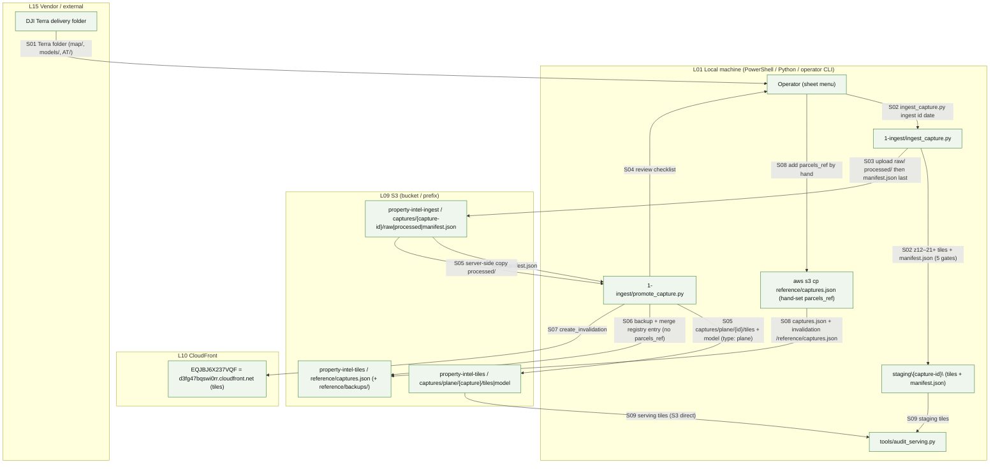

## P02 — County parcel publish (Segment 2, mapped 2026-09-15)

**Summary.** Operator CLI. County taxlot GeoJSON → z12 shards (adaptive split to z16) → `reference/parcels/{county}/` on `property-intel-tiles`, index written last, referee probe over the CDN. Counties published: `deschutes`, `lane`. `[K2]` `[src 2-parcels/counties.json]`.

| Step | Layer | Script / function | Trigger | Input → Output | Source | Status |
|---|---|---|---|---|---|---|
| S01 | Vendor → Local | download county taxlot layer (Deschutes portal by hand; Lane via `tools/download_lane_taxlots.py` from the ArcGIS FeatureServer) | manual | GIS layer → local GeoJSON (EPSG:4326) | `[K2 §Adding or refreshing a county]` `[src counties.json source, download_lane_taxlots.py]` | live |
| S02 | human → Local | add/confirm the county entry in `2-parcels/counties.json` (`join_field`, `feature_id_field`, `keep_properties`) | manual | → `counties.json` | `[K2 §Adding step 2]` | live |
| S03 | Local | `2-parcels/inspect_parcels.py <geojson>` | manual CLI | count, CRS, id uniqueness | `[K2 §Tooling]` | live |
| S04 | Local | `publish_parcels.py report <county> <geojson>` — `build_shards` locally, zero AWS | manual CLI | → build report | `[K2 §Tooling]` `[src publish_parcels.py defs]` | live |
| S05 | Local | `publish_parcels.py publish <county> <geojson> dry` | manual CLI | → operation list | `[K2]` | live |
| S06 | Local → S3 → CloudFront | `publish_parcels.py publish` — backup prior index → `reference/backups/parcels-{county}-{ts}.json`, upload shards, prune stale, write `index.json` last, invalidate, verify via CDN | manual CLI | → `reference/parcels/{county}/index.json` + `shards/{z}-{x}-{y}.geojson` | `[K2 §Layout, §Tooling]` | live |
| S07 | CloudFront → Local | `probe_parcels.py <county> <reference-geojson> [--base]` — referee through the consumer query path | manual CLI | index → shards → verdict per known parcel | `[K2 §Tooling]` | live |
| S08 | Local → S3 | `migrate_registry_parcels.py` — one-shot `parcels_key` → `parcels_ref` on `reference/captures.json` (backup first) | manual, one-shot | registry rewritten | `[src migrate_registry_parcels.py]` `[C SUPERSEDED per-capture parcels_key]` | dead code (one-shot, done) |

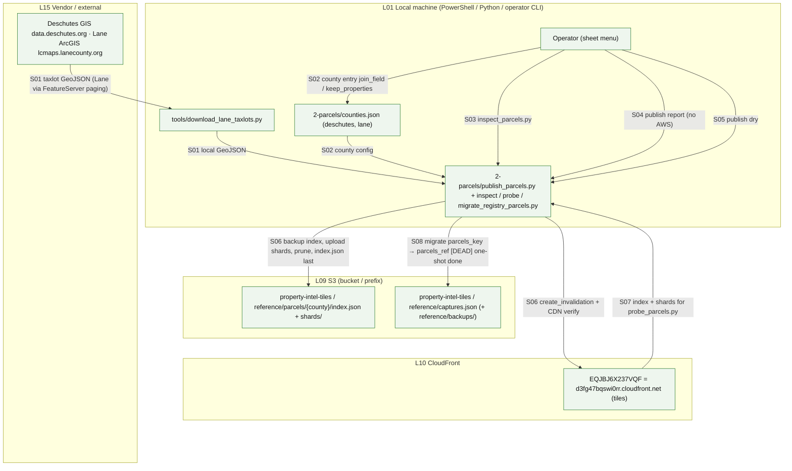

## P03 — Viewer lot-line tile publish (`data/parcels/{county}_{lat}_{lng}.geojson`, mapped 2026-09-15)

**Summary.** A second, independent copy of parcel geometry for browsers: 0.07° grid GeoJSON files committed to the public repo and read from GitHub Pages / raw.githubusercontent by the viewers and by Apps Script (`fetchParcelRing`). A copy is synced to `property-intel-tiles/parcels/` for the planned cutover. **The script that cuts the 0.07° grid is in neither repo.** `[KR §County parcel tiles]` `[src config.gs:170-173]`.

| Step | Layer | Script / function | Trigger | Input → Output | Source | Status |
|---|---|---|---|---|---|---|
| S01 | Local | grid cutter (county GeoJSON → `{county}_{lat}_{lng}.geojson`, 0.07° cells) | manual | county layer → 607 files (`deschutes_*`, `lane_*`, untracked `josephine_*`) | ops log 2026-08-27 "Lane viewer tiles extracted" (no file named) | **not found in sources** |
| S02 | human → GitHub | `git add data/parcels/*.geojson; git commit; git push` | manual | → repo `main` → Pages | `[KI "Git keeps … lot-line tiles"]`, git status (josephine untracked) | live (manual) |
| S03 | GitHub → Apps Script | `shared.gs getParcelFile / fetchParcelRing` GET `PARCEL_BASE + {county}_{lat}_{lng}.geojson` from `raw.githubusercontent.com` | upstream: satellite `prepareSatNadir_`, pin gate `satFetchRingForPinGate_` | ring for the property | `[src config.gs:170; shared.gs:757; satellite.gs:352,953]` | live (Deschutes grid constants only) |
| S04 | GitHub Pages → viewers | `element-review.html`, `viewer.html`, `responder-intel.html`, `nearmap-viewer.html`, `js/vyanet-viewer/nearmap-lot.js`, `nadir-geo.js` fetch `data/parcels/…` (Deschutes + Lane grids) | page load | lot lines on the basemap | scan `[src element-review.html; viewer.html; responder-intel.html; nearmap-lot.js]` `[KN §Nearmap viewer]` | live |
| S05 | Local → S3 | `tools/publish-records-static.py --parcels` → `aws s3 sync data/parcels s3://property-intel-tiles/parcels/` (`max-age=3600`) | manual, one-shot 2026-09-11 (506 files) | → `property-intel-tiles/parcels/*.geojson` | `[KR §County parcel tiles, changelog 09-11]` `[src publish-records-static.py sync_parcels]` | live (operator) |
| S06 | S3 → CloudFront | planned viewer URL `d3fg47bqswi0rr.cloudfront.net/parcels/{filename}` after cutover | — | no reader yet | `[KR "Viewer URL after cutover"]` | not built (no reader) |
| S07 | Local | `tools/nearmap/lot_clip.py` reads the tile from local `data/parcels/` or Pages | manual CLI | taxlot ring for the Nearmap crop | `[KN §lot_clip.py]` `[src lot_clip.py parcel_file_for]` | live (trial) |

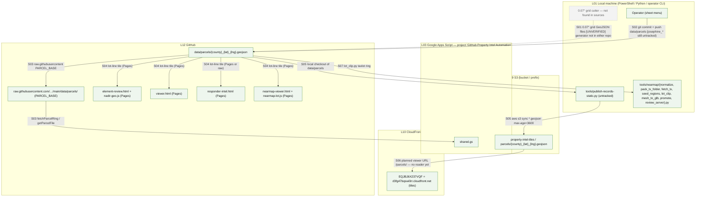

## P04 — Eligibility service `plane-eligibility-check-v2` (Segment 3, mapped 2026-09-15)

**Summary.** The Lambda's own path for one `POST /eligibility` batch. Reads everything through CloudFront (no S3 API), geocodes rows without coordinates, samples z19 tile opacity, returns a verdict per row. Callers: `plane.gs checkPlaneEligibility` (P08) and `drone-test.gs` (P09 S03). `[K3]`.

| Step | Layer | Script / function | Trigger | Input → Output | Source | Status |
|---|---|---|---|---|---|---|
| S01 | Apps Script → API GW → Lambda | `plane.gs callPlaneEligibility_` → `POST /eligibility` → `3-eligibility/lambda_handler.lambda_handler` → `eligibility_check.check_batch` | menu (P08 / P09) | `{addresses:[{rowIndex,address,lat?,lng?}]}` | `[K3 §Interface]` `[src plane.gs:168-182; 3-eligibility/lambda_handler.py]` | live |
| S02 | Lambda → Secrets | `get_maps_key` from `MAPS_API_KEY_SECRET_ARN` | cold start | Maps key | `[K3 §Deployment]` `[src eligibility_check.py get_maps_key]` | live |
| S03 | Lambda → Google | `geocode` for rows without `lat/lng` | per row | address → lat/lng (echoed back) | `[K3 §Scale design 2]` `[src eligibility_check.py:243]` | live |
| S04 | CloudFront → Lambda | `load_captures` GET `reference/captures.json`; bounds gate (+0.002°) | per invoke (warm cache) | registry → enabled plane or drone captures newest-first | `[K3 §Data consumed]` `[src eligibility_check.py:79; clip_parcel.py:64-69]` | live — **`type in (plane,drone)` edit not deployed [UNVERIFIED]** `[Cd]` |
| S05 | CloudFront → Lambda | `load_county_index` + `load_shard_features` → `find_parcel` (bbox shortlist → point-in-polygon) | per in-bounds row | `reference/parcels/{parcels_ref}/index.json` + shards → TAXLOT + geometry | `[K3]` `[K2 §Consumer rules]` | live |
| S06 | CloudFront → Lambda | `sample_points` (≤600) + `capture_coverage` at `REFERENCE_ZOOM=19` — tiles from `cap.tiles` | per row | z19 PNG tiles → opaque fraction ≥ 0.80 | `[K3 §Criterion]` `[src eligibility_check.py:43,203-243]` | live |
| S07 | Lambda → API GW → Apps Script | response `{results:[{rowIndex,eligible,taxlot,capture,reason,coverage?,county?,lat?,lng?}]}` | end of batch | JSON | `[K3 §Interface]` | live |
| S08 | Lambda → CloudWatch | stdout | side effect | log group | implied | live |
| S09 | Lambda (v1) → S3 | `plane-eligibility-check` (v1) reads `reference/parcels/bend-5-21-26-parcels.geojson` via `REFERENCE_BUCKET` | none (retired route) | 179-parcel extract | `[K2 §Deprecated]` `[K3 punch list retire]` `[src lambda/eligibility_check_lambda.py]` | superseded — deployed? [UNVERIFIED] |

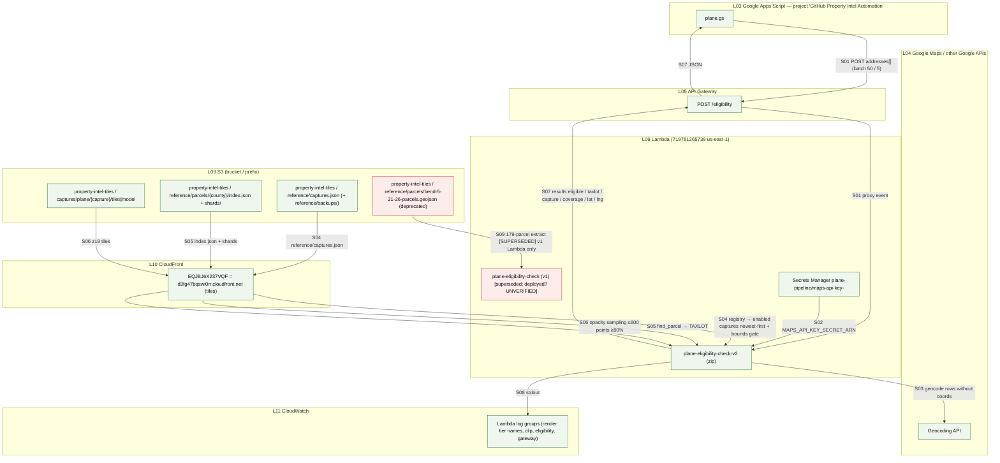

## P05 — Parcel clip / GLB ensure service `plane-parcel-clip` (Segment 4, mapped 2026-09-15)

**Summary.** For each `{rowIndex, taxlot}`: return the cached `clipped.glb` if it exists (`s3.head_object`), else download the newest covering capture's OBJ/MTL/textures, clip, upload, warm CloudFront. `{purge:true}` deletes cached GLBs and invalidates. Callers: `plane.gs` (P08), `drone-test.gs` (P09). `[K4]` `[src 4-clip/lambda_handler.py]`.

| Step | Layer | Script / function | Trigger | Input → Output | Source | Status |
|---|---|---|---|---|---|---|
| S01 | Apps Script → API GW → Lambda | `plane.gs callV2_('/clip')` → `4-clip/lambda_handler.lambda_handler` | menu "Generate 3D Models" (P08/P09) + 1-min pollers | `{properties:[{rowIndex,taxlot,lat?,lng?}]}` | `[K4 §Interface]` `[src plane.gs:341]` | live |
| S02 | CloudFront → Lambda | `clip_parcel.load_captures` GET `reference/captures.json` | per invoke | enabled captures newest-first (`model_source`, `model_transform`, `parcels_ref`, `bounds`) | `[src clip_parcel.py:45-69]` | live — deployed `type` filter [UNVERIFIED] |
| S03 | Lambda → S3 | `cached_capture` — `s3.head_object` `captures/plane/{cap}/parcels/{taxlot}/clipped.glb` per capture | per taxlot | hit → `status: cached` | `[K4 §Semantics 1]` `[src :56-65]` | live |
| S04 | CloudFront → Lambda | `find_parcel_geoms(taxlot, parcels_ref, bounds)` → widen to whole county on miss | on cache miss | county index + shards → parcel polygons | `[K4 §Semantics 2]` `[src :153-170]` | live |
| S05 | S3 → Lambda | `ensure_model_package` — `s3.download_file` OBJ, MTL, every `map_Kd` texture (no ListBucket) → `/tmp/model_{cap}` | once per capture per warm container | `captures/plane/{cap}/model/BlockR.*` | `[K4 §Config IAM]` `[src :82-115]` | live |
| S06 | Lambda → S3 | `build_local_polys` + `clip_to_glb` → `s3.upload_file` `clipped.glb` (`model/gltf-binary`) | on cache miss | GLB written | `[src :176-192]` | live |
| S07 | Lambda → CloudFront | 18×5 s `HEAD glb_url` warm loop | after upload | URL serves 200 | `[K4 §Semantics 2]` `[src :195-201]` | live (a CloudFront HEAD — the contract forbids it for existence checks but uses it here as a warm loop) |
| S08 | Lambda → S3 + CloudFront | `purge_taxlot` — `head_object` + `delete_object` per capture; `create_invalidation` of removed keys | `{purge:true}` from `regeneratePlaneModels_` (P08) | GLBs deleted | `[src :67-80, 220-247; plane.gs:637]` | live |
| S09 | Lambda → API GW → Apps Script | `{results:[{rowIndex,taxlot,ok,status,capture,glb_url,glb_mb?,faces?}]}` | end | JSON (or API GW 29 s cut → caller polls) | `[K4 §Interface]` | live |
| S10 | Lambda → CloudWatch | stdout (`[package]`, `[purge]`, generated sizes) | side effect | log group | `[src prints]` | live |
| S11 | Local → ECR → Lambda | image build/push for `plane-clip` | manual | `4-clip/Dockerfile` → ECR `plane-clip` → function | `[K4 §Config]` | **deploy script not found in sources** |

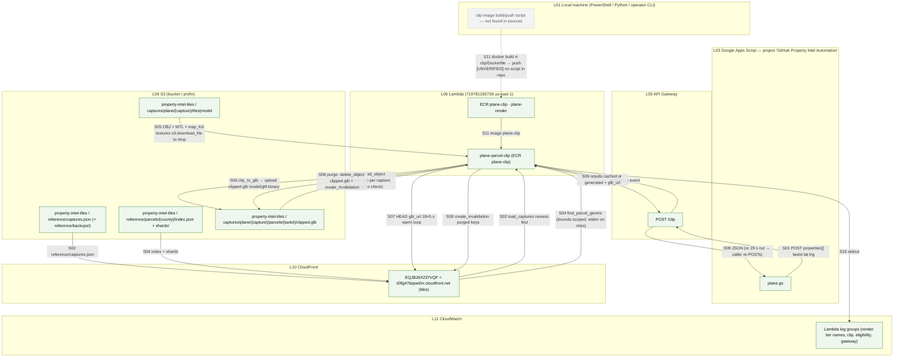

## P06 — Render service `plane-parcel-render` (Segment 5, mapped 2026-09-15)

**Summary.** One `POST /render` body has four shapes: `{probe}` (S3 status only), `{storyboard}` (frontage maths only, no S3 write), `{async}` (self-invoke Event, 202), and the full render (obliques via bundled `render-viewer.html` in Playwright, nadir crop from tiles, five JPG uploads, CloudFront invalidation). Deployed by `deploy-render.ps1`; swept by `render_sweep.py`. `[K5]` `[src 5-render/lambda_handler.py]`.

| Step | Layer | Script / function | Trigger | Input → Output | Source | Status |
|---|---|---|---|---|---|---|
| S01 | Apps Script → API GW → Lambda | `callV2_('/render', …)` → `lambda_handler` dispatch on `probe` / `storyboard` / `async` / full | menus + pollers (P08/P09) | body → branch | `[src :848-917]` | live |
| S02 | Lambda → Lambda | `{async:true}` → `boto3.client("lambda").invoke(InvocationType="Event")` on `AWS_LAMBDA_FUNCTION_NAME`, return 202 | S01 async | same body minus `async` | `[src :879-896]` | live |
| S03 | CloudFront → Lambda | `prepare_render`: `load_captures`, `find_parcel_geoms` (county via `parcels_ref`, widen) | S01 storyboard / full | registry + shards → parcel geoms | `[src :703-725]` | live |
| S04 | CloudFront → Lambda | GATE 1 `ec.sample_points` + `ec.capture_coverage` ≥ 0.80 at z19 (same function as P04) | S03 | tiles → `tile_cap`, coverage | `[K5 §Gates 1]` `[src :727-742]` | live |
| S05 | S3 → Lambda | GATE 2 `s3.head_object` `clipped.glb` newest capture; refuse if none ("run Generate 3D Models first") | S04 | GLB presence → `glb_cap`, `glb_url` | `[K5 §Gates 2]` `[src :744-761]` | live |
| S06 | Lambda → Google + Secrets | `frontage_and_views`: Directions API (ENTRANCE tier), reverse geocode `result_type=route` (ROAD tier), county edge probe, nearest-edge fallback; key from `MAPS_API_KEY_SECRET_ARN` | S05 | address → alpha bearing + entrance point (`ent_x/ent_y` or null) | `[K5 §Frontage tier chain]` `[src :342,372,430-492]` | live |
| S07 | Lambda → API GW | `build_storyboard` → `{alpha, ent_x, ent_y, glb_url, capture_3d}` — **no S3 write** | S01 storyboard | JSON | `[src :778-796]` | live — contradicts `[K5 §Storyboard data output]` (says `storyboard.json` uploaded + invalidated) |
| S08 | Lambda ↔ CDN + CloudFront | `render_all_obliques`: Playwright Chromium (SwiftShader flags) loads `file:///var/task/render-viewer.html?model={glb_url}&…` → three.js r128 + draco from cdnjs/jsdelivr, GLB from CloudFront; 4 screenshots, crop-to-content | full render | → `/tmp/{taxlot}_{view}.jpg` ×4 | `[K5 §Rendering architecture]` `[src render-viewer.html urls]` | live |
| S09 | CloudFront → Lambda | `crop_nadir(padded_bbox, tile_base, NADIR_ZOOM=20)` | full render | z20 tiles → nadir JPG + `nadir_bounds` | `[src :817-823]` | live |
| S10 | Lambda → S3 | `enforce_image_limit` + `upload_image` ×5 → `…/renders/{view}.jpg` (`image/jpeg`) | full render | 5 JPGs | `[src :826-830, 653-658]` | live |
| S11 | Lambda → S3 | `nadir_local_corners` + `write_nadir_meta` → `renders/nadir-meta.json` | full render | **in v2 `master` the JSON is built and never `put_object`ed** | `[src :643-651]`; CHANGELOG 2026-08-27 says fixed | live in intent; **master does not upload** — deployed image [UNVERIFIED] |
| S12 | Lambda → CloudFront | `invalidate_render_paths` — 5 render keys + `nadir-meta.json` | after S10 | invalidation | `[K5 §CDN invalidation]` `[src :597-615]` | live |
| S13 | Lambda → S3 → API GW | `probe_property`: `head_object` GLB + 5 renders, `get_object nadir-meta.json` → `{complete, images, capture_3d, nadir_bounds?, nadir_local?}` | S01 probe (pollers, backfill) | status JSON | `[src :660-700]` | live |
| S14 | Lambda → CloudWatch | prints (frontage tier by name, nadir tile counts, `[cdn]`) | side effect | log group | `[K5 "Every render logs the tier"]` | live |
| S15 | Local → ECR → Lambda | `5-render/deploy-render.ps1` — `docker build -f 5-render/Dockerfile .` (repo root, classic store), `crane push` `plane-render:{git-sha}`, verify single manifest, `update-function-code plane-parcel-render` (`-FunctionName plane-parcel-video` reuses the image) | manual (dirty-tree guard) | image → function | `[K5 §Deploy method]` `[src deploy-render.ps1]` | live |
| S16 | Local → Lambda | `5-render/render_sweep.py ADDRESSES [--concurrency]` — geocode + `taxlot_for_point` over CDN shards, direct `invoke` with `retries=0`, one invalidation `/captures/plane/*` at the end | manual CLI | roster → renders | `[K5 §Referee record]` `[src render_sweep.py]` | live |
| S17 | Local | `5-render/sync-render-viewer.ps1` — sync the bundled viewer into the image context | manual | `render-viewer.html` | `[C §In flight]` | live |

```mermaid
flowchart TB
  classDef live fill:#eef6ee,stroke:#2e7d32,color:#111;
  classDef dead fill:#fdecea,stroke:#c62828,color:#111;
  classDef unver fill:#fff8e1,stroke:#f9a825,color:#111,stroke-dasharray:4 3;
  classDef notfound fill:#f3f3f3,stroke:#9e9e9e,color:#555,stroke-dasharray:2 2;
  classDef anchor fill:none,stroke:none,color:transparent,font-size:1px;
  subgraph L01["L01 Local machine (PowerShell / Python / operator CLI)"]
    direction LR
    A01[" "]:::anchor
    LC_deployrender["5-render/deploy-render.ps1 (crane)"]:::live
    LC_syncviewer["5-render/sync-render-viewer.ps1"]:::live
    LC_sweep["5-render/render_sweep.py"]:::live
  end
  subgraph L03["L03 Google Apps Script — project 'GitHub Property Intel Automation'"]
    direction LR
    A03[" "]:::anchor
    AS_plane["plane.gs"]:::live
  end
  subgraph L04["L04 Google Maps / other Google APIs"]
    direction LR
    A04[" "]:::anchor
    GG_geocode["Geocoding API"]:::live
    GG_directions["Directions API"]:::live
  end
  subgraph L05["L05 API Gateway"]
    direction LR
    A05[" "]:::anchor
    AG_render["POST /render (probe · storyboard · async · backfill_meta)"]:::live
  end
  subgraph L06["L06 Lambda (719781265739 us-east-1)"]
    direction LR
    A06[" "]:::anchor
    LM_render["plane-parcel-render (ECR plane-render)"]:::live
    LM_secret["Secrets Manager plane-pipeline/maps-api-key-<suffix>"]:::live
    LM_ecr["ECR plane-clip · plane-render"]:::live
  end
  subgraph L09["L09 S3 (bucket / prefix)"]
    direction LR
    A09[" "]:::anchor
    S3_ref_captures["property-intel-tiles / reference/captures.json (+ reference/backups/)"]:::live
    S3_ref_parcels["property-intel-tiles / reference/parcels/{county}/index.json + shards/"]:::live
    S3_tiles_capture["property-intel-tiles / captures/plane/{capture}/tiles|model"]:::live
    S3_tiles_glb["property-intel-tiles / captures/plane/{capture}/parcels/{taxlot}/clipped.glb"]:::live
    S3_tiles_renders["…/parcels/{taxlot}/renders/{view}.jpg + nadir-meta.json"]:::live
  end
  subgraph L10["L10 CloudFront"]
    direction LR
    A10[" "]:::anchor
    CF_tiles["EQJBJ6X237VQF = d3fg47bqswi0rr.cloudfront.net (tiles)"]:::live
  end
  subgraph L11["L11 CloudWatch"]
    direction LR
    A11[" "]:::anchor
    CW_logs["Lambda log groups (render tier names, clip, eligibility, gateway)"]:::live
  end
  subgraph L15["L15 Vendor / external"]
    direction LR
    A15[" "]:::anchor
    EX_cdn["cdnjs three.js r128 · jsdelivr · gstatic draco · fonts"]:::live
  end
  %% Request + dispatch
  AS_plane -->|"S01 POST body probe / storyboard / async / full"| AG_render
  AG_render -->|"S01 proxy event"| LM_render
  LM_render -->|"S02 async: self-invoke Event, 202 to caller"| LM_render
  %% Prepare (gates + frontage)
  S3_ref_captures -->|"S03 reference/captures.json"| CF_tiles
  S3_ref_parcels -->|"S03 index + shards"| CF_tiles
  CF_tiles -->|"S03 load_captures + find_parcel_geoms"| LM_render
  S3_tiles_capture -->|"S04 z19 tiles"| CF_tiles
  CF_tiles -->|"S04 capture_coverage ≥ 80% (shared function)"| LM_render
  S3_tiles_glb -->|"S05 head_object clipped.glb (never clip inline)"| LM_render
  LM_secret -->|"S06 MAPS_API_KEY_SECRET_ARN"| LM_render
  LM_render -->|"S06 Directions API ENTRANCE tier"| GG_directions
  LM_render -->|"S06 reverse geocode ROAD tier"| GG_geocode
  LM_render -->|"S07 storyboard: alpha, ent_x, ent_y, glb_url (no S3 write)"| AG_render
  %% Render + upload
  EX_cdn -->|"S08 three.js r128 + draco into file:///var/task/render-viewer.html"| LM_render
  S3_tiles_glb -->|"S08 clipped.glb (glb_url)"| CF_tiles
  CF_tiles -->|"S08 GLB into Playwright → 4 oblique screenshots"| LM_render
  CF_tiles -->|"S09 z20 tiles → nadir crop + bounds"| LM_render
  LM_render -->|"S10 upload alpha/bravo/charlie/delta/nadir.jpg"| S3_tiles_renders
  LM_render -->|"S11 nadir-meta.json (built, NOT uploaded in master)"| S3_tiles_renders
  LM_render -->|"S12 create_invalidation renders/* + nadir-meta.json"| CF_tiles
  %% Probe
  S3_tiles_renders -->|"S13 head_object renders + get_object nadir-meta.json"| LM_render
  LM_render -->|"S13 complete, images, capture_3d, nadir_bounds, nadir_local"| AG_render
  LM_render -->|"S14 stdout: frontage tier, nadir tiles, cdn"| CW_logs
  %% Deploy + sweep
  LC_syncviewer -->|"S17 render-viewer.html into build context"| LC_deployrender
  LC_deployrender -->|"S15 docker build repo root → crane push plane-render:{sha}"| LM_ecr
  LM_ecr -->|"S15 update-function-code by SHA tag"| LM_render
  LC_sweep -->|"S16 direct invoke per address (retries 0) + final invalidation"| LM_render
  A01 ~~~ A03 ~~~ A04 ~~~ A05 ~~~ A06 ~~~ A09 ~~~ A10 ~~~ A11 ~~~ A15
```

## P07 — Approach videos `plane-parcel-video` (Segment 5 extension, mapped 2026-09-15)

**Summary.** Same ECR image as render, `ImageConfig.Command` → `video_render.lambda_handler`; one invocation = one view's 60-frame approach video, key hashed from inputs. **No Apps Script caller and no API Gateway route exist in the sources**; only `render_sweep.py --video` invokes it. Deployment state `(verify)` in `[Cd]`. `[K5 §Video extension]` `[src 5-render/video_render.py]`.

| Step | Layer | Script / function | Trigger | Input → Output | Source | Status |
|---|---|---|---|---|---|---|
| S01 | Local → Lambda | `render_sweep.py ADDRESSES --video [--views]` → per (property, view) `invoke plane-parcel-video` | manual CLI | `{taxlot, lat, lng, address, view}` | `[src render_sweep.py docstring]` | live tool; function deployed **[UNVERIFIED]** |
| S02 | CloudFront + S3 → Lambda | `prepare_render` (imported from `lambda_handler`) — same gates/frontage as P06 S03–S06 | S01 | geoms, glb_cap, views, ent_x/ent_y | `[src video_render.py imports]` | live |
| S03 | Lambda → S3 | `_video_hash` of inputs (+`VIDEO_ALGO_VERSION="v1"`) → `videos/{view}-{hash}.mp4`; `s3.head_object` = resume (already rendered) | S02 | key known before rendering | `[K5 §Video output keys]` `[src :37-46]` | live |
| S04 | Lambda ↔ CDN + CloudFront | Playwright path mode on `render-viewer.html` (`azimuth`, `polar`, `az_end`, `end_radius`, `hold`…) — 60 frames at 15 fps, `page.screenshot` per frame; ffmpeg encode | S03 miss | frames → `.mp4` in `/tmp` | `[K5 §Video render architecture]` `[src :26-60]` | live (ffmpeg presence in image: `[Cd]` says missing — [UNVERIFIED]) |
| S05 | Lambda → S3 | upload `.mp4` to the versioned key; **never invalidated** | S04 | `captures/plane/{cap}/parcels/{taxlot}/videos/{view}-{hash}.mp4` | `[K5 §Video output keys]` | live — populated? [UNVERIFIED] |
| S06 | Local → ECR → Lambda | `deploy-render.ps1 -FunctionName plane-parcel-video` reuses the render image | manual | image → function (Command override) | `[K5 §Deploy method]` `[src deploy-render.ps1 params]` | live |
| S07 | — | Apps Script menu item / API GW route for videos | — | — | none in `menu.gs`, `plane.gs`, `drone-test.gs` | **not found in sources** |

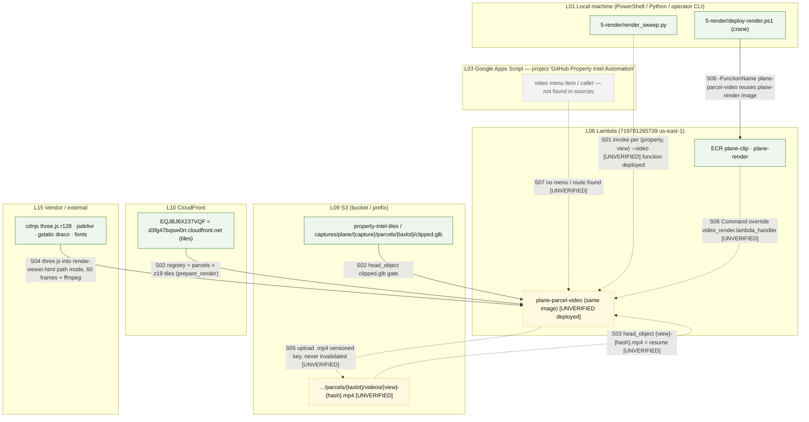

## P08 — Plane sheet pipeline (mapped 2026-09-15)

**Summary.** Tab `Plane`, `plane.gs`. Same shape as P09 with Plane columns: eligibility intake from the Satellite tab → 3D models → images → storyboard → Pass 1 → review → rerun → Pass 2 → sync. Differences from P09: intake appends rows from the Satellite tab; hub id via `indexHubId_` (site_no only, never mints a hub); sync also writes tab `Intel Links`; sync publishes to S3 records **only** (plane is not in the GitHub dual-write), while `viewer.html` still reads `data/plane/` from GitHub Pages. `[src plane.gs]`.

| Step | Layer | Script / function | Trigger | Input → Output | Source | Status |
|---|---|---|---|---|---|---|
| S01 | Sheets → Apps Script | `checkPlaneEligibility` reads every Satellite row (address, type, name, HOA, site_no), skips addresses already on Plane | menu "Check Plane Eligibility" | Satellite rows → candidates | `[src plane.gs:77-103]` | live |
| S02 | Apps Script → API GW → Lambda | `callPlaneEligibility_` batches of `ELIGIBILITY_BATCH_SIZE`=50 → P04 | S01 | `{addresses}` → verdicts | `[src :117-128; config.gs:137]` | live |
| S03 | Apps Script → Sheets | append eligible rows to `Plane` (A type, B name, C address, D HOA, E taxlot, AC site_no) | S02 | new Plane rows | `[src :133-146]` | live |
| S04 | Sheets → Apps Script → API GW → Lambda | `generate3DModelsV2` → (rows lacking taxlot: `/eligibility` in `V2_ELIG_BATCH`=5, `geocodeAddress` fallback) → `callV2_('/clip')` → P05 | menu "Generate 3D Models (v2)" | rows → `{properties}` → results | `[src :414-540]` (same shape as P09 S02–S08) | live |
| S05 | Apps Script → Sheets props/triggers | non-200 → Script Property `planeClipJobV2`, trigger `pollClipV2_` every 1 min re-POSTs until 200 or `V2_MAX_POLLS` | S04 | job JSON | `[src :371-380, 503-540]` | live |
| S06 | Apps Script → Sheets | `writeClipResultsV2_` → O `360 View URL` = `V2_VIEWER_BASE + glb_url`, AA status | S04/S05 | cells | `[src plane.gs]` | live |
| S07 | Apps Script → API GW → Lambda → S3 + CloudFront | `regeneratePlaneModelForActiveRow` / `…SelectedRows` → `callV2_('/clip', {purge:true, properties})` then re-ensure; clears the row's stale outputs | menu "Regenerate 3D Model(s) (v2)" | purge + regenerate | `[src :566-670]` | live |
| S08 | Apps Script → Sheets props/triggers → API GW → Lambda | `generateImagesV2` → `planeImgJobV2`, trigger `imagesTickV2_` 1 min: `POST /render async:true` (`V2_FIRE_PER_TICK`=3) then `{probe:true}` polls → P06 | menu "Generate Property Images (v2)" | → I nadir, K–N obliques, J `Nadir Bounds`, AA | `[src :700-760, 1575]` | live |
| S09 | Apps Script → API GW → Lambda → Sheets | `generateStoryboardV2` / `…ForActiveRow` → `processStoryboardRow_` → `/render {storyboard:true}` → AB `{alpha,ent_x,ent_y}`, O rebuilt via `buildStoryboardViewerUrl_` | menu "Generate Storyboard (v2)" | approach record | `[src :200-330]` | live |
| S10 | GitHub Pages + CloudFront + Bedrock → Apps Script → Sheets | `generateElementPinsV2` → `processElementPinsRow_` → `runElementPinsCall_`: `fetchPinCatalog_` (`PIN_CATALOG_URL`), 5 images `fetchImageAsBase64`, `queryKnowledgeBase`, `callBedrock(planeElementPinsPrompt_)`, `parseElementPins_` + `validateElementPins_` → P `Nadir Elements`, Q=false | menu "Generate Element Pins — Pass 1 (v2)" | pins JSON | `[src plane.gs runElementPinsCall_; prompts.gs]` | live |
| S11 | Apps Script → human → Pages → web app | `openElementReviewForActiveRow` → `buildElementReviewUrl_` → `element-review.html?nadir=&pins=&type=&addr=…` (dialog); page GETs `?route=elements` on the web app | menu "Open Element Review (This Row)" | review URL | `[src plane.gs buildElementReviewUrl_]` | live — **which sheet row the critique files against for a Plane row (Satellite by address vs Plane) is [UNVERIFIED]**; `critique-api.gs` has Satellite and drone-test finders only |
| S12 | Apps Script → Bedrock → Sheets | `rerunElementPinsForActiveRow` / `rerunElementPinsBatch` → `rerunElementPinsRow_` (R `Nadir Fixes` note + `currentPinsAsText_` + `planeElementRerunInstruction_`) → P rewritten, Q=false, R kept | menu "Rerun Element Pins from Fixes" (batch: R non-empty and Q unticked) | pins JSON | `[src config.gs v5.22 notes; plane.gs rerun*]` | live |
| S13 | Apps Script → Bedrock → Sheets | `generatePass2V2` / `…ForActiveRow` → `runPass2Call_` (gate Q===true, T empty): `planeConcernAndDescPrompt_` + `frConcernNames`, 5 images, confirmed pins → `parsePlaneDescriptions_`, `validateConcernPins_` → S concerns, T–W descriptions, X considerations, Y clarifications | menu "Generate Pass 2 — Concerns + Descriptions" | Pass 2 cells | `[src config.gs v5.23 notes; plane.gs runPass2Call_]` | live |
| S14 | Sheets → Apps Script | `processPlaneSheet`: completeness gate (I, K–N, P, T–W; T not ERROR); `viewId = hashId(slug(name)+'-plane')`; `hubId = indexHubId_({siteNo AC, name, address})` — null → publish view, skip index | menu "Sync Plane" / `syncNow` | `propertyData` (`view:'plane'`, nadir pins split + merged, bounds, obliques, viewer360) | `[src :1614-1680]` | live |
| S15 | GitHub + S3 records → Apps Script | `upsertIndexEntry_(hubId, {views:{plane}, pins_source:'3d'})` (GET `data/index/{hubId}.json` via Contents API); `pinsFileForSync_` (GET records `pins/{hubId}.json`, fallback GitHub) | S14 | files[] = `data/plane/{viewId}.json`, `data/index/{hubId}.json`, `data/pins/{hubId}.json`? | `[src :1702-1721; shared.gs:343,483]` | live |
| S16 | Apps Script → S3 records | `pushAllToGitHub(files,'Plane')` → `pushAllToRecords_`: PUT `plane/{viewId}.json` + `recordsJoinViewIndex_('plane')`; `pins/{hubId}.json` (3d wins) + index `files.pins`; index merge | S15 | S3 objects | `[src shared.gs:201-215; records.gs:287-333]` | live |
| S17 | Apps Script → GitHub | `recordsIsPagesGithubPath_(path,'Plane')` → **false for every plane file** → no GitHub commit | S16 | nothing | `[src shared.gs:195-199]` | live — **GitHub `data/plane/` no longer updated by sync, yet the viewer reads it (S19)** |
| S18 | Apps Script → Sheets | Z `FR Link` = `viewer.html?property={hubId}&tab=plane`, H `Upload Date`; `updateIntelLinksSheet(name,address,intelLink,views,hoa)` → tab `Intel Links` | S16 success | cells + Intel Links row | `[src :1742-1749; shared.gs:728]` | live |
| S19 | GitHub Pages → viewer | `viewer.html?property={hubId}&tab=plane` → `data/index/{hubId}.json` → `views.plane` → `data/plane/{viewId}.json`; `vyanet-viewer.html` Private 2D iframe | responder opens Z link / hub | JSON → page | `[KI §Viewer resolution]` `[src viewer.html scan]` | live (reads the GitHub copy) |
| S20 | Apps Script | `checkPlaneAccountNameCollisions`, `auditAccountNameMismatches` (Satellite vs Plane by address) — editor-run audits, log only | manual (no menu) | log lines | `[src :1757-1804]` | live (no menu item) |

```mermaid
flowchart TB
  classDef live fill:#eef6ee,stroke:#2e7d32,color:#111;
  classDef dead fill:#fdecea,stroke:#c62828,color:#111;
  classDef unver fill:#fff8e1,stroke:#f9a825,color:#111,stroke-dasharray:4 3;
  classDef notfound fill:#f3f3f3,stroke:#9e9e9e,color:#555,stroke-dasharray:2 2;
  classDef anchor fill:none,stroke:none,color:transparent,font-size:1px;
  subgraph L01["L01 Local machine (PowerShell / Python / operator CLI)"]
    direction LR
    A01[" "]:::anchor
    HUMAN_operator["Operator (sheet menu)"]:::live
    HUMAN_reviewer["Reviewer (element-review)"]:::live
  end
  subgraph L02["L02 Google Sheets (spreadsheet <spreadsheet-id>)"]
    direction LR
    A02[" "]:::anchor
    SH_satellite["tab Satellite"]:::live
    SH_plane["tab Plane"]:::live
    SH_intellinks["tab Intel Links"]:::live
    SH_props["Script Properties (GITHUB_TOKEN, MAPS_KEY, AWS_*, BEDROCK_*, HASH_SALT, job keys)"]:::live
    SH_triggers["time triggers: *AutoRun 5 min · pollClip/imagesTick 1 min · recordsSheetAutoTick_ 5 min [installed set UNVERIFIED]"]:::live
  end
  subgraph L03["L03 Google Apps Script — project 'GitHub Property Intel Automation'"]
    direction LR
    A03[" "]:::anchor
    AS_plane["plane.gs"]:::live
    AS_shared["shared.gs"]:::live
    AS_prompts["prompts.gs"]:::live
    AS_records["records.gs"]:::live
    AS_webapp["web app /macros/s/<web-app-deployment-id>…/exec"]:::live
  end
  subgraph L04["L04 Google Maps / other Google APIs"]
    direction LR
    A04[" "]:::anchor
    GG_geocode["Geocoding API"]:::live
  end
  subgraph L05["L05 API Gateway"]
    direction LR
    A05[" "]:::anchor
    AG_eligibility["POST /eligibility"]:::live
    AG_clip["POST /clip"]:::live
    AG_render["POST /render (probe · storyboard · async · backfill_meta)"]:::live
  end
  subgraph L06["L06 Lambda (719781265739 us-east-1)"]
    direction LR
    A06[" "]:::anchor
    LM_elig["plane-eligibility-check-v2 (zip)"]:::live
    LM_clip["plane-parcel-clip (ECR plane-clip)"]:::live
    LM_render["plane-parcel-render (ECR plane-render)"]:::live
  end
  subgraph L07["L07 AWS Bedrock"]
    direction LR
    A07[" "]:::anchor
    BR_model["model us.anthropic.claude-sonnet-4-6 (bedrock-runtime)"]:::live
    BR_kb["Knowledge Base 2USE5KFEJ6 property-intel-kb (bedrock-agent-runtime retrieve)"]:::live
  end
  subgraph L09["L09 S3 (bucket / prefix)"]
    direction LR
    A09[" "]:::anchor
    S3_tiles_glb["property-intel-tiles / captures/plane/{capture}/parcels/{taxlot}/clipped.glb"]:::live
    S3_tiles_renders["…/parcels/{taxlot}/renders/{view}.jpg + nadir-meta.json"]:::live
    S3_records_plane["property-intel-records / plane/{viewId}.json"]:::live
    S3_records_index["property-intel-records / index/{hubId}.json"]:::live
    S3_records_pins["property-intel-records / pins/{hubId}.json"]:::live
  end
  subgraph L10["L10 CloudFront"]
    direction LR
    A10[" "]:::anchor
    CF_tiles["EQJBJ6X237VQF = d3fg47bqswi0rr.cloudfront.net (tiles)"]:::live
  end
  subgraph L12["L12 GitHub"]
    direction LR
    A12[" "]:::anchor
    GH_contents["Contents API api.github.com/repos/…/contents (GITHUB_TOKEN)"]:::live
    GH_data_pincatalog["data/pin-catalog/pins-catalog.json"]:::live
    GH_data_plane["data/plane/{viewId}.json"]:::live
    GH_data_index["data/index/{hubId}.json"]:::live
    GH_viewers_er["element-review.html + nadir-geo.js (Pages)"]:::live
    GH_viewers_viewer["viewer.html (Pages)"]:::live
  end
  %% Eligibility intake
  HUMAN_operator -->|"S01 menu Check Plane Eligibility"| AS_plane
  SH_satellite -->|"S01 every row: address, type, name, HOA, site_no"| AS_plane
  AS_plane -->|"S02 POST addresses[] batch 50"| AG_eligibility
  AG_eligibility -->|"S02 proxy"| LM_elig
  LM_elig -->|"S02 verdicts eligible / taxlot"| AS_plane
  AS_plane -->|"S03 append eligible rows A–E + AC site_no"| SH_plane
  %% 3D models
  HUMAN_operator -->|"S04 menu Generate 3D Models (v2)"| AS_plane
  SH_plane -->|"S04 rows address / taxlot / coords"| AS_plane
  AS_plane -->|"S04 /eligibility for rows lacking taxlot (batch 5)"| AG_eligibility
  AS_shared -->|"S04 geocodeAddress fallback"| GG_geocode
  AS_plane -->|"S04 POST /clip properties[]"| AG_clip
  AG_clip -->|"S04 proxy"| LM_clip
  LM_clip -->|"S04 results cached or generated + glb_url"| AS_plane
  AS_plane -->|"S05 planeClipJobV2"| SH_props
  AS_plane -->|"S05 install pollClipV2_ 1 min"| SH_triggers
  SH_triggers -->|"S05 tick re-POST /clip"| AS_plane
  AS_plane -->|"S06 O 360 View URL, AA status"| SH_plane
  HUMAN_operator -->|"S07 menu Regenerate 3D Model(s) (v2)"| AS_plane
  AS_plane -->|"S07 POST /clip purge:true then re-ensure"| AG_clip
  LM_clip -->|"S07 delete clipped.glb + invalidate"| S3_tiles_glb
  %% Images
  HUMAN_operator -->|"S08 menu Generate Property Images (v2)"| AS_plane
  AS_plane -->|"S08 planeImgJobV2"| SH_props
  AS_plane -->|"S08 install imagesTickV2_ 1 min"| SH_triggers
  SH_triggers -->|"S08 tick: 3 renders/min + probes"| AS_plane
  AS_plane -->|"S08 POST /render async:true then probe:true"| AG_render
  AG_render -->|"S08 proxy"| LM_render
  LM_render -->|"S08 renders → S3 (see P06)"| S3_tiles_renders
  LM_render -->|"S08 probe: images, nadir_bounds, capture_3d"| AS_plane
  AS_plane -->|"S08 I nadir, K–N obliques, J bounds, AA"| SH_plane
  %% Storyboard
  HUMAN_operator -->|"S09 menu Generate Storyboard (v2)"| AS_plane
  AS_plane -->|"S09 POST /render storyboard:true"| AG_render
  LM_render -->|"S09 alpha, ent_x, ent_y, glb_url"| AS_plane
  AS_plane -->|"S09 AB storyboard JSON, O viewer URL"| SH_plane
  %% Pass 1 + review + rerun
  HUMAN_operator -->|"S10 menu Generate Element Pins — Pass 1 (v2)"| AS_plane
  GH_data_pincatalog -->|"S10 pins-catalog.json (fetchPinCatalog_)"| AS_plane
  S3_tiles_renders -->|"S10 five render JPGs"| CF_tiles
  CF_tiles -->|"S10 fetchImageAsBase64 ×5"| AS_shared
  AS_shared -->|"S10 KB retrieve"| BR_kb
  AS_prompts -->|"S10 planeElementPinsPrompt_"| AS_plane
  AS_shared -->|"S10 invoke model 5 images"| BR_model
  AS_plane -->|"S10 P Nadir Elements, Q=false"| SH_plane
  HUMAN_operator -->|"S11 menu Open Element Review (This Row)"| AS_plane
  AS_plane -->|"S11 element-review.html URL nadir pins type addr (dialog)"| HUMAN_reviewer
  HUMAN_reviewer -->|"S11 opens review page"| GH_viewers_er
  GH_viewers_er -.->|"S11 GET route=elements / POST critique — target row for a Plane row [UNVERIFIED]"| AS_webapp
  HUMAN_operator -->|"S12 menu Rerun Element Pins from Fixes"| AS_plane
  AS_shared -->|"S12 invoke model: pins as text + R note (full vocabulary)"| BR_model
  AS_plane -->|"S12 P rewritten, Q=false, R kept"| SH_plane
  %% Pass 2
  HUMAN_operator -->|"S13 menu Generate Pass 2 — Concerns + Descriptions"| AS_plane
  AS_shared -->|"S13 invoke model planeConcernAndDescPrompt_ + 5 images + confirmed pins"| BR_model
  AS_plane -->|"S13 S concerns, T–W descriptions, X, Y"| SH_plane
  %% Sync
  HUMAN_operator -->|"S14 menu Sync Plane / Sync Now (All)"| AS_plane
  SH_plane -->|"S14 complete rows → propertyData view plane"| AS_plane
  SH_satellite -->|"S15 site_no lookup indexHubId_"| AS_shared
  GH_contents -->|"S15 GET data/index/{hubId}.json"| AS_shared
  S3_records_pins -->|"S15 GET pins/{hubId}.json (3d wins)"| AS_shared
  AS_plane -->|"S16 pushAllToGitHub files[] label Plane"| AS_shared
  AS_shared -->|"S16 pushAllToRecords_"| AS_records
  AS_records -->|"S16 PUT plane/{viewId}.json (SigV4)"| S3_records_plane
  AS_records -->|"S16 merge index files.plane + views.plane"| S3_records_index
  AS_records -->|"S16 PUT pins/{hubId}.json source 3d"| S3_records_pins
  AS_shared -->|"S17 no GitHub push for plane paths [SUPERSEDED] data/plane no longer written"| GH_data_plane
  AS_plane -->|"S18 Z FR Link viewer.html?property=hub&tab=plane, H Upload Date"| SH_plane
  AS_shared -->|"S18 updateIntelLinksSheet"| SH_intellinks
  %% Viewer
  GH_data_index -->|"S19 data/index/{hubId}.json → views.plane"| GH_viewers_viewer
  GH_data_plane -->|"S19 data/plane/{viewId}.json (GitHub copy, stale after S17)"| GH_viewers_viewer
  %% Audits
  HUMAN_operator -->|"S20 editor-run audits (no menu): name collisions, Satellite mismatches"| AS_plane
  A01 ~~~ A02 ~~~ A03 ~~~ A04 ~~~ A05 ~~~ A06 ~~~ A07 ~~~ A09 ~~~ A10 ~~~ A12
```

## P10 — Drone / Terra capture onboarding (mapped 2026-09-15)

**Summary.** There is no separate drone code path: a drone capture goes through P01 (optionally via `tools/adapt_obj_delivery.py` when the export has no `map/` pyramid), lands under `captures/plane/` with `type: plane` stamped by promote, and is then used by P05/P06 like any capture. The Customer A capture was a manual S3 copy to `captures/drone/`; the `load_captures()` `type in (plane, drone)` edit that would make such a prefix visible is not confirmed deployed. `[Cd §SUPERSEDED, §Open questions]` `[K1 §parcels_ref applies to every capture class]` `docs/EUGENE_CAPTURE_RUNBOOK.md`.

| Step | Layer | Script / function | Trigger | Input → Output | Source | Status |
|---|---|---|---|---|---|---|
| S01 | Vendor → Local | Terra OBJ/B3DM export (e.g. `Vyanet Eugene.zip`: BlockRA + BlockRX, metadata.xml, no `map/`) | manual | export folder | `[src adapt_obj_delivery.py docstring]` | live |
| S02 | Local | `tools/adapt_obj_delivery.py <src> <dest>` — merge BlockR*, copy `metadata.xml`, synthesize `AT/sfm_geo_desc.json`, rasterize `map/result.tif` (+tfw/prj), seed native `map/{z}` z12–19 | manual CLI | Terra-shaped delivery folder | `[src adapt_obj_delivery.py]` `[Cd Eugene]` | live |
| S03 | Local → S3 → S3 | P01 S02–S07 (ingest, upload, review, promote) — promote hardcodes `captures/plane/` and `type: plane` | manual | `captures/plane/{drone-capture}/…`, registry entry | `[Cd §Open questions]` ops log 2026-08-27 Eugene | live |
| S04 | human → S3 | Customer A `customer-a-residence-2026-06-16`: manual server-side S3 copy to `captures/drone/`, registry `type: drone` | manual, one-off | `captures/drone/…` | `[Cd §Where things live, §Open questions]` | superseded-but-deployed (prefix no script produces) |
| S05 | human → Local → S3 | hand-set `parcels_ref` (P01 S08) — required for drone captures too | manual | registry | `[K1 §parcels_ref applies to every capture class]` | live |
| S06 | S3 → CloudFront → Lambda | `load_captures()` in `clip_parcel.py` / `eligibility_check.py` accepts `type in (plane, drone)` — **not deployed**; until then `type: drone` entries are invisible to clip/render | runtime | registry → capture list | `[Cd §In flight]` `[src clip_parcel.py:68]` | [UNVERIFIED] deployed |
| S07 | Sheets | drone-test row (tab `drone-test`, column E = expected capture id) → P09 | manual | row → P09 | `[src drone-test.gs:40-46]` | live |

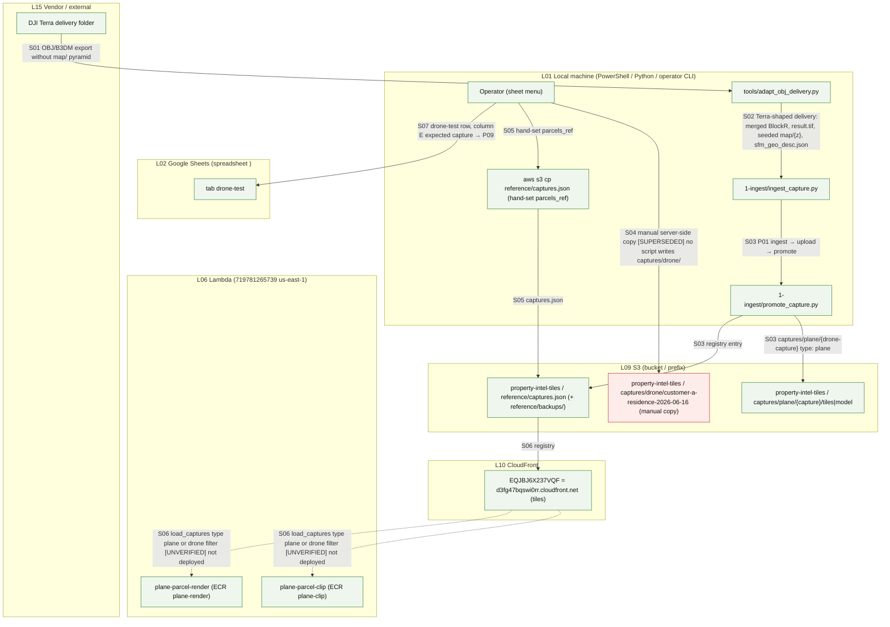

## P11 — Satellite two-pass pin pipeline (mapped 2026-09-15)

**Summary.** Tab `Satellite` (identity = `site_no`, col A). Nadir = a parcel-fitted Google Static Maps image (URL in H); Pass 1 = one Bedrock call over that image with the restricted "twenty" vocabulary → I; human review via element-review; rerun from K with the full 239 vocabulary; Pass 2 = two Bedrock halves (FR → L/M/N, WF → O/P/Q); sync publishes `satellite/{id}.json`, `index/{id}.json` (`security`+`wildfire`), `pins/{id}.json` (source satellite, never over 3d), `hoa/{slug}.json` — to S3 records only. Two self-installed 5-minute triggers. `[src satellite.gs]` `[CL]`.

| Step | Layer | Script / function | Trigger | Input → Output | Source | Status |
|---|---|---|---|---|---|---|
| S01 | Sheets → Apps Script → Google | `prepareSatNadir_`: D address, F/G coords; `geocodeAddress` when F/G empty → writes F/G | inside Pass 1 (`processSatElementPinsRow_`) | address → lat/lng | `[src satellite.gs:934-948; shared.gs:889]` | live |
| S02 | GitHub raw → Apps Script → Google | `fetchParcelRing(lat,lng)` GET `PARCEL_BASE + deschutes_*.geojson` → `parcelBounds` + `zoomForBounds` → `buildParcelFittedNadirUrl` (Static Maps `center`, `zoom`, `size=640x640`, `maptype=satellite`, yellow marker) → H `Nadir URL`; no ring → `selectBestZoom` standard | S01 | ring → Static Maps URL | `[src :953-967, 646-652; shared.gs:757; config.gs:170]` | live (Deschutes grid only) |
| S03 | GitHub Pages → Apps Script | `satFetchPinCatalog_(accountTypeRaw)` GET `PIN_CATALOG_URL` → `emitNames/emitIds` (the twenty / school set), `elementNames/elementIds` (all 239), FR/WF concern sets; cached | Pass 1 / rerun / Pass 2 | catalog JSON | `[src :481; config.gs:144; CL "Fresh Pass 1 = the twenty"]` | live |
| S04 | Google → Apps Script | `fetchImageAsBase64(nadirUrl)` — the Static Maps PNG | Pass 1 / rerun / Pass 2 | image → base64 | `[src :1014]` | live |
| S05 | Apps Script → Bedrock KB | `queryKnowledgeBase(SAT_P1_KB_QUERY_STANDARD or _SCHOOL)` | Pass 1 | KB context | `[src :1010-1012]` | live |
| S06 | Apps Script → Bedrock model → Sheets | `callBedrock(satelliteElementPinsPrompt_ or School + vocabulary + KB, nadir + trailing instruction + satTargetBoxInstruction_, 1000)` → `parseElementPins_` → `satValidateElementPins_(vocabIds, maxPins 12 or 20)` → `satFilterPinsToProperty_` (parcel ring gate) → I `Nadir Elements`, J=false | menu "Generate Element Pins — Pass 1 (Batch / This Row)" (`BATCH_SIZE`=20 rows) | pins JSON or `ERROR:`/`REFUSED off-property` | `[src :988-1066]` | live |
| S07 | Sheets triggers → Apps Script | `startSatElementPinsAuto` installs `generateSatElementPinsAutoRun` every 5 min (ScriptLock) → `runSatElementPinsBatch_` (rows with address and I blank/ERROR) | menu "Start Auto Element Pins" | S06 repeated | `[src :1142-1180]` | live (installed set [UNVERIFIED]) |
| S08 | Apps Script → human → Pages | `openSatElementReviewForActiveRow` → `buildSatElementReviewUrl_` → `element-review.html?site=&site_no=&nadir=<Static Maps URL>&pins=&type=&addr=` (dialog) | top-level menu "Open Element Review (This Row)" | review URL | `[src :1551]` `[H §4.2]` | live |
| S09 | Pages ↔ web app → Sheets | reviewer POSTs critique → `critique-api.gs critiquePost_`: `critiqueFindRow_` (site_no from URL, else address — ambiguous refused) → appends `element-critique` row, writes K `Nadir Fixes`, inline `rerunSatElementPinsRow_(useFullVocab=true)` rewrites I, J=false | reviewer Submit | critique + re-pin | `[src critique-api.gs:1544-1650, 131]` `[KI §site_no format]` | live — open bug #1 add-loss `[CL]` |
| S10 | Apps Script → Bedrock → Sheets | `rerunSatElementPinsForActiveRow` / `rerunSatElementPinsBatch` → `rerunSatElementPinsRow_` (K note, `satApplyFixesNoteCoords_`, full vocabulary) → I; `startSatElementRerunAuto` installs `generateSatElementRerunAutoRun` 5 min | menu "Rerun Element Pins from Fixes" / "Start Auto Rerun" | I rewritten | `[src :1243, 1479-1530]` | live |
| S11 | human → Sheets | reviewer ticks J `Elements Reviewed` | manual | Pass 2 gate | `[src :1735]` | live |
| S12 | Apps Script → Bedrock → Sheets | `runSatPass2Row_` (gate J===true) → `runSatPass2Half_(SAT_PASS2_FR)`: `satFrConcernsPrompt_` + `frConcernNames` + KB, nadir + confirmed pins → `parseSatPass2_`, `validateConcernPins_`, `satFilterPinsToProperty_` → L/M/N; then `SAT_PASS2_WF` → O/P/Q (independent halves) | menu "Generate Pass 2 — FR + Wildfire Concerns (This Row / All Reviewed)" | six cells | `[src :1631-1740]` | live |
| S13 | Sheets → Apps Script | `processSatelliteSheet` / `syncActiveRow`: rows with name+address+valid site_no; `id = satPropertyId_(site_no)`; HOA map from E; rows without I → identity stub index only | menu "Sync Satellite" / "Sync This Row" / `syncNow` | rows → `propertyData {name,address,hoa,account_type,nadir_url,elements,fr{},wildfire{},lat,lng}` | `[src :670-767]` | live |
| S14 | GitHub + S3 records → Apps Script | `upsertIndexEntry_(id, {views:{security:id, wildfire:id}, deleteViews:[satellite,safety,fr], has_nadir, site_no})`; `pinsFileForSync_(id, source:'satellite')` (skipped when existing is `3d`) | S13 | files[] = `data/satellite/{id}.json`, `data/index/{id}.json`, `data/pins/{id}.json`?, `data/hoa/{slug}.json` per HOA | `[src :745-773; shared.gs:343,483]` | live |
| S15 | Apps Script → S3 records | `pushAllToGitHub(files,'Satellite')` → `pushAllToRecords_`: `recordsKeepParcelRing_` + PUT `satellite/{id}.json`; index merge; `pins/{id}.json` (3d wins); `hoa/{slug}.json` | S14 | S3 objects | `[src records.gs:287-322]` | live |
| S16 | Apps Script → GitHub | `recordsIsPagesGithubPath_` → false for satellite/index/pins/hoa under label `Satellite` → no GitHub commit | S15 | nothing | `[src shared.gs:195-199]` | live — **`data/satellite/`, `data/hoa/` on GitHub no longer updated, yet `viewer.html` / `hoa-viewer.html` read them (S18)** |
| S17 | Apps Script → Sheets | R `FR Link` `viewer.html?property={id}&tab=security&mode=fr`, S `WF Link` `…tab=wildfire…`, T `Upload Date`; `updateIntelLinksSheet` | S15 success | cells + `Intel Links` | `[src :777-788]` | live |
| S18 | GitHub Pages → viewers | `viewer.html?property={id}&tab=security` → `data/index/{id}.json` → `data/satellite/{id}.json`; `hoa-viewer.html?hoa={slug}` → `data/hoa/{slug}.json` → members' index/satellite files | responder / hub | JSON → map overlay | `[KI §Viewer resolution]` `[src hoa-viewer.html scan]` | live (GitHub copies) |

```mermaid
flowchart TB
  classDef live fill:#eef6ee,stroke:#2e7d32,color:#111;
  classDef dead fill:#fdecea,stroke:#c62828,color:#111;
  classDef unver fill:#fff8e1,stroke:#f9a825,color:#111,stroke-dasharray:4 3;
  classDef notfound fill:#f3f3f3,stroke:#9e9e9e,color:#555,stroke-dasharray:2 2;
  classDef anchor fill:none,stroke:none,color:transparent,font-size:1px;
  subgraph L01["L01 Local machine (PowerShell / Python / operator CLI)"]
    direction LR
    A01[" "]:::anchor
    HUMAN_operator["Operator (sheet menu)"]:::live
    HUMAN_reviewer["Reviewer (element-review)"]:::live
  end
  subgraph L02["L02 Google Sheets (spreadsheet <spreadsheet-id>)"]
    direction LR
    A02[" "]:::anchor
    SH_satellite["tab Satellite"]:::live
    SH_critique["tab element-critique"]:::live
    SH_intellinks["tab Intel Links"]:::live
    SH_triggers["time triggers: *AutoRun 5 min · pollClip/imagesTick 1 min · recordsSheetAutoTick_ 5 min [installed set UNVERIFIED]"]:::live
  end
  subgraph L03["L03 Google Apps Script — project 'GitHub Property Intel Automation'"]
    direction LR
    A03[" "]:::anchor
    AS_satellite["satellite.gs"]:::live
    AS_shared["shared.gs"]:::live
    AS_prompts["prompts.gs"]:::live
    AS_critique["critique-api.gs (doGet/doPost)"]:::live
    AS_webapp["web app /macros/s/<web-app-deployment-id>…/exec"]:::live
    AS_records["records.gs"]:::live
  end
  subgraph L04["L04 Google Maps / other Google APIs"]
    direction LR
    A04[" "]:::anchor
    GG_geocode["Geocoding API"]:::live
    GG_staticmaps["Static Maps API"]:::live
  end
  subgraph L07["L07 AWS Bedrock"]
    direction LR
    A07[" "]:::anchor
    BR_model["model us.anthropic.claude-sonnet-4-6 (bedrock-runtime)"]:::live
    BR_kb["Knowledge Base 2USE5KFEJ6 property-intel-kb (bedrock-agent-runtime retrieve)"]:::live
  end
  subgraph L09["L09 S3 (bucket / prefix)"]
    direction LR
    A09[" "]:::anchor
    S3_records_satellite["property-intel-records / satellite/{id}.json"]:::live
    S3_records_index["property-intel-records / index/{hubId}.json"]:::live
    S3_records_pins["property-intel-records / pins/{hubId}.json"]:::live
    S3_records_hoa["property-intel-records / hoa/{slug}.json"]:::live
  end
  subgraph L12["L12 GitHub"]
    direction LR
    A12[" "]:::anchor
    GH_raw_parcels["raw.githubusercontent.com/…/main/data/parcels/ (PARCEL_BASE)"]:::live
    GH_data_pincatalog["data/pin-catalog/pins-catalog.json"]:::live
    GH_contents["Contents API api.github.com/repos/…/contents (GITHUB_TOKEN)"]:::live
    GH_data_satellite["data/satellite/{id}.json"]:::live
    GH_data_hoa["data/hoa/{slug}.json"]:::live
    GH_data_index["data/index/{hubId}.json"]:::live
    GH_viewers_er["element-review.html + nadir-geo.js (Pages)"]:::live
    GH_viewers_viewer["viewer.html (Pages)"]:::live
    GH_viewers_hoa["hoa-viewer.html (Pages)"]:::live
  end
  %% Nadir
  SH_satellite -->|"S01 D address, F/G coords"| AS_satellite
  AS_shared -->|"S01 geocodeAddress when F/G empty"| GG_geocode
  AS_satellite -->|"S01 F/G lat lng"| SH_satellite
  GH_raw_parcels -->|"S02 deschutes_{lat}_{lng}.geojson → parcel ring"| AS_shared
  AS_satellite -->|"S02 H Nadir URL = Static Maps center/zoom/marker"| SH_satellite
  %% Pass 1
  HUMAN_operator -->|"S06 menu Generate Element Pins — Pass 1"| AS_satellite
  GH_data_pincatalog -->|"S03 pins-catalog.json → emit twenty / full 239 / concern sets"| AS_satellite
  GG_staticmaps -->|"S04 nadir PNG (fetchImageAsBase64)"| AS_shared
  AS_shared -->|"S05 KB retrieve standard or school query"| BR_kb
  AS_prompts -->|"S06 satelliteElementPinsPrompt_ / School"| AS_satellite
  AS_shared -->|"S06 invoke model: nadir + twenty vocabulary (1000 tokens)"| BR_model
  AS_satellite -->|"S06 I Nadir Elements (validated, parcel-gated), J=false"| SH_satellite
  HUMAN_operator -->|"S07 menu Start Auto Element Pins"| AS_satellite
  AS_satellite -->|"S07 install generateSatElementPinsAutoRun 5 min"| SH_triggers
  SH_triggers -->|"S07 tick → runSatElementPinsBatch_ (20 rows)"| AS_satellite
  %% Review + rerun
  HUMAN_operator -->|"S08 menu Open Element Review (This Row)"| AS_satellite
  AS_satellite -->|"S08 element-review URL site_no nadir pins (dialog)"| HUMAN_reviewer
  HUMAN_reviewer -->|"S08 opens review page"| GH_viewers_er
  GH_viewers_er -->|"S09 POST critique 19-key payload"| AS_webapp
  AS_webapp -->|"S09 doPost → critiquePost_ (site_no / address match)"| AS_critique
  AS_critique -->|"S09 append critique row"| SH_critique
  AS_critique -->|"S09 K Nadir Fixes + inline re-pin rewrites I (full vocabulary)"| SH_satellite
  HUMAN_operator -->|"S10 menu Rerun from Fixes / Start Auto Rerun"| AS_satellite
  AS_satellite -->|"S10 install generateSatElementRerunAutoRun 5 min"| SH_triggers
  AS_shared -->|"S10 invoke model: pins as text + K note (all 239)"| BR_model
  AS_satellite -->|"S10 I rewritten, J=false, K kept"| SH_satellite
  HUMAN_reviewer -->|"S11 tick J Elements Reviewed"| SH_satellite
  %% Pass 2
  HUMAN_operator -->|"S12 menu Generate Pass 2 — FR + Wildfire (gate J)"| AS_satellite
  AS_prompts -->|"S12 satFrConcernsPrompt_ / satWfConcernsPrompt_"| AS_satellite
  AS_shared -->|"S12 KB retrieve FR then WF query"| BR_kb
  AS_shared -->|"S12 invoke model ×2 halves: nadir + confirmed pins (4000 tokens)"| BR_model
  AS_satellite -->|"S12 L/M/N FR, O/P/Q WF (independent halves)"| SH_satellite
  %% Sync
  HUMAN_operator -->|"S13 menu Sync Satellite / Sync This Row / Sync Now (All)"| AS_satellite
  SH_satellite -->|"S13 rows with site_no → satellite JSON + HOA map + identity stubs"| AS_satellite
  GH_contents -->|"S14 GET data/index/{id}.json (upsertIndexEntry_)"| AS_shared
  S3_records_pins -->|"S14 GET pins/{id}.json — keep 3d"| AS_shared
  AS_satellite -->|"S15 pushAllToGitHub files[] label Satellite"| AS_shared
  AS_shared -->|"S15 pushAllToRecords_"| AS_records
  AS_records -->|"S15 PUT satellite/{id}.json (+ parcel ring kept)"| S3_records_satellite
  AS_records -->|"S15 merge index security + wildfire"| S3_records_index
  AS_records -->|"S15 PUT pins/{id}.json source satellite (3d wins)"| S3_records_pins
  AS_records -->|"S15 PUT hoa/{slug}.json"| S3_records_hoa
  AS_shared -->|"S16 no GitHub push for satellite paths [SUPERSEDED] data/satellite + data/hoa no longer written"| GH_data_satellite
  AS_shared -->|"S16 no GitHub push [SUPERSEDED] data/hoa"| GH_data_hoa
  AS_satellite -->|"S17 R FR Link, S WF Link, T Upload Date"| SH_satellite
  AS_shared -->|"S17 updateIntelLinksSheet"| SH_intellinks
  %% Viewer
  GH_data_index -->|"S18 data/index/{id}.json → views.security / wildfire"| GH_viewers_viewer
  GH_data_satellite -->|"S18 data/satellite/{id}.json (GitHub copy)"| GH_viewers_viewer
  GH_data_hoa -->|"S18 data/hoa/{slug}.json → member ids"| GH_viewers_hoa
  A01 ~~~ A02 ~~~ A03 ~~~ A04 ~~~ A07 ~~~ A09 ~~~ A12
```

## P12 — Element critique loop (review page ↔ web app, mapped 2026-09-15)

**Summary.** `element-review.html` (v6.8.x) is the pin-QA page for Satellite, Sandbox, and drone-test rows. It reads the row through the Apps Script web app (`doGet` routes) and posts a 19-key critique (`doPost`) that is logged to `element-critique`, written to the row's Nadir Fixes column, and re-pinned inline. Also hosts route review (`&route=`) for P14 and serves golf/nearmap routes for P20/P19. `[src critique-api.gs]` `[src element-review.html]`.

| Step | Layer | Script / function | Trigger | Input → Output | Source | Status |
|---|---|---|---|---|---|---|
| S01 | human → Pages | reviewer opens the URL built by P11 S08 / P09 S24 / P13 / P14 | click in the sheet dialog | `element-review.html?...&site_no=` or `&view=drone-test&key=` or `&view=sandbox` | `[src satellite.gs:1551; drone-test.gs:967; critique-api.gs "v6.8.15 '1' routes GET/POST to Satellite"]` | live |
| S02 | Pages + Google + CloudFront → page | loads `data/pin-catalog/pins-catalog.json`, `data/parcels/*.geojson`, Maps JS basemap, the nadir image (Static Maps URL or CloudFront JPG), `nadir-geo.js` | page load | overlays | `[src element-review.html scan; nadir-geo.js]` | live |
| S03 | page → web app → Sheets | `GET …/exec?route=elements&site_no=` (or `view=drone-test&key=`, `sandbox=1`) → `critiqueGetElements_` / `critiqueGetDtElements_` reads the row (pins, fixes pending); `route=rounds` → `critiqueGetRounds_` (round history from `element-critique`); `route=pin-freq` → `critiqueGetPinFreq_` (6 h cache) | page load / "Show pins" | row JSON | `[src critique-api.gs:1761-1815, 819, 1860]` | live |
| S04 | page → web app → Sheets | `POST` 19-key payload (verdicts, moves, adds, note, substrate, version) → `critiquePost_` / `critiquePostDt_` → `critiqueEnsureLogSheet_` + `critiqueBuildRow_` → append to `element-critique` (or `Element Critique Sandbox`); `CRITIQUE_PIN_SLOTS` hard limit | Submit | log row | `[src :1298-1462, 1544-1750, 142-176]` | live |
| S05 | web app → Sheets | write the composed note to `Nadir Fixes` (Satellite K / drone-test T / sandbox) | S04 | note | `[src :1374, 1618]` | live |
| S06 | web app → Bedrock → Sheets | `CRITIQUE_RERUN_MODE='inline'` → `rerunSatElementPinsRow_` / `rerunElementPinsRowDT_` inside the request (full 239 vocabulary); snapshot before, pin-loss guard (`critiquePinLoss_`), forced moves/adds (`critiqueApplyForcedPins_`); on success note may be cleared | S05 | pins rewritten | `[src :131, 1379-1423, 1544-1650]` | live — open bug: adds dropped by stale validator `[CL]` |
| S07 | web app → page | JSON response `{ok, round, message, rerunRan, freshPins}`; page redraws pins and re-GETs the row | S06 | UI | `[src :1450-1462, 1728-1748]`; CHANGELOG 08-27 v6.8.8 | live |
| S08 | page → web app | `route=ping` returns build, sheet names, pin slots, rerun mode (deployment check) | manual | JSON | `[src :1768-1786]` | live |

```mermaid
flowchart TB
  classDef live fill:#eef6ee,stroke:#2e7d32,color:#111;
  classDef dead fill:#fdecea,stroke:#c62828,color:#111;
  classDef unver fill:#fff8e1,stroke:#f9a825,color:#111,stroke-dasharray:4 3;
  classDef notfound fill:#f3f3f3,stroke:#9e9e9e,color:#555,stroke-dasharray:2 2;
  classDef anchor fill:none,stroke:none,color:transparent,font-size:1px;
  subgraph L01["L01 Local machine (PowerShell / Python / operator CLI)"]
    direction LR
    A01[" "]:::anchor
    HUMAN_reviewer["Reviewer (element-review)"]:::live
  end
  subgraph L02["L02 Google Sheets (spreadsheet <spreadsheet-id>)"]
    direction LR
    A02[" "]:::anchor
    SH_satellite["tab Satellite"]:::live
    SH_dronetest["tab drone-test"]:::live
    SH_critique["tab element-critique"]:::live
    SH_sandbox["tabs Satellite Sandbox · Element Critique Sandbox"]:::live
  end
  subgraph L03["L03 Google Apps Script — project 'GitHub Property Intel Automation'"]
    direction LR
    A03[" "]:::anchor
    AS_webapp["web app /macros/s/<web-app-deployment-id>…/exec"]:::live
    AS_critique["critique-api.gs (doGet/doPost)"]:::live
    AS_satellite["satellite.gs"]:::live
    AS_dronetest["drone-test.gs"]:::live
  end
  subgraph L04["L04 Google Maps / other Google APIs"]
    direction LR
    A04[" "]:::anchor
    GG_mapsjs["Maps JavaScript API"]:::live
    GG_staticmaps["Static Maps API"]:::live
  end
  subgraph L07["L07 AWS Bedrock"]
    direction LR
    A07[" "]:::anchor
    BR_model["model us.anthropic.claude-sonnet-4-6 (bedrock-runtime)"]:::live
  end
  subgraph L10["L10 CloudFront"]
    direction LR
    A10[" "]:::anchor
    CF_tiles["EQJBJ6X237VQF = d3fg47bqswi0rr.cloudfront.net (tiles)"]:::live
  end
  subgraph L12["L12 GitHub"]
    direction LR
    A12[" "]:::anchor
    GH_viewers_er["element-review.html + nadir-geo.js (Pages)"]:::live
    GH_data_pincatalog["data/pin-catalog/pins-catalog.json"]:::live
    GH_data_parcels["data/parcels/{county}_{lat}_{lng}.geojson"]:::live
  end
  %% Open
  HUMAN_reviewer -->|"S01 open review URL (site_no / view=drone-test key / sandbox)"| GH_viewers_er
  GH_data_pincatalog -->|"S02 pins-catalog.json"| GH_viewers_er
  GH_data_parcels -->|"S02 lot-line tile"| GH_viewers_er
  GG_mapsjs -->|"S02 basemap"| GH_viewers_er
  GG_staticmaps -->|"S02 satellite nadir PNG"| GH_viewers_er
  CF_tiles -->|"S02 drone-test / plane nadir JPG"| GH_viewers_er
  %% Read
  GH_viewers_er -->|"S03 GET route=elements / rounds / pin-freq"| AS_webapp
  AS_webapp -->|"S03 doGet dispatch"| AS_critique
  SH_satellite -->|"S03 row pins + fixes pending"| AS_critique
  SH_dronetest -->|"S03 drone-test row by taxlot key"| AS_critique
  SH_critique -->|"S03 round history"| AS_critique
  %% Submit
  GH_viewers_er -->|"S04 POST critique 19-key payload"| AS_webapp
  AS_webapp -->|"S04 doPost → critiquePost_ / critiquePostDt_"| AS_critique
  AS_critique -->|"S04 append critique row (pin slots)"| SH_critique
  AS_critique -->|"S04 sandbox: Element Critique Sandbox row"| SH_sandbox
  AS_critique -->|"S05 Nadir Fixes note (K)"| SH_satellite
  AS_critique -->|"S05 Nadir Fixes note (T)"| SH_dronetest
  AS_critique -->|"S06 inline rerunSatElementPinsRow_ full vocabulary"| AS_satellite
  AS_critique -->|"S06 inline rerunElementPinsRowDT_"| AS_dronetest
  AS_satellite -->|"S06 invoke model with the note"| BR_model
  AS_critique -->|"S07 ok / round / rerunRan / freshPins"| GH_viewers_er
  GH_viewers_er -->|"S08 GET route=ping (build, rerun mode)"| AS_webapp
  A01 ~~~ A02 ~~~ A03 ~~~ A04 ~~~ A07 ~~~ A10 ~~~ A12
```

## P13 — Satellite Sandbox (mapped 2026-09-15)

**Summary.** A copy of the Satellite tab (`Satellite Sandbox`) with its own critique log (`Element Critique Sandbox`) and its own 5-minute triggers, running the P11/P12 code against sandbox rows. No sync. `[src satellite-sandbox.gs]` `[src config.gs:108-112]`.

| Step | Layer | Script / function | Trigger | Input → Output | Source | Status |
|---|---|---|---|---|---|---|
| S01 | Apps Script → Sheets | `setupSatelliteSandbox` → `sbEnsureSatTab_` + `sbEnsureCritiqueTab_` (orange tab colour) | menu "Set Up Sandbox Tabs" | two tabs | `[src satellite-sandbox.gs setupSatelliteSandbox, sbEnsure*]` | live |
| S02 | Sheets → Apps Script → Sheets | `copySatelliteIntoSandbox` — overwrite sandbox rows from `Satellite` | menu "Copy Satellite → Sandbox (overwrite)" | rows | `[src copySatelliteIntoSandbox]` | live |
| S03 | Apps Script → Bedrock → Sheets | `generateSbElementPinsBatch` / `…ForActiveRow` — P11 S03–S06 against the sandbox tab; `startSbElementPinsAuto` installs `generateSbElementPinsAutoRun` 5 min | menu | I pins | `[src :40, 336-362]` | live |
| S04 | Apps Script → human → Pages → web app | `openSbElementReviewForActiveRow` → `buildSbElementReviewUrl_` (`view=sandbox`) → P12 with `sandbox=1` → `Element Critique Sandbox` | menu "Open SANDBOX Element Review" | critique | `[src buildSbElementReviewUrl_; critique-api.gs critiqueIsSandbox_, critiqueSandboxNames_]` | live |
| S05 | Apps Script → Bedrock → Sheets | `rerunSbElementPins*`; `startSbElementRerunAuto` installs `generateSbElementRerunAutoRun` 5 min | menu | I rewritten | `[src :41, 483-510]` | live |
| S06 | Apps Script → Bedrock → Sheets | `generateSbPass2ForActiveRow` / `generateSbPass2Batch` — P11 S12 against sandbox | menu | L–Q | `[src generateSbPass2*]` | live |
| S07 | — | no sync / publish from the sandbox | — | — | `[src config.gs:109-110 "no GitHub sync"]` | by design |

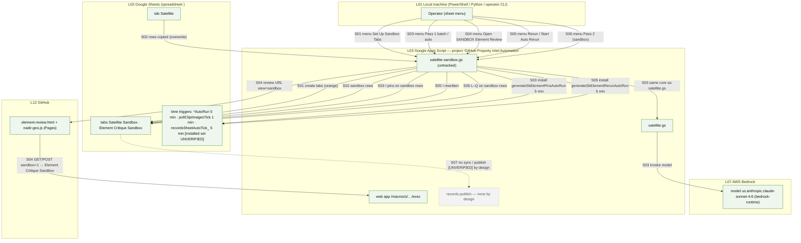

## P14 — Responder Directions (mapped 2026-09-15)

**Summary.** Tab `responder-directions`: one row = one guidance route for a drone-test property (joined by Property Name). Bedrock writes ordered waypoints in nadir-% space; the route is reviewed on `element-review.html?route=`; reviewed routes ride inside the drone-test record at sync (P09 S30). `[src responder-directions.gs]`.

| Step | Layer | Script / function | Trigger | Input → Output | Source | Status |
|---|---|---|---|---|---|---|
| S01 | Apps Script → Sheets | `setupDirectionsSheet` → headers A Property, B Name, C Trigger, D Target, E Start, F Route, G Route Reviewed, H Fixes, I Status | menu "Set Up responder-directions Sheet" | tab | `[src :46-54, 70-80]` | live |
| S02 | Sheets → Apps Script | `rdFindProperty_(name)` reads the matching `drone-test` row (nadir URL, bounds, element pins, approach) | `generateDirectionsRD` / `…ForActiveRow` | property context | `[src :112-120]` | live |
| S03 | GitHub Pages + Bedrock → Apps Script | `runDirectionsCall_`: catalog (`fetchPinCatalog_`), `rdResolveAnchor_` (target/start pin ids), nadir image, `queryKnowledgeBase('first responder property access route …')`, `callBedrock(responderDirectionsPrompt_, 1500)` → `parseDirections_` + `validateWaypoints_` | menu "Generate Directions (This Row / All Ready)"; gate: drone-test row has pins + reviewed | → F `Route` JSON `[{seq,x,y}]`, I status | `[src :221-335; prompts.gs responderDirectionsPrompt_]` | live |
| S04 | Apps Script → human → Pages → web app | `openDirectionsReviewForActiveRowRD` → `buildDirectionsReviewUrl_` → `element-review.html?...&route=<json>` (numbered polyline) | menu "Open Route Review (This Row)" | review URL | `[src :384-415]` | live |
| S05 | human → Sheets | reviewer ticks G `Route Reviewed`; writes H `Fixes` when needed | manual | gate | `[src :52-53]` | live |
| S06 | Apps Script → Bedrock → Sheets | `rerunDirectionsForActiveRowRD` / `rerunDirectionsBatchRD` → `rerunDirectionsRow_` with H note + `responderDirectionsRerunInstruction_` | menu "Rerun from Fixes" | F rewritten | `[src :358-380]` | live |
| S07 | Sheets → Apps Script (P09) | `rdDirectionsForProperty_(name)` returns reviewed routes → drone-test sync attaches `directions[]` (+ local metres via AE) | P09 S30 | routes in `data/drone-test/{viewId}.json` | `[src :457; drone-test.gs:1549-1558]` | live |

```mermaid
flowchart TB
  classDef live fill:#eef6ee,stroke:#2e7d32,color:#111;
  classDef dead fill:#fdecea,stroke:#c62828,color:#111;
  classDef unver fill:#fff8e1,stroke:#f9a825,color:#111,stroke-dasharray:4 3;
  classDef notfound fill:#f3f3f3,stroke:#9e9e9e,color:#555,stroke-dasharray:2 2;
  classDef anchor fill:none,stroke:none,color:transparent,font-size:1px;
  subgraph L01["L01 Local machine (PowerShell / Python / operator CLI)"]
    direction LR
    A01[" "]:::anchor
    HUMAN_operator["Operator (sheet menu)"]:::live
    HUMAN_reviewer["Reviewer (element-review)"]:::live
  end
  subgraph L02["L02 Google Sheets (spreadsheet <spreadsheet-id>)"]
    direction LR
    A02[" "]:::anchor
    SH_directions["tab responder-directions"]:::live
    SH_dronetest["tab drone-test"]:::live
  end
  subgraph L03["L03 Google Apps Script — project 'GitHub Property Intel Automation'"]
    direction LR
    A03[" "]:::anchor
    AS_directions["responder-directions.gs"]:::live
    AS_shared["shared.gs"]:::live
    AS_prompts["prompts.gs"]:::live
    AS_dronetest["drone-test.gs"]:::live
  end
  subgraph L07["L07 AWS Bedrock"]
    direction LR
    A07[" "]:::anchor
    BR_model["model us.anthropic.claude-sonnet-4-6 (bedrock-runtime)"]:::live
    BR_kb["Knowledge Base 2USE5KFEJ6 property-intel-kb (bedrock-agent-runtime retrieve)"]:::live
  end
  subgraph L10["L10 CloudFront"]
    direction LR
    A10[" "]:::anchor
    CF_tiles["EQJBJ6X237VQF = d3fg47bqswi0rr.cloudfront.net (tiles)"]:::live
  end
  subgraph L12["L12 GitHub"]
    direction LR
    A12[" "]:::anchor
    GH_data_pincatalog["data/pin-catalog/pins-catalog.json"]:::live
    GH_viewers_er["element-review.html + nadir-geo.js (Pages)"]:::live
  end
  %% Setup + generate
  HUMAN_operator -->|"S01 menu Set Up responder-directions Sheet"| AS_directions
  AS_directions -->|"S01 headers A–I"| SH_directions
  HUMAN_operator -->|"S03 menu Generate Directions"| AS_directions
  SH_directions -->|"S02 row: property, trigger, target, start"| AS_directions
  SH_dronetest -->|"S02 matching drone-test row: nadir, bounds, pins"| AS_directions
  GH_data_pincatalog -->|"S03 catalog for anchors"| AS_directions
  CF_tiles -->|"S03 nadir JPG"| AS_shared
  AS_shared -->|"S03 KB retrieve route query"| BR_kb
  AS_prompts -->|"S03 responderDirectionsPrompt_"| AS_directions
  AS_shared -->|"S03 invoke model (1500 tokens)"| BR_model
  AS_directions -->|"S03 F Route waypoints, I status"| SH_directions
  %% Review + rerun
  HUMAN_operator -->|"S04 menu Open Route Review"| AS_directions
  AS_directions -->|"S04 element-review URL &route= (dialog)"| HUMAN_reviewer
  HUMAN_reviewer -->|"S04 opens polyline review"| GH_viewers_er
  HUMAN_reviewer -->|"S05 tick G Route Reviewed / write H Fixes"| SH_directions
  HUMAN_operator -->|"S06 menu Rerun from Fixes"| AS_directions
  AS_shared -->|"S06 invoke model with H note"| BR_model
  AS_directions -->|"S06 F rewritten"| SH_directions
  %% Consumed by drone-test sync
  SH_directions -->|"S07 reviewed routes (rdDirectionsForProperty_)"| AS_directions
  AS_directions -->|"S07 directions[] → P09 sync"| AS_dronetest
  A01 ~~~ A02 ~~~ A03 ~~~ A07 ~~~ A10 ~~~ A12
```

## P15 — Sheet → records/GitHub sync trampoline (mapped 2026-09-15)

**Summary.** `shared.gs pushAllToGitHub(files,label)` is called by every sheet sync. Since 2026-09-11 it publishes everything to `property-intel-records` first (`records.gs pushAllToRecords_`), then commits **only** drone paths (`data/responder-drone/`, `data/drone/`) and, for label `drone-test`, `data/drone-test/` + `data/index/` to GitHub via the Git Data API. Everything else that used to reach GitHub Pages (satellite, plane, nearmap, hoa, pins, cameras, gis) stops here. `[src shared.gs:152-223]` `[KR §Writers]`.

| Step | Layer | Script / function | Trigger | Input → Output | Source | Status |
|---|---|---|---|---|---|---|
| S01 | Apps Script | callers: `processSatelliteSheet`/`syncActiveRow` (Satellite), `processPlaneSheet` (Plane), `processDroneTestRows_` (drone-test), `processNearmapSheet`/row (Nearmap) → `pushAllToGitHub(files,label)` | sync menus | `files[] {path:'data/…', content}` | `[src satellite.gs:776; plane.gs:1737; drone-test.gs:1630; nearmap.gs:1638,1659]` | live |
| S02 | Apps Script → S3 records | `pushAllToRecords_` → `recordsPublishGithubPath_` per GitHub-shaped path → SigV4 PUT/GET on `property-intel-records.s3.us-east-1.amazonaws.com` (`recordsS3PutObject_`, 4× retry on transient) | S01 | records objects + index merges | `[src shared.gs:206-215; records.gs:100-116, 287-387]` | live |
| S03 | Apps Script | filter `recordsIsPagesGithubPath_(path,label)`: `data/(responder-drone or drone)/*.json` always; `data/(drone-test or index)/*.json` only when label is `drone-test` | S02 success | subset | `[src shared.gs:189-199]` | live |
| S04 | Apps Script → GitHub | `pushGithubDataFiles_`: GET ref `main` → base commit → POST blobs → POST tree → POST commit `Sync {label} — {date}` → PATCH `refs/heads/main` | S03 non-empty | one commit | `[src shared.gs:152-187]` | live |
| S05 | GitHub → Pages | Pages rebuild serves the committed JSON | S04 | `responder-intel.vyanet.com/data/…` | `[src CNAME]` | live |
| S06 | Apps Script → GitHub | pre-09-11 behaviour: all `files[]` committed to GitHub | — | — | `[KR changelog 09-11 "pushAllToGitHub is a trampoline"]` | superseded (code removed) |

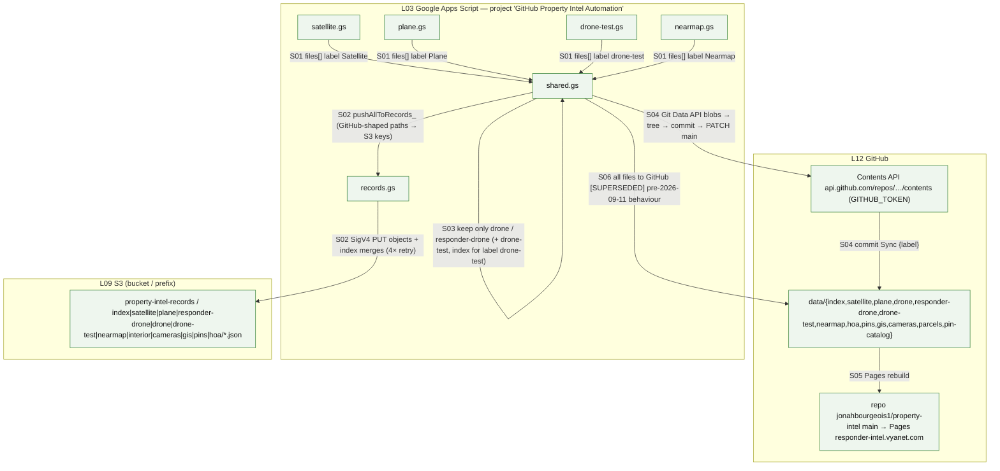

## P16 — Responder Intel (client) publish — tab `Drone` (mapped 2026-09-15)

**Summary.** `responder intel.gs` (`RI v1.0.0`, untracked) publishes complete `Drone`-tab rows as frozen name-hashed `responder-drone/{id}.json` records to S3 records **and** to GitHub with its own Git Data push (not the trampoline), then writes the client link. `responder-intel.html` reads the GitHub copy. `[src responder intel.gs]` `[KI §Identity]`.

| Step | Layer | Script / function | Trigger | Input → Output | Source | Status |
|---|---|---|---|---|---|---|
| S01 | Sheets → Apps Script | `riPublish_(onlyRow)`: rows with name + address; `riMissingFields_` gate (5 URLs + 5 descriptions) | menu "Publish This Row" / "Publish All Complete Rows" | rows → `riBuildPayload_` (`view: drone`, nadir/alpha/…/delta `{url, desc bullets}`, considerations, clarifications, viewer360) | `[src :104-138, 207-259]` | live |
| S02 | Apps Script | `viewId = riHashId_(riSlug_(name)+'-drone', HASH_SALT)` → `data/responder-drone/{viewId}.json` | S01 | frozen id | `[src :249-253]` `[KI "Frozen. Customer links already use this id"]` | live |
| S03 | Apps Script → S3 records | `pushAllToRecords_(files,'Responder Intel')` → `responder-drone/{id}.json` + `recordsJoinViewIndex_('drone')` | user confirms dialog | S3 objects | `[src :283-290; records.gs:308-314]` | live |
| S04 | Apps Script → GitHub | `riPush_` — own Git Data API push to `RI_REPO`/`RI_BRANCH`, commit `Publish Responder Intel — N properties — date` | S03 success | `data/responder-drone/{id}.json` | `[src :142-203]` | live |
| S05 | Apps Script → Sheets | link column = `responder-intel.html?property={viewId}` written only after both pushes | S04 success | cell | `[src :299-302]` | live |
| S06 | GitHub Pages + Google + raw + Zoho + Cloudinary → page | `responder-intel.html?property=` fetches `data/responder-drone/{id}.json` directly (no index), geocodes the address client-side (`config.js` key), loads `data/parcels/` via raw.githubusercontent, embeds the Zoho Survey iframe; legacy records point images at Cloudinary | customer / responder opens link | page | `[KI "responder-intel.html does not go through the index"]` `[src responder-intel.html scan; config.gs:133]` | live |

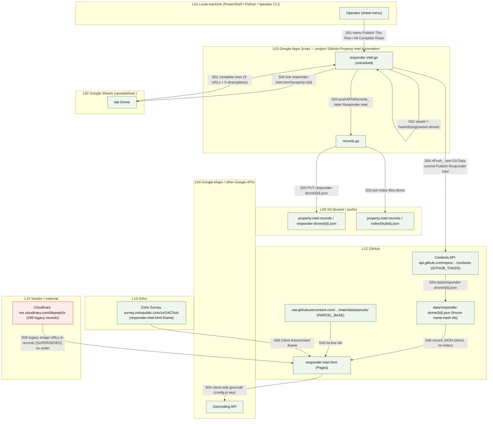

## P17 — Records (S3) mothership publish (mapped 2026-09-15)

**Summary.** `records.gs` walks the sheets tab by tab (`satellite → plane → drone → drone-test → nearmap → retry → hoa`) and PUTs the same payloads the row syncs build into `property-intel-records`, one index per house keyed `hashId(slug(site_no))`. Checkpointed in Script Property `RECORDS_SHEET_MASS_STATE`; 4.5-minute slices; an optional 5-minute trigger resumes until finished. A leftover "GitHub hub copy" mass publish also exists. Nothing reads the bucket yet. `[src records.gs]` `[KR]`.

| Step | Layer | Script / function | Trigger | Input → Output | Source | Status |
|---|---|---|---|---|---|---|
| S01 | Apps Script → S3 records | `checkRecordsWrite` → PUT `_probe/apps-script-write-check.json` | menu "Check records S3 write" | probe object | `[src :453-460]` `[KR "403 AccessDenied means…"]` | live |
| S02 | Apps Script → Sheets props | `publishRecordsFromSheets` / `startRecordsSheetAuto` → state `{phase:'satellite', i:0}` in `RECORDS_SHEET_MASS_STATE`; auto installs `recordsSheetAutoTick_` every 5 min (ScriptLock) | menu "Publish mothership to records" / "Start mothership overnight" | state | `[src :1121-1123, 1750, 1839-1926]` | live |
| S03 | Sheets → Apps Script | `recordsSatMassTick_` reads the phase's tab (`getDataRange`) and processes rows until 4.5 min | S02 / tick | rows | `[src :1598-1697]` | live |
| S04 | Apps Script → S3 records | per row: `recordsPublishSatelliteSheetRow_` (satellite + identity stub + parcel ring), `recordsPublishPlaneSheetRow_`, `recordsPublishDroneSheetRow_` (Drone tab via `RI_C`), `recordsPublishDroneTestSheetRow_`, `recordsPublishNearmapSheetRow_` (`nmBuildRecord_`) → `recordsPutJson_` + `recordsUpsertIndex_`/`recordsJoinViewIndex_` | S03 | `satellite/…`, `plane/…`, `responder-drone/…`, `drone-test/…`, `nearmap/…`, `index/{hub}.json`, `pins/{hub}.json` | `[src :1151-1500]` | live |
| S05 | Apps Script → Sheets props | failures → `state.failRows`; phase `retry` → `recordsRetryFailTick_` re-runs them (`retryRecordsFailedSheetRows` menu does the same without moving the checkpoint) | S04 errors | retried rows | `[src :1571-1596, 1928]` `[KR changelog 09-11]` | live |
| S06 | Sheets → Apps Script → S3 records | phase `hoa`: `recordsBuildHoaMapFromSatelliteSheet_` → PUT `hoa/{slug}.json` per HOA | after retry | HOA files | `[src :1699-1724]` | live |
| S07 | Apps Script | `checkRecordsSatSheetPublish` / `resumeRecordsSatSheetPublish` / `cancelRecordsSatSheetPublish` / `stopRecordsSheetAuto` — status, resume, cancel (deletes trigger + state) | menu | state | `[src records.gs; menu.gs Records (S3)]` | live |
| S08 | GitHub → Apps Script → S3 records | `publishRecordsAllHubs` → `recordsMassTick_` → `recordsPublishHubFromGithub_(hubId)` copies GitHub `data/index/{hub}.json` + view JSON into the bucket (first bucket fill) | menu (no longer listed in `menu.gs`) | name-hash hub objects | `[src :20-21, 632, 1045]` `[KR changelog 09-10 "not the mothership layout"]` | superseded-but-deployed |
| S09 | S3 records → CloudFront | `E2GZ8OZSJKL173` / `d1h1on7f1v1lpy.cloudfront.net` (OAC, CachingDisabled) serves the bucket | — | no viewer reads it | `[KR §CloudFront, "Live Pages HTML still reads GitHub"]` | live, no consumer |

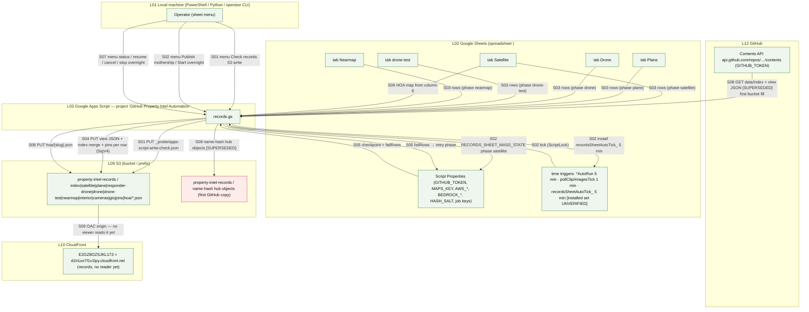

## P18 — Static publish git → AWS (cameras, GIS, parcels; mapped 2026-09-15)

**Summary.** Two writers for the same keys: the laptop script `tools/publish-records-static.py` (parcels → tiles, camera stills → tiles, cameras/GIS JSON → records + index merge, Customer B plane/drone attach) and the Apps Script `publishRecordsSidecarsFromGithub` (cameras/GIS JSON only, via the Contents API). Source of truth for cameras/GIS is git, not the Sheet. `[src publish-records-static.py]` `[src records.gs:528-630]` `[KR §Writers]`.

| Step | Layer | Script / function | Trigger | Input → Output | Source | Status |
|---|---|---|---|---|---|---|
| S01 | Local → S3 | `publish-records-static.py --parcels` → `sync_parcels` `aws s3 sync data/parcels → s3://property-intel-tiles/parcels/` | manual CLI | 506 GeoJSON | `[src :116-127]` | live |
| S02 | Local → S3 | `--cameras` → `publish_cameras`: `aws s3 sync data/cameras/images/{gitId} → tiles/cameras/{hubId}/` (`CAM_HUB` remap) | manual CLI | stills | `[src :130-145]` | live |
| S03 | Local → S3 records | `rewrite_cameras` (photo URLs → `TILES_CF/cameras/{hub}/`) → `s3api put-object cameras/{hub}.json`; GET `index/{hub}.json` → set `files.cameras` → PUT | S02 | JSON + index merge | `[src :146-159]` | live |
| S04 | Local → S3 records | `--gis` → `publish_gis`: `data/gis/{gitId}.json` → `gis/{hub}.json` + index `files.gis` (`GIS_HUB` remap, Customer A fork skipped) | manual CLI | JSON + index | `[src :162-184]` | live |
| S05 | Local → S3 records | `attach_customer_b_views` → Customer B index `files.plane`, `files.drone`, `views` | with `--cameras` | index | `[src :186-198]` | live (Customer B-specific hardcode) |
| S06 | GitHub → Apps Script → S3 records | `publishRecordsSidecarsFromGithub` → `recordsPublishSidecarCameras_` / `recordsPublishSidecarGis_` read `data/cameras/json/{gitId}.json`, `data/gis/{gitId}.json` via Contents API → `recordsSidecarHubId_` remap → PUT + index merge; no JPEGs, no parcels | menu "Copy cameras + GIS from GitHub" | JSON | `[src records.gs:479-630]` `[KR §Writers]` | live |
| S07 | human → GitHub | camera stills and camera/GIS JSON are hand-committed to `data/cameras/`, `data/gis/` (Apps Script drone-test sync may PUT `data/cameras/json/{hubId}.json`; CHANGELOG 08-27 shows hand files) | manual | git files | `[KI §Cameras]`, CHANGELOG 2026-08-27 | live (manual) |

```mermaid
flowchart TB
  classDef live fill:#eef6ee,stroke:#2e7d32,color:#111;
  classDef dead fill:#fdecea,stroke:#c62828,color:#111;
  classDef unver fill:#fff8e1,stroke:#f9a825,color:#111,stroke-dasharray:4 3;
  classDef notfound fill:#f3f3f3,stroke:#9e9e9e,color:#555,stroke-dasharray:2 2;
  classDef anchor fill:none,stroke:none,color:transparent,font-size:1px;
  subgraph L01["L01 Local machine (PowerShell / Python / operator CLI)"]
    direction LR
    A01[" "]:::anchor
    HUMAN_operator["Operator (sheet menu)"]:::live
    LC_pubstatic["tools/publish-records-static.py (untracked)"]:::live
  end
  subgraph L03["L03 Google Apps Script — project 'GitHub Property Intel Automation'"]
    direction LR
    A03[" "]:::anchor
    AS_records["records.gs"]:::live
  end
  subgraph L09["L09 S3 (bucket / prefix)"]
    direction LR
    A09[" "]:::anchor
    S3_tiles_parcels["property-intel-tiles / parcels/{county}_{lat}_{lng}.geojson"]:::live
    S3_tiles_cameras["property-intel-tiles / cameras/{hubId}/cam-NN.jpg"]:::live
    S3_records_cameras["property-intel-records / cameras/{hubId}.json"]:::live
    S3_records_gis["property-intel-records / gis/{hubId}.json"]:::live
    S3_records_index["property-intel-records / index/{hubId}.json"]:::live
  end
  subgraph L12["L12 GitHub"]
    direction LR
    A12[" "]:::anchor
    GH_data_parcels["data/parcels/{county}_{lat}_{lng}.geojson"]:::live
    GH_data_cameras["data/cameras/json/{hubId}.json + images/{hubId}/cam-NN.jpg"]:::live
    GH_data_gis["data/gis/{hubId}.json"]:::live
    GH_contents["Contents API api.github.com/repos/…/contents (GITHUB_TOKEN)"]:::live
  end
  %% Laptop script
  HUMAN_operator -->|"S07 hand-commit stills + cameras / GIS JSON"| GH_data_cameras
  HUMAN_operator -->|"S07 hand-commit GIS facts"| GH_data_gis
  GH_data_parcels -->|"S01 local checkout"| LC_pubstatic
  LC_pubstatic -->|"S01 aws s3 sync parcels"| S3_tiles_parcels
  GH_data_cameras -->|"S02 local checkout stills + JSON"| LC_pubstatic
  LC_pubstatic -->|"S02 aws s3 sync stills → cameras/{hubId}/"| S3_tiles_cameras
  LC_pubstatic -->|"S03 put cameras/{hub}.json (photo URLs → tiles CloudFront)"| S3_records_cameras
  LC_pubstatic -->|"S03 index files.cameras merge"| S3_records_index
  GH_data_gis -->|"S04 local checkout"| LC_pubstatic
  LC_pubstatic -->|"S04 put gis/{hub}.json"| S3_records_gis
  LC_pubstatic -->|"S04 index files.gis merge"| S3_records_index
  LC_pubstatic -->|"S05 Customer B index files.plane + files.drone"| S3_records_index
  %% Apps Script sidecar
  HUMAN_operator -->|"S06 menu Copy cameras + GIS from GitHub"| AS_records
  GH_contents -->|"S06 GET data/cameras/json + data/gis"| AS_records
  AS_records -->|"S06 PUT cameras/{hub}.json + index"| S3_records_cameras
  AS_records -->|"S06 PUT gis/{hub}.json + index"| S3_records_gis
  A01 ~~~ A03 ~~~ A09 ~~~ A12
```

## P19 — Nearmap trial pipeline (mapped 2026-09-15)

**Summary.** Isolated trial: vendor zip (or API pull) → canonical tree → serving subset promoted to `property-intel-tiles/nearmap/{delivery_id}/` + `reference/nearmap.json` → imported into tab `Nearmap` → reviewer edits regions/pins in `nearmap-review.html` (saved to S3 `ai/edits/regions.json` via Apps Script SigV4 PUT) → Pass 3 FR/WF concerns via Bedrock → sync `data/nearmap/{id}.json` to records → `nearmap-viewer.html`. Nearmap **Pass 1** code exists with no menu item. `[KN]` `[RN]` `[src nearmap.gs; tools/nearmap/*]`.

| Step | Layer | Script / function | Trigger | Input → Output | Source | Status |
|---|---|---|---|---|---|---|
| S01 | Vendor → Local | `customer-c.zip` (Transactional API folder + MapBrowser 3D zips) on disk; optional `aws s3 cp` to `property-intel-ingest/nearmap/{delivery}/raw/` | manual | zip | `[RN §1]` | live (trial) |
| S02 | Vendor API → Local | `tools/nearmap/fetch_tx.py --address … --preview / --commit` (`NEARMAP_API_KEY`) → Vert / N/E/S/W / DSM / DTM / TrueOrtho + AI into the canonical tree; `pack_tx_folder.py` for a downloaded probe folder | manual CLI | API → canonical | `[src fetch_tx.py docstring; pack_tx_folder.py]` `[RN §Columbia]` | live (trial) |
| S03 | Local | `normalize.py --zip … --out tmp/nearmap-canonical --serve-out tmp/nearmap-serve` → `manifest.json`, `vert.jpg`, `vert-p1.jpg`, N/E/S/W JPGs, `ai/features.json`, `ai/hints.json`, `ai/original/regions.json`, `ai/edits/regions.json`; `seed_regions.py` reseeds | manual CLI | canonical + serve trees | `[RN §2]` `[KN §Canonical tree]` | live (trial) |
| S04 | Local | `lot_clip.py --serve-dir --delivery` → `vert-lot.jpg`, `vert-lot-p1.jpg`, `lot.json`, `observed.json`, manifest `urls.vert_lot`/`bounds_lot` (taxlot from `data/parcels/` or Pages) | manual CLI | lot products | `[KN §lot_clip.py]` | live (trial) |
| S05 | Local | `mesh_to_glb.py --zip --member --serve-dir` → `mesh/model.glb` (Draco via `npx gltf-pipeline`), `mesh/mesh.json`, manifest `urls.mesh` | manual CLI | GLB | `[RN §2b]` `[KN §Mesh]` | live (trial) |
| S06 | Local → S3 → CloudFront | `promote.py --serve-dir --delivery [--files --url]` → upload serve tree (`put_and_head`), seed `ai/edits/regions.json` if absent, merge `reference/nearmap.json`, invalidate `/nearmap/{id}/*` + `/reference/nearmap.json`; optional `aws s3 sync canonical → ingest` | manual CLI | tiles objects + registry | `[RN §3]` `[src promote.py]` | live (trial) |
| S07 | Apps Script → Sheets | `setupNearmapSheet` (tab `Nearmap`, headers A–AC, appended at end) | menu "Set Up Nearmap Sheet" | tab | `[src nearmap.gs setupNearmapSheet; config.gs:247-285]` | live |
| S08 | CloudFront → Apps Script → Sheets | `importNearmapRegistry` GET `NM_REGISTRY_URL` → rows H delivery, I survey date, J nadir URL, K bounds, L–O obliques, P AI URL, Q manifest URL; Site No (A) filled by hand | menu "Import from CloudFront registry" | rows | `[src :506-511; config.gs:162]` `[RN §4]` | live |
| S09 | Apps Script → human → Pages | `openNearmapReviewForActiveRow` (`?mode=regions`) / `openNearmapPinsForActiveRow` (`?mode=pins`) → `nearmap-review.html?site_no=&delivery=` | menu | review URL | `[src :1672-1705]` `[RN §Two editors]` | live |
| S10 | CloudFront + Pages + Google + web app → page | `nearmap-review.html` loads `vert.jpg`, `ai/original/regions.json` (cacheable), `ai/edits/regions.json` (no-store), `pins-catalog.json`, Maps JS; `GET ?route=nearmap-elements&site_no=` → `nmGetElements_` (pins R, W summary, regions URLs) | page load | overlays | `[src critique-api.gs:1802; nearmap.gs:1730-1790]` `[KN §Review fetch]` | live |
| S11 | page → web app → S3 + Sheets | Save → `POST route=nearmap-save` → `nmSavePins_`: `nmValidateRegionsDoc_` → `nmS3PutObject_` SigV4 PUT `nearmap/{delivery}/ai/edits/regions.json` (`Cache-Control: no-cache`); pins editor → R packed `{v:2,c,p}`; `nmWriteW_` summary → W | reviewer Save | S3 edits + cells | `[src :231, 336, 1831-1895]` `[KN §Regions]` | live |
| S12 | human → Sheets | tick S `Elements Reviewed` | manual | Pass 3 gate | `[KN §Pass 3 Gate]` | live |
| S13 | CloudFront + Bedrock → Apps Script → Sheets | `runNearmapPass3Row_` (gate S + region-style R) → `runNearmapPass3Half_` ×2: `nmFetchNadirForBedrock_` (`vert-lot-p1.jpg` then `vert-p1.jpg`), `nmAppendObliqueImages_` (budget), confirmed pins as class names, `nmFetchRegionsCounts_` (counts only), KB, `callBedrock(nmFrConcernsPrompt_ / nmWfConcernsPrompt_, 4000)` → `parseNmPass3_`, `validateConcernPins_` (plane.gs), `nmFilterConcernsToLot_` → X–Z FR, AA–AC WF | menu "Generate Pass 3 — FR + Wildfire (This Row / All Reviewed)" | six cells | `[src :825, 1155-1345]` `[KN §Pass 3]` | live |
| S14 | Sheets → Apps Script → S3 records | `processNearmapSheet` / `processNearmapForActiveRow` → `nmQueueSyncRow_` → `nmBuildRecord_` (`view: nearmap`, nadir + bounds, obliques, `ai_url`, elements, drawn, `regions{original, edits}`, fr/wildfire) → `pushAllToGitHub(files,'Nearmap')` → records `nearmap/{id}.json` + index `files.nearmap`; U = `nearmap-viewer.html?full=1&site_no=&delivery=`; no GitHub commit; `NM_UPSERT_INDEX=false` on Pages | menu "Sync This Row" / "Sync Nearmap" | record | `[src :1551-1670; records.gs:298-302]` `[KN §Identity]` | live |
| S15 | Pages + CloudFront + web app → viewer | `nearmap-viewer.html?full=1&delivery=&site_no=` loads `manifest.json`, `vert.jpg`, regions, `mesh/model.glb`, `ai/firerisk.json`, `data/parcels/` tile; background `nearmap-elements`; `NEARMAP_DELIVERY_HUB` redirect to `vyanet-viewer.html` | menu "Open Nearmap Viewer" / hub Private → Nearmap | page | `[KN §Nearmap viewer]` `[src nearmap-viewer.html scan; property.js]` | live (trial) |
| S16 | Apps Script → Bedrock → Sheets | `runNearmapElementPinsCall_` / `generateNearmapElementPinsForActiveRow` / `…Batch` — Nearmap Pass 1 over `hints.json` centroids | **no menu item** | R pins | `[src :936-1000]`; `[src menu.gs]` has no entry | dead code (unreachable from the menu) |
| S17 | Local | `review_server.py 8899` — local PUT of `ai/edits/regions.json` for `delivery=`-only sessions | manual | local file | `[RN §5]` | live (dev) |

```mermaid
flowchart TB
  classDef live fill:#eef6ee,stroke:#2e7d32,color:#111;
  classDef dead fill:#fdecea,stroke:#c62828,color:#111;
  classDef unver fill:#fff8e1,stroke:#f9a825,color:#111,stroke-dasharray:4 3;
  classDef notfound fill:#f3f3f3,stroke:#9e9e9e,color:#555,stroke-dasharray:2 2;
  classDef anchor fill:none,stroke:none,color:transparent,font-size:1px;
  subgraph L01["L01 Local machine (PowerShell / Python / operator CLI)"]
    direction LR
    A01[" "]:::anchor
    HUMAN_operator["Operator (sheet menu)"]:::live
    HUMAN_reviewer["Reviewer (element-review)"]:::live
    LC_nearmaptools["tools/nearmap/{normalize, pack_tx_folder, fetch_tx, seed_regions, lot_clip, mesh_to_glb, promote, review_server}.py"]:::live
  end
  subgraph L02["L02 Google Sheets (spreadsheet <spreadsheet-id>)"]
    direction LR
    A02[" "]:::anchor
    SH_nearmap["tab Nearmap"]:::live
  end
  subgraph L03["L03 Google Apps Script — project 'GitHub Property Intel Automation'"]
    direction LR
    A03[" "]:::anchor
    AS_nearmap["nearmap.gs"]:::live
    AS_shared["shared.gs"]:::live
    AS_records["records.gs"]:::live
    AS_webapp["web app /macros/s/<web-app-deployment-id>…/exec"]:::live
    AS_plane["plane.gs"]:::live
  end
  subgraph L04["L04 Google Maps / other Google APIs"]
    direction LR
    A04[" "]:::anchor
    GG_mapsjs["Maps JavaScript API"]:::live
  end
  subgraph L07["L07 AWS Bedrock"]
    direction LR
    A07[" "]:::anchor
    BR_model["model us.anthropic.claude-sonnet-4-6 (bedrock-runtime)"]:::live
    BR_kb["Knowledge Base 2USE5KFEJ6 property-intel-kb (bedrock-agent-runtime retrieve)"]:::live
  end
  subgraph L09["L09 S3 (bucket / prefix)"]
    direction LR
    A09[" "]:::anchor
    S3_ingest_nearmap["property-intel-ingest / nearmap/{delivery}/raw|canonical"]:::live
    S3_tiles_nearmap["property-intel-tiles / nearmap/{delivery_id}/ (vert*.jpg, N/E/S/W, ai/*, mesh/*, manifest.json)"]:::live
    S3_ref_nearmap["property-intel-tiles / reference/nearmap.json"]:::live
    S3_records_nearmap["property-intel-records / nearmap/{id}.json"]:::live
    S3_records_index["property-intel-records / index/{hubId}.json"]:::live
  end
  subgraph L10["L10 CloudFront"]
    direction LR
    A10[" "]:::anchor
    CF_tiles["EQJBJ6X237VQF = d3fg47bqswi0rr.cloudfront.net (tiles)"]:::live
  end
  subgraph L12["L12 GitHub"]
    direction LR
    A12[" "]:::anchor
    GH_data_pincatalog["data/pin-catalog/pins-catalog.json"]:::live
    GH_data_parcels["data/parcels/{county}_{lat}_{lng}.geojson"]:::live
    GH_viewers_nmreview["nearmap-review.html (Pages)"]:::live
    GH_viewers_nm["nearmap-viewer.html + nearmap-lot.js (Pages)"]:::live
    GH_viewers_hub["vyanet-viewer.html + js/vyanet-viewer/property.js (Pages)"]:::live
  end
  subgraph L15["L15 Vendor / external"]
    direction LR
    A15[" "]:::anchor
    EX_nearmap_zip["Nearmap manual exports (customer-c.zip)"]:::live
    EX_nearmap_api["Nearmap api.nearmap.com (fetch_tx.py)"]:::live
    EX_cdn["cdnjs three.js r128 · jsdelivr · gstatic draco · fonts"]:::live
  end
  %% Ingest (local)
  EX_nearmap_zip -->|"S01 customer-c.zip on disk (raw copy to ingest optional)"| LC_nearmaptools
  LC_nearmaptools -->|"S01 aws s3 cp raw/ (optional archive)"| S3_ingest_nearmap
  EX_nearmap_api -->|"S02 fetch_tx.py Vert N/E/S/W DSM DTM AI (NEARMAP_API_KEY)"| LC_nearmaptools
  LC_nearmaptools -->|"S03 normalize.py → canonical + serve trees"| LC_nearmaptools
  GH_data_parcels -->|"S04 taxlot tile for lot_clip.py"| LC_nearmaptools
  LC_nearmaptools -->|"S05 mesh_to_glb.py → mesh/model.glb (Draco)"| LC_nearmaptools
  %% Promote
  LC_nearmaptools -->|"S06 promote.py put_and_head serve tree + seed ai/edits"| S3_tiles_nearmap
  LC_nearmaptools -->|"S06 merge reference/nearmap.json"| S3_ref_nearmap
  LC_nearmaptools -->|"S06 invalidate /nearmap/{id}/* + /reference/nearmap.json"| CF_tiles
  LC_nearmaptools -->|"S06 aws s3 sync canonical/ (optional)"| S3_ingest_nearmap
  %% Sheet
  HUMAN_operator -->|"S07 menu Set Up Nearmap Sheet"| AS_nearmap
  AS_nearmap -->|"S07 headers A–AC"| SH_nearmap
  HUMAN_operator -->|"S08 menu Import from CloudFront registry (+ Site No by hand)"| AS_nearmap
  S3_ref_nearmap -->|"S08 reference/nearmap.json"| CF_tiles
  CF_tiles -->|"S08 registry deliveries"| AS_nearmap
  AS_nearmap -->|"S08 H–Q delivery, dates, URLs"| SH_nearmap
  %% Review + save
  HUMAN_operator -->|"S09 menu Open Nearmap Regions / Pins Editor"| AS_nearmap
  AS_nearmap -->|"S09 nearmap-review.html?mode=&site_no=&delivery="| HUMAN_reviewer
  HUMAN_reviewer -->|"S09 opens editor"| GH_viewers_nmreview
  S3_tiles_nearmap -->|"S10 vert.jpg + ai/original + ai/edits regions"| CF_tiles
  CF_tiles -->|"S10 stills + regions"| GH_viewers_nmreview
  GH_data_pincatalog -->|"S10 pins-catalog.json"| GH_viewers_nmreview
  GG_mapsjs -->|"S10 basemap"| GH_viewers_nmreview
  GH_viewers_nmreview -->|"S10 GET route=nearmap-elements site_no"| AS_webapp
  AS_webapp -->|"S10 nmGetElements_ (R pins, W summary, regions URLs)"| AS_nearmap
  GH_viewers_nmreview -->|"S11 POST route=nearmap-save regions / pins"| AS_webapp
  AS_webapp -->|"S11 nmSavePins_"| AS_nearmap
  AS_nearmap -->|"S11 SigV4 PUT ai/edits/regions.json (no-cache)"| S3_tiles_nearmap
  AS_nearmap -->|"S11 R packed pins, W summary"| SH_nearmap
  HUMAN_reviewer -->|"S12 tick S Elements Reviewed"| SH_nearmap
  %% Pass 3
  HUMAN_operator -->|"S13 menu Generate Pass 3 — FR + Wildfire"| AS_nearmap
  CF_tiles -->|"S13 vert-lot-p1.jpg / vert-p1.jpg + obliques + region counts"| AS_nearmap
  AS_shared -->|"S13 KB retrieve FR / WF"| BR_kb
  AS_shared -->|"S13 invoke model ×2 halves (4000 tokens)"| BR_model
  AS_plane -->|"S13 validateConcernPins_ (reused)"| AS_nearmap
  AS_nearmap -->|"S13 X–Z FR, AA–AC WF"| SH_nearmap
  %% Sync
  HUMAN_operator -->|"S14 menu Sync This Row / Sync Nearmap"| AS_nearmap
  SH_nearmap -->|"S14 row → nmBuildRecord_"| AS_nearmap
  AS_nearmap -->|"S14 pushAllToGitHub files[] label Nearmap"| AS_shared
  AS_shared -->|"S14 pushAllToRecords_"| AS_records
  AS_records -->|"S14 PUT nearmap/{id}.json"| S3_records_nearmap
  AS_records -->|"S14 index files.nearmap + views.nearmap"| S3_records_index
  AS_nearmap -->|"S14 U viewer link (?full=1)"| SH_nearmap
  %% Viewer
  HUMAN_operator -->|"S15 menu Open Nearmap Viewer"| AS_nearmap
  CF_tiles -->|"S15 manifest.json, vert.jpg, regions, mesh/model.glb, ai/firerisk.json"| GH_viewers_nm
  GH_data_parcels -->|"S15 lot-line tile"| GH_viewers_nm
  EX_cdn -->|"S15 three.js r128 + draco"| GH_viewers_nm
  GH_viewers_nm -->|"S15 GET nearmap-elements (background)"| AS_webapp
  GH_viewers_nm -->|"S15 redirect via NEARMAP_DELIVERY_HUB (stage=home)"| GH_viewers_hub
  %% Dead Pass 1 + local server
  AS_nearmap -->|"S16 Nearmap Pass 1 hints.json centroids [DEAD] no menu item"| BR_model
  LC_nearmaptools -->|"S17 review_server.py 8899 local edits PUT"| LC_nearmaptools
  A01 ~~~ A02 ~~~ A03 ~~~ A04 ~~~ A07 ~~~ A09 ~~~ A10 ~~~ A12 ~~~ A15
```

## P20 — Golf pipeline (mapped 2026-09-15)

**Summary.** Tabs `Golf` + `Golf Pins`; geocode-only Pass 1; pins are placed by hand on `golf-review.html` and saved through the web app. No Bedrock, no records, no GitHub. `[src golf.gs]` `[src menu.gs:28-29]`.

| Step | Layer | Script / function | Trigger | Input → Output | Source | Status |
|---|---|---|---|---|---|---|
| S01 | Apps Script → Sheets | `setupGolfSheet` (A–J), `setupGolfPinsSheet` (`Id, Name, Definition, Section`, seeded by `golfCatalogFromSeed_`) | menu "Set Up Golf Sheet" / "Set Up Golf Pins Sheet" | tabs | `[src golf.gs:298-330; config.gs:227-242]` | live |
| S02 | Sheets → Apps Script → Google → Sheets | `golfGeocodeRow_` → `geocodeAddress` → F/G, J status; batch `generateGolfGeocodeBatch` (rows missing coords) | menu "Geocode Address — Pass 1" | lat/lng | `[src :538-600]` | live |
| S03 | Apps Script → human → Pages | `openGolfReviewForActiveRow` → `buildGolfReviewUrl_` → `golf-review.html?site_no=…` | menu "Open Golf Review (This Row)" | review URL | `[src :615]` | live |
| S04 | Pages → web app → Sheets | `golf-review.html` `GET route=golf-catalog` (`golfGetCatalog_` from `Golf Pins`) and `route=golf-elements&site_no=` (`golfGetElements_`); Maps JS basemap | page load | catalog + pins | `[src critique-api.gs:1790-1801; golf.gs:386,471]` | live |
| S05 | Pages → web app → Sheets | `POST route=golf-save` → `golfSavePins_` → `golfValidatePins_` (`GOLF_MAX_PINS`=200, refuse over) → H `Nadir Elements` `[{id,lat,lng}]`, I reviewed tick | reviewer Save | H | `[src critique-api.gs:1832-1837; golf.gs:501]` | live |
| S06 | — | publish / sync | — | — | `[src menu.gs:29 "no GitHub"]` | not built (by design this round) |

```mermaid
flowchart TB
  classDef live fill:#eef6ee,stroke:#2e7d32,color:#111;
  classDef dead fill:#fdecea,stroke:#c62828,color:#111;
  classDef unver fill:#fff8e1,stroke:#f9a825,color:#111,stroke-dasharray:4 3;
  classDef notfound fill:#f3f3f3,stroke:#9e9e9e,color:#555,stroke-dasharray:2 2;
  classDef anchor fill:none,stroke:none,color:transparent,font-size:1px;
  subgraph L01["L01 Local machine (PowerShell / Python / operator CLI)"]
    direction LR
    A01[" "]:::anchor
    HUMAN_operator["Operator (sheet menu)"]:::live
    HUMAN_reviewer["Reviewer (element-review)"]:::live
  end
  subgraph L02["L02 Google Sheets (spreadsheet <spreadsheet-id>)"]
    direction LR
    A02[" "]:::anchor
    SH_golf["tabs Golf · Golf Pins"]:::live
  end
  subgraph L03["L03 Google Apps Script — project 'GitHub Property Intel Automation'"]
    direction LR
    A03[" "]:::anchor
    AS_golf["golf.gs"]:::live
    AS_shared["shared.gs"]:::live
    AS_webapp["web app /macros/s/<web-app-deployment-id>…/exec"]:::live
    AS_nopublish["golf publish / sync — not built"]:::notfound
  end
  subgraph L04["L04 Google Maps / other Google APIs"]
    direction LR
    A04[" "]:::anchor
    GG_geocode["Geocoding API"]:::live
    GG_mapsjs["Maps JavaScript API"]:::live
  end
  subgraph L12["L12 GitHub"]
    direction LR
    A12[" "]:::anchor
    GH_viewers_golf["golf-review.html (Pages)"]:::live
  end
  %% Setup + geocode
  HUMAN_operator -->|"S01 menu Set Up Golf / Golf Pins Sheet"| AS_golf
  AS_golf -->|"S01 headers + seeded catalog"| SH_golf
  HUMAN_operator -->|"S02 menu Geocode Address — Pass 1"| AS_golf
  SH_golf -->|"S02 D address"| AS_golf
  AS_shared -->|"S02 geocodeAddress"| GG_geocode
  AS_golf -->|"S02 F/G coords, J status"| SH_golf
  %% Review + save
  HUMAN_operator -->|"S03 menu Open Golf Review"| AS_golf
  AS_golf -->|"S03 golf-review.html?site_no= (dialog)"| HUMAN_reviewer
  HUMAN_reviewer -->|"S03 opens page"| GH_viewers_golf
  GG_mapsjs -->|"S04 basemap"| GH_viewers_golf
  GH_viewers_golf -->|"S04 GET route=golf-catalog / golf-elements"| AS_webapp
  AS_webapp -->|"S04 golfGetCatalog_ / golfGetElements_"| AS_golf
  SH_golf -->|"S04 Golf Pins catalog + row pins"| AS_golf
  GH_viewers_golf -->|"S05 POST route=golf-save pins"| AS_webapp
  AS_webapp -->|"S05 golfSavePins_ (cap 200, refuse over)"| AS_golf
  AS_golf -->|"S05 H Nadir Elements [{id,lat,lng}]"| SH_golf
  SH_golf -.->|"S06 no publish [UNVERIFIED] by design"| AS_nopublish
  A01 ~~~ A02 ~~~ A03 ~~~ A04 ~~~ A12
```

## P21 — KB / Bedrock / OpenSearch (mapped 2026-09-15)

**Summary.** Every AI call in the system goes through two `shared.gs` functions: `queryKnowledgeBase` (KB `2USE5KFEJ6` retrieve, 3 results) and `callBedrock` (model `us.anthropic.claude-sonnet-4-6`, SigV4 from Script Properties, 3 attempts, 30 s back-off on 429). The KB's vector index on the OpenSearch domain was created once from Apps Script. **How documents enter the KB (data source bucket, sync job) is in no source.** `[src shared.gs:82-140, 978-1000]`.

| Step | Layer | Script / function | Trigger | Input → Output | Source | Status |
|---|---|---|---|---|---|---|
| S01 | Apps Script → OpenSearch | `createKbVectorIndex` — SigV4 (`es`) PUT `/property-intel-index` on `search-property-intel-vectors-<domain-suffix>.us-east-1.es.amazonaws.com` (knn, `bedrock-knowledge-base-default-vector`, `AMAZON_BEDROCK_TEXT`, `AMAZON_BEDROCK_METADATA`) | manual, one-time (editor) | index | `[src shared.gs:978-1000]` | live (one-shot, done) |
| S02 | ? → Bedrock KB | KB data source + ingestion (which bucket/prefix holds `KB_Element_Placement_Standard_2026-08-18.md`, `KB_Concern_Pin_Definitions_2026-08-18.md`; how they are synced) | — | — | `[H §5.7]` names the docs (Downloads scratch) | **not found in sources** |
| S03 | Apps Script → Bedrock KB | `queryKnowledgeBase(query)` → POST `bedrock-agent-runtime…/knowledgebases/{BEDROCK_KB_ID}/retrieve` `numberOfResults: 3` → concatenated context | every Pass 1 / rerun / Pass 2 / Pass 3 / directions call | text | `[src :82-100]` | live |
| S04 | Apps Script → Bedrock model | `callBedrock(systemPrompt, userContent, maxTokens)` → POST `bedrock-runtime…/model/{BEDROCK_MODEL_ID}/invoke` (`anthropic_version bedrock-2023-05-31`), retries ×3, 429 → sleep 30 s | callers: `satellite.gs`, `plane.gs`, `drone-test.gs`, `nearmap.gs`, `responder-directions.gs`, `critique-api.gs` (inline rerun), sandbox | text (JSON in prompt shape) | `[src :108-140]` | live |
| S05 | Sheets props → Apps Script | credentials `AWS_ACCESS_KEY_ID`, `AWS_SECRET_ACCESS_KEY`, `AWS_REGION`, `BEDROCK_KB_ID`, `BEDROCK_MODEL_ID` via `getCredentials` + `buildAwsHeaders` SigV4 | each call | headers | `[src config.gs:342-358; shared.gs buildAwsHeaders]` | live |
| S06 | Apps Script | `testKnowledgeBase`, `testKnowledgeBaseRaw`, `debugAwsCreds` — editor diagnostics | manual | logs | `[src shared.gs:940-976]` | live (manual) |
| S07 | Lambda → Bedrock | `describe_image` in the stale v1 `lambda/lambda_handler.py` | none | — | `[src lambda/lambda_handler.py]` `[C SUPERSEDED]` | dead code |

```mermaid
flowchart TB
  classDef live fill:#eef6ee,stroke:#2e7d32,color:#111;
  classDef dead fill:#fdecea,stroke:#c62828,color:#111;
  classDef unver fill:#fff8e1,stroke:#f9a825,color:#111,stroke-dasharray:4 3;
  classDef notfound fill:#f3f3f3,stroke:#9e9e9e,color:#555,stroke-dasharray:2 2;
  classDef anchor fill:none,stroke:none,color:transparent,font-size:1px;
  subgraph L01["L01 Local machine (PowerShell / Python / operator CLI)"]
    direction LR
    A01[" "]:::anchor
    HUMAN_operator["Operator (sheet menu)"]:::live
    LC_downloads["Downloads\\property-intel-v2 scratch [UNVERIFIED]"]:::unver
  end
  subgraph L02["L02 Google Sheets (spreadsheet <spreadsheet-id>)"]
    direction LR
    A02[" "]:::anchor
    SH_props["Script Properties (GITHUB_TOKEN, MAPS_KEY, AWS_*, BEDROCK_*, HASH_SALT, job keys)"]:::live
  end
  subgraph L03["L03 Google Apps Script — project 'GitHub Property Intel Automation'"]
    direction LR
    A03[" "]:::anchor
    AS_shared["shared.gs"]:::live
    AS_satellite["satellite.gs"]:::live
    AS_plane["plane.gs"]:::live
    AS_dronetest["drone-test.gs"]:::live
    AS_nearmap["nearmap.gs"]:::live
    AS_directions["responder-directions.gs"]:::live
    AS_critique["critique-api.gs (doGet/doPost)"]:::live
  end
  subgraph L07["L07 AWS Bedrock"]
    direction LR
    A07[" "]:::anchor
    BR_model["model us.anthropic.claude-sonnet-4-6 (bedrock-runtime)"]:::live
    BR_kb["Knowledge Base 2USE5KFEJ6 property-intel-kb (bedrock-agent-runtime retrieve)"]:::live
    BR_kbsource["KB data source bucket/prefix + sync — not found in sources"]:::notfound
  end
  subgraph L08["L08 OpenSearch"]
    direction LR
    A08[" "]:::anchor
    OS_domain["domain search-property-intel-vectors-<domain-suffix> / index property-intel-index"]:::live
  end
  subgraph L12["L12 GitHub"]
    direction LR
    A12[" "]:::anchor
    GH_lambda_stale["lambda/lambda_handler.py · lambda/eligibility_check_lambda.py (stale v1)"]:::dead
  end
  %% Setup
  HUMAN_operator -->|"S01 run createKbVectorIndex once (editor)"| AS_shared
  AS_shared -->|"S01 SigV4 es PUT /property-intel-index knn"| OS_domain
  LC_downloads -.->|"S02 KB_*.md source docs → data source [UNVERIFIED] ingestion not in sources"| BR_kbsource
  BR_kbsource -.->|"S02 sync into KB [UNVERIFIED]"| BR_kb
  BR_kb -->|"S02 vectors in index"| OS_domain
  %% Calls
  SH_props -->|"S05 AWS_* BEDROCK_KB_ID BEDROCK_MODEL_ID"| AS_shared
  AS_satellite -->|"S03 + S04 queries + prompts"| AS_shared
  AS_plane -->|"S03 + S04 queries + prompts"| AS_shared
  AS_dronetest -->|"S03 + S04 queries + prompts"| AS_shared
  AS_nearmap -->|"S03 + S04 queries + prompts"| AS_shared
  AS_directions -->|"S03 + S04 queries + prompts"| AS_shared
  AS_critique -->|"S04 inline rerun prompt"| AS_shared
  AS_shared -->|"S03 retrieve numberOfResults 3"| BR_kb
  AS_shared -->|"S04 invoke model (3 attempts, 429 back-off)"| BR_model
  HUMAN_operator -->|"S06 testKnowledgeBase / debugAwsCreds (editor)"| AS_shared
  GH_lambda_stale -->|"S07 describe_image [DEAD] stale v1 copy"| BR_model
  A01 ~~~ A02 ~~~ A03 ~~~ A07 ~~~ A08 ~~~ A12
```

## P22 — Viewer data loads (hub + plugins on GitHub Pages, mapped 2026-09-15)

**Summary.** `vyanet-viewer.html` (hub 1.8.22) reads `data/index/{id}.json` and mounts the plugin pages in iframes; every plugin reads GitHub Pages `data/` (records, pins, cameras, GIS, HOA, parcels, pin catalog), binaries from CloudFront, live video from the gateway, and public data APIs. Nothing reads the records bucket. Secondary/test pages (`plane-viewer`, `plane-test`, `model-viewer-test`, `cesium-viewer`) are listed for the audit. `[KI]` `[KN]` scans of the HTML.

| Step | Layer | Script / function | Trigger | Input → Output | Source | Status |
|---|---|---|---|---|---|---|
| S01 | Pages → browser | `vyanet-viewer.html?property={id}` → `js/vyanet-viewer/property.js`: fetch `data/index/{id}.json`; gate (role + passcode via gateway `/live` alias walk); HOME / PRIVATE / COMMUNITY | user opens link | index → tab enablement | `[KI §Viewer resolution, §Hub gate]` `[src property.js]` | live |
| S02 | Pages + CloudFront + CDN → `model-viewer.html` iframe | `resolveViaIndex` → `data/{drone-test or plane or drone}/{viewId}.json` (`no-store`); `pins-catalog.json`; `data/pins/{id}.json`; `data/cameras/json/{id}.json` + stills; GLB via `viewer360 model=` (GLTFLoader, three.js r128 from cdnjs/jsdelivr, draco from gstatic); weather/hazard panels (public APIs) | Private → 3D | 3D scene | `[src model-viewer.html:798-1075, 1139, 1722, 1813]` | live |
| S03 | Pages + Google → `viewer.html` iframe | `data/index/{id}.json` → satellite / plane / drone-test record; `data/pins/{id}.json`; `data/gis/{id}.json` (`gis-facts.js`); `data/parcels/` tile; Maps JS; Cover overlay from Nearmap `ai/edits/regions.json` (CloudFront) via `nearmap-lot.js` | Private → 2D | map overlay | `[KI §Pins, §GIS facts]` `[src viewer.html scan]` | live |
| S04 | Pages + gateway → `live-viewer.html` iframe | `/live`, `/clips` on `chekt-viewer-gateway` with `x-viewer-key`; MJPEG `` | Private → Live (stage message) | video wall | `[KI §Cameras]` `[src live-viewer.html; property.js gwLiveQuery]` | live |
| S05 | Pages + Google + public APIs → `hoa-viewer.html` iframe + `dashboard.js` | `data/hoa/{slug}.json` → members → `data/index/{hash}.json` (fallback `data/satellite/`); Geocoding fallback; NWS / USGS / NIFC WFIGS / OpenFEMA / NOAA SWPC cards | Community → Map | community map + cards | `[KI §Community]` `[src hoa-viewer.html, dashboard.js scan]` | live |
| S06 | Pages + CloudFront → `nearmap-viewer.html` (full page) | leave/return to P19 S15 when `NEARMAP_DELIVERY_HUB` has the hub | Private → Nearmap | Nearmap page | `[KN §Nearmap viewer]` | live (trial) |
| S07 | GitHub Actions → Pages → browsers | `config.js` (`CONFIG.GEOCODE_KEY`) loaded by viewers that geocode client-side (`viewer.html`, `hoa-viewer.html`, `plane-viewer.html`, `plane-test.html`, `responder-intel.html`) | page load | Geocoding API calls from the browser | `[src .github/workflows/build.yml; viewer scans]` | live |
| S08 | Pages + CloudFront → `plane-viewer.html` v1.0.0 / `plane-test.html` v0.5.0 | `data/plane/{id}.json`; `plane-test` also `reference/captures.json` (CloudFront) and gitignored `tmp/tetherow-local-capture.json` | manual | ortho-tile test pages | scan | live pages — **[UNVERIFIED] whether any process links to them** |
| S09 | Lambda → Pages | `model-viewer-test.html` is `PUBLIC_VIEWER_URL` (default) used by the render Lambda to build `viewer_url` | render response | link string only (no data write) | `[src 5-render/lambda_handler.py:70-71]` | live (the one sanctioned Lambda→Pages reference) |
| S10 | Pages | `cesium-viewer.html` (Cesium 3D Tiles viewer) | none found | — | `[C SUPERSEDED Cesium → Three.js]` | superseded-but-deployed (still in repo/Pages) |
| S11 | Pages → browser | `element-review.html`, `nearmap-review.html`, `golf-review.html` — reviewer pages (P12 / P19 / P20) | reviewer | — | see those processes | live |

```mermaid
flowchart TB
  classDef live fill:#eef6ee,stroke:#2e7d32,color:#111;
  classDef dead fill:#fdecea,stroke:#c62828,color:#111;
  classDef unver fill:#fff8e1,stroke:#f9a825,color:#111,stroke-dasharray:4 3;
  classDef notfound fill:#f3f3f3,stroke:#9e9e9e,color:#555,stroke-dasharray:2 2;
  classDef anchor fill:none,stroke:none,color:transparent,font-size:1px;
  subgraph L01["L01 Local machine (PowerShell / Python / operator CLI)"]
    direction LR
    A01[" "]:::anchor
    HUMAN_responder["Responder / customer / technician (browser)"]:::live
  end
  subgraph L04["L04 Google Maps / other Google APIs"]
    direction LR
    A04[" "]:::anchor
    GG_mapsjs["Maps JavaScript API"]:::live
    GG_geocode["Geocoding API"]:::live
  end
  subgraph L06["L06 Lambda (719781265739 us-east-1)"]
    direction LR
    A06[" "]:::anchor
    LM_chekt["chekt-viewer-gateway (function URL <function-url-id>.lambda-url)"]:::live
    LM_render["plane-parcel-render (ECR plane-render)"]:::live
  end
  subgraph L09["L09 S3 (bucket / prefix)"]
    direction LR
    A09[" "]:::anchor
    S3_records["property-intel-records / index|satellite|plane|responder-drone|drone|drone-test|nearmap|interior|cameras|gis|pins|hoa/*.json"]:::live
  end
  subgraph L10["L10 CloudFront"]
    direction LR
    A10[" "]:::anchor
    CF_tiles["EQJBJ6X237VQF = d3fg47bqswi0rr.cloudfront.net (tiles)"]:::live
    CF_records["E2GZ8OZSJKL173 = d1h1on7f1v1lpy.cloudfront.net (records, no reader yet)"]:::live
  end
  subgraph L12["L12 GitHub"]
    direction LR
    A12[" "]:::anchor
    GH_build[".github/workflows/build.yml → config.js"]:::live
    GH_data_index["data/index/{hubId}.json"]:::live
    GH_data_dronetest["data/drone-test/{viewId}.json"]:::live
    GH_data_plane["data/plane/{viewId}.json"]:::live
    GH_data_satellite["data/satellite/{id}.json"]:::live
    GH_data_responderdrone["data/responder-drone/{id}.json (frozen name-hash ids)"]:::live
    GH_data_pins["data/pins/{hubId}.json"]:::live
    GH_data_cameras["data/cameras/json/{hubId}.json + images/{hubId}/cam-NN.jpg"]:::live
    GH_data_gis["data/gis/{hubId}.json"]:::live
    GH_data_hoa["data/hoa/{slug}.json"]:::live
    GH_data_parcels["data/parcels/{county}_{lat}_{lng}.geojson"]:::live
    GH_data_pincatalog["data/pin-catalog/pins-catalog.json"]:::live
    GH_viewers_hub["vyanet-viewer.html + js/vyanet-viewer/property.js (Pages)"]:::live
    GH_viewers_mv["model-viewer.html (Pages)"]:::live
    GH_viewers_viewer["viewer.html (Pages)"]:::live
    GH_viewers_live["live-viewer.html (Pages)"]:::live
    GH_viewers_hoa["hoa-viewer.html (Pages)"]:::live
    GH_viewers_nm["nearmap-viewer.html + nearmap-lot.js (Pages)"]:::live
    GH_viewers_planetest["plane-viewer.html · plane-test.html (Pages test surfaces)"]:::unver
    GH_viewers_mvtest["model-viewer-test.html (Pages; PUBLIC_VIEWER_URL default)"]:::live
    GH_viewers_cesium["cesium-viewer.html (Pages)"]:::dead
    GH_viewers_er["element-review.html + nadir-geo.js (Pages)"]:::live
  end
  subgraph L15["L15 Vendor / external"]
    direction LR
    A15[" "]:::anchor
    EX_cdn["cdnjs three.js r128 · jsdelivr · gstatic draco · fonts"]:::live
    EX_publicapis["NWS · USGS · NIFC WFIGS · OpenFEMA · NOAA SWPC · ArcGIS Online"]:::live
  end
  %% Hub
  HUMAN_responder -->|"S01 opens vyanet-viewer.html?property="| GH_viewers_hub
  GH_data_index -->|"S01 data/index/{id}.json → views / hoa / identity"| GH_viewers_hub
  GH_viewers_hub -->|"S01 gate: /live alias walk with x-viewer-key"| LM_chekt
  %% 3D
  GH_viewers_hub -->|"S02 iframe Private 3D"| GH_viewers_mv
  GH_data_index -->|"S02 index → views.drone-test / plane / drone"| GH_viewers_mv
  GH_data_dronetest -->|"S02 view record (no-store)"| GH_viewers_mv
  GH_data_plane -->|"S02 view record"| GH_viewers_mv
  GH_data_responderdrone -->|"S02 fallback record"| GH_viewers_mv
  GH_data_pincatalog -->|"S02 pins-catalog.json"| GH_viewers_mv
  GH_data_pins -->|"S02 data/pins/{id}.json"| GH_viewers_mv
  GH_data_cameras -->|"S02 cameras JSON + stills"| GH_viewers_mv
  CF_tiles -->|"S02 GLB (viewer360 model=) + renders"| GH_viewers_mv
  EX_cdn -->|"S02 three.js r128 + GLTFLoader + draco"| GH_viewers_mv
  EX_publicapis -->|"S02 weather / hazard panels"| GH_viewers_mv
  %% 2D
  GH_viewers_hub -->|"S03 iframe Private 2D"| GH_viewers_viewer
  GH_data_index -->|"S03 index → satellite / plane / drone-test"| GH_viewers_viewer
  GH_data_satellite -->|"S03 satellite record"| GH_viewers_viewer
  GH_data_pins -->|"S03 data/pins/{id}.json"| GH_viewers_viewer
  GH_data_gis -->|"S03 data/gis/{id}.json (gis-facts.js)"| GH_viewers_viewer
  GH_data_parcels -->|"S03 lot-line tile"| GH_viewers_viewer
  GG_mapsjs -->|"S03 basemap"| GH_viewers_viewer
  CF_tiles -->|"S03 Nearmap ai/edits/regions.json (Cover overlay)"| GH_viewers_viewer
  %% Live
  GH_viewers_hub -->|"S04 iframe Private Live"| GH_viewers_live
  GH_viewers_live -->|"S04 GET /live, /clips x-viewer-key"| LM_chekt
  %% Community
  GH_viewers_hub -->|"S05 iframe Community Map + dashboard cards"| GH_viewers_hoa
  GH_data_hoa -->|"S05 data/hoa/{slug}.json → members"| GH_viewers_hoa
  GH_data_index -->|"S05 member index files (fallback satellite)"| GH_viewers_hoa
  GG_geocode -->|"S05 client-side geocode fallback"| GH_viewers_hoa
  EX_publicapis -->|"S05 NWS / USGS / NIFC / FEMA / SWPC cards"| GH_viewers_hoa
  %% Nearmap
  GH_viewers_hub -->|"S06 navigate nearmap-viewer.html?full=1 (NEARMAP_DELIVERY_HUB)"| GH_viewers_nm
  %% config.js + test pages
  GH_build -->|"S07 config.js GEOCODE_KEY (Action-generated)"| GH_viewers_viewer
  GH_build -->|"S07 config.js"| GH_viewers_planetest
  GH_data_plane -.->|"S08 data/plane/{id}.json + reference/captures.json [UNVERIFIED] no process links these pages"| GH_viewers_planetest
  LM_render -->|"S09 viewer_url = PUBLIC_VIEWER_URL?model= (link string only)"| GH_viewers_mvtest
  EX_cdn -->|"S10 Cesium / 3d-tiles-renderer [SUPERSEDED] Cesium → Three.js"| GH_viewers_cesium
  HUMAN_responder -->|"S11 reviewer pages (P12 / P19 / P20)"| GH_viewers_er
  S3_records -->|"S01 records bucket — no viewer reads it yet"| CF_records
  A01 ~~~ A04 ~~~ A06 ~~~ A09 ~~~ A10 ~~~ A12 ~~~ A15
```

## P23 — Live video (CHEKT gateway, mapped 2026-09-15)

**Summary.** Viewers call the `chekt-viewer-gateway` function URL with the shared passcode; the Lambda resolves the CHEKT site (env `PROPERTY_MAP` override → `site_no` → address → name against a cached `/sites` list), then proxies `/live` (per-camera MJPEG URLs) and `/clips` (paged activity-log search per category + `/events-video-urls`). Dealer key never leaves AWS. Deployed by `tools/deploy_chekt_gateway.py`. `[src chekt-viewer-gateway.py]` v2 CHANGELOG 2026-08-27.

| Step | Layer | Script / function | Trigger | Input → Output | Source | Status |
|---|---|---|---|---|---|---|
| S01 | browser → Lambda | `live-viewer.html` / `model-viewer.html` / hub gate → `GET {functionURL}/live?property=&site_no=&address=&name=` with header `x-viewer-key` (`sessionStorage.vyViewerKey`) | Live substrate / camera pin click / gate | request | `[KI §Cameras "CHEKT live (gateway, 2026-09-14)"]` `[src property.js gwLiveQuery; model-viewer.html:2517,2758]` | live |
| S02 | Lambda | CORS (`ALLOWED_ORIGINS`), OPTIONS 204; passcode HMAC compare vs `VIEWER_PASSCODE` → 401 | S01 | auth | `[src :32-45, 168-177]` | live |
| S03 | Lambda → CHEKT | `_resolve_site`: `PROPERTY_MAP` env (`id:site` or `site+site`) → else `_sites()` cache (`GET /sites`, 30 min) matched by `account_reference_id == site_no`, then address key, then name key; no unique hit → 404 | S02 | site id | `[src :64-159]` | live |
| S04 | Lambda → CHEKT → browser | `/live` → `GET /sites/{site}/cameras` → `[{name, device_id, mac, status, mjpeg_url}]`, `expires_in 3600` | S03 | MJPEG URLs (60-min tokens) | `[src :189-194]` | live |
| S05 | Lambda → CHEKT → browser | `/clips?days=` → per `CLIP_CATEGORIES` (20007, 22003) `POST /activity-logs/search` paged backward (≤3 pages, 0.25 s spacing, 429 → truncated) → `POST /events-video-urls` in chunks of 20 (cap 60) → events with `mp4`, `thumbnail`, `snapshots` | S03 | clips JSON | `[src :196-303]` | live |
| S06 | browser | `joinLiveToPins` (device_id → `live.device`, else unique name) → camera pins go live; MJPEG in ``; clips list | S04/S05 | UI | `[KI §Cameras]` `[src model-viewer.html]` | live |
| S07 | Lambda → CloudWatch | prints request shape only (`path`, `property[:12]`, `site`, `via`; never key/passcode/address) | each request | log | `[src :186]` | live |
| S08 | Local → Lambda | `tools/deploy_chekt_gateway.py` (py_compile, zip as `lambda_function.py`, `update_function_code chekt-viewer-gateway`); `update_chekt_property_map.py` (env `PROPERTY_MAP` from CHEKT `/sites`); `verify_chekt_property_map.py`, `verify_chekt_uncap.py` probes | manual CLI | code + env | `[src tools/deploy_chekt_gateway.py; update_chekt_property_map.py]` | live |
| S09 | Lambda env | `CHEKT_API_KEY` dealer key in env (Secrets Manager blocked on IAM) | — | — | `[ops status bug 13]` `[src :19]` | live (known gap) |

```mermaid
flowchart TB
  classDef live fill:#eef6ee,stroke:#2e7d32,color:#111;
  classDef dead fill:#fdecea,stroke:#c62828,color:#111;
  classDef unver fill:#fff8e1,stroke:#f9a825,color:#111,stroke-dasharray:4 3;
  classDef notfound fill:#f3f3f3,stroke:#9e9e9e,color:#555,stroke-dasharray:2 2;
  classDef anchor fill:none,stroke:none,color:transparent,font-size:1px;
  subgraph L01["L01 Local machine (PowerShell / Python / operator CLI)"]
    direction LR
    A01[" "]:::anchor
    HUMAN_responder["Responder / customer / technician (browser)"]:::live
    LC_chektdeploy["tools/deploy_chekt_gateway.py + update/verify_chekt_*.py"]:::live
  end
  subgraph L06["L06 Lambda (719781265739 us-east-1)"]
    direction LR
    A06[" "]:::anchor
    LM_chekt["chekt-viewer-gateway (function URL <function-url-id>.lambda-url)"]:::live
    LM_chekt_env["chekt-viewer-gateway env: CHEKT_API_KEY · VIEWER_PASSCODE · PROPERTY_MAP · ALLOWED_ORIGINS · CLIP_CATEGORIES"]:::live
  end
  subgraph L11["L11 CloudWatch"]
    direction LR
    A11[" "]:::anchor
    CW_logs["Lambda log groups (render tier names, clip, eligibility, gateway)"]:::live
  end
  subgraph L12["L12 GitHub"]
    direction LR
    A12[" "]:::anchor
    GH_viewers_hub["vyanet-viewer.html + js/vyanet-viewer/property.js (Pages)"]:::live
    GH_viewers_live["live-viewer.html (Pages)"]:::live
    GH_viewers_mv["model-viewer.html (Pages)"]:::live
    GH_data_cameras["data/cameras/json/{hubId}.json + images/{hubId}/cam-NN.jpg"]:::live
  end
  subgraph L15["L15 Vendor / external"]
    direction LR
    A15[" "]:::anchor
    EX_chekt["CHEKT api.chekt.com/ext/v1"]:::live
  end
  %% Request + auth
  HUMAN_responder -->|"S01 enters passcode (hub gate) / opens Live"| GH_viewers_hub
  GH_viewers_hub -->|"S01 GET /live alias walk x-viewer-key"| LM_chekt
  GH_viewers_live -->|"S01 GET /live, /clips?days= x-viewer-key + site_no / address / name"| LM_chekt
  GH_viewers_mv -->|"S01 camera pin → /live + /clips"| LM_chekt
  LM_chekt_env -->|"S02 VIEWER_PASSCODE HMAC compare, ALLOWED_ORIGINS CORS"| LM_chekt
  %% Resolve
  LM_chekt_env -->|"S03 PROPERTY_MAP override"| LM_chekt
  LM_chekt -->|"S03 GET /sites (30 min cache) → site_no / address / name match"| EX_chekt
  %% Live + clips
  LM_chekt -->|"S04 GET /sites/{site}/cameras"| EX_chekt
  EX_chekt -->|"S04 cameras: name, device_id, mac, mjpeg_url (60 min)"| LM_chekt
  LM_chekt -->|"S04 cameras[] expires_in 3600"| GH_viewers_live
  LM_chekt -->|"S05 POST /activity-logs/search per category, paged; POST /events-video-urls ×20"| EX_chekt
  EX_chekt -->|"S05 events mp4 / thumbnail / snapshots"| LM_chekt
  LM_chekt -->|"S05 events[] clips_mode truncated"| GH_viewers_live
  %% Join in browser
  GH_data_cameras -->|"S06 pins with live.device / live.name"| GH_viewers_mv
  GH_viewers_live -->|"S06 joinLiveToPins → MJPEG img + clips list"| GH_viewers_mv
  LM_chekt -->|"S07 request shape only"| CW_logs
  %% Deploy + env
  LC_chektdeploy -->|"S08 zip lambda_function.py → update_function_code"| LM_chekt
  LC_chektdeploy -->|"S08 update PROPERTY_MAP from CHEKT /sites"| LM_chekt_env
  LC_chektdeploy -->|"S09 CHEKT_API_KEY dealer key stays in env (Secrets Manager blocked)"| LM_chekt_env
  A01 ~~~ A06 ~~~ A11 ~~~ A12 ~~~ A15
```

## P24 — Technician photo intake (mapped 2026-09-15)

**Summary.** Blocked at the transport. Zoho Forms (7 routes) cannot release files; a SurveySparrow embed was tried and superseded; a Zoho Creator probe is described only in HANDOFF. The processing code (`prep_camera_photos.py`) and the designed S3 layout exist outside both repos. Today camera stills and JSON reach the viewers by hand-commit to git (P18 S07). `docs/PHOTO_INTAKE_DECISION.md` `[Cd §Blocked]` `[KI §Cameras]`.

| Step | Layer | Script / function | Trigger | Input → Output | Source | Status |
|---|---|---|---|---|---|---|
| S01 | Vendor → Zoho | technician uploads photos (GPS + `GPSImgDirectionRef` in EXIF) through the Zoho Form | field visit | photos in Zoho Forms | `PHOTO_INTAKE_DECISION.md §What we found` | live intake, **closed transport** |
| S02 | Zoho → anything | Flow S3 connector, webhook JSON, webhook multipart, report download links, OAuth API, native cloud storage, Flow custom function — all closed | — | none | `PHOTO_INTAKE_DECISION.md` table (7 routes) | dead (do not re-litigate) |
| S03 | Pages | SurveySparrow `Vyanet-Property-Intake` iframe/launcher in `element-review.html` v3 | — | — | `[src element-review.html:4515-4560]` | superseded (kept as comment) |
| S04 | Zoho Creator | "Vyanet PD Portal" probe 2 (Deluge fetch via download endpoint) | — | — | `[H §4.10]` only | **[UNVERIFIED]** (HANDOFF-only) |
| S05 | Local | `prep_camera_photos.py`, `camera_exif_probe.py` — per-photo `GPSImgDirectionRef` branch, `exif_transpose` + Orientation=1, 9.2 MB → 653 KB | manual | normalised JPGs | `[Cd invariants 8-9]` `[H §4.10]` | code exists **outside both repos** |
| S06 | Local → S3 | designed: raw → `property-intel-ingest/cameras/{propertyId}/`, normalised → `property-intel-tiles/cameras/{propertyId}/cam-NN.jpg` | — | — | `[KI §Cameras]` | not built (stills currently reach tiles via P18 S02) |
| S07 | human → GitHub | actual path today: stills + `data/cameras/json/{hubId}.json` hand-committed (P18 S07), consumed by P22 S02 | manual | git files | CHANGELOG 2026-08-27 | live (manual) |

```mermaid
flowchart TB
  classDef live fill:#eef6ee,stroke:#2e7d32,color:#111;
  classDef dead fill:#fdecea,stroke:#c62828,color:#111;
  classDef unver fill:#fff8e1,stroke:#f9a825,color:#111,stroke-dasharray:4 3;
  classDef notfound fill:#f3f3f3,stroke:#9e9e9e,color:#555,stroke-dasharray:2 2;
  classDef anchor fill:none,stroke:none,color:transparent,font-size:1px;
  subgraph L01["L01 Local machine (PowerShell / Python / operator CLI)"]
    direction LR
    A01[" "]:::anchor
    HUMAN_technician["Technician (phone camera)"]:::live
    HUMAN_operator["Operator (sheet menu)"]:::live
    LC_downloads["Downloads\\property-intel-v2 scratch [UNVERIFIED]"]:::unver
  end
  subgraph L09["L09 S3 (bucket / prefix)"]
    direction LR
    A09[" "]:::anchor
    S3_ingest_cameras["property-intel-ingest / cameras/{propertyId}/ (not built)"]:::notfound
    S3_tiles_cameras["property-intel-tiles / cameras/{hubId}/cam-NN.jpg"]:::live
  end
  subgraph L12["L12 GitHub"]
    direction LR
    A12[" "]:::anchor
    GH_data_cameras["data/cameras/json/{hubId}.json + images/{hubId}/cam-NN.jpg"]:::live
    GH_viewers_er["element-review.html + nadir-geo.js (Pages)"]:::live
  end
  subgraph L13["L13 Zoho"]
    direction LR
    A13[" "]:::anchor
    ZO_forms["Zoho Forms photo upload (closed transport)"]:::dead
    ZO_creator["Zoho Creator 'Vyanet PD Portal' probe [UNVERIFIED]"]:::unver
  end
  subgraph L15["L15 Vendor / external"]
    direction LR
    A15[" "]:::anchor
    EX_surveysparrow["SurveySparrow Vyanet-Property-Intake (superseded embed)"]:::dead
  end
  %% Intake attempts
  HUMAN_technician -->|"S01 photos with GPS + heading EXIF"| ZO_forms
  ZO_forms -->|"S02 7 automation routes [DEAD] all closed"| LC_downloads
  EX_surveysparrow -->|"S03 property-intake iframe [SUPERSEDED] v3 embed"| GH_viewers_er
  ZO_creator -.->|"S04 Creator probe 2 [UNVERIFIED] HANDOFF-only"| LC_downloads
  %% Processing + designed storage
  LC_downloads -.->|"S05 prep_camera_photos.py normalise [UNVERIFIED] not in either repo"| LC_downloads
  LC_downloads -.->|"S06 raw → ingest cameras/{propertyId} [UNVERIFIED] designed, not built"| S3_ingest_cameras
  LC_downloads -.->|"S06 normalised → tiles cameras/{hubId} [UNVERIFIED] designed"| S3_tiles_cameras
  %% Manual path today
  HUMAN_operator -->|"S07 hand-commit stills + cameras JSON (P18)"| GH_data_cameras
  A01 ~~~ A09 ~~~ A12 ~~~ A13 ~~~ A15
```

## P25 — Zoho CRM account import (one-shot, mapped 2026-09-15)

**Summary.** `import accounts.gs` (untracked) collects unique column-B account names from `Satellite`, `Plane`, `Drone` and inserts missing `PI_Accounts` records in Zoho CRM v7. It depends on `getZohoAccessToken_()`, which no exported file defines; there is no menu item. `[src import accounts.gs]`.

| Step | Layer | Script / function | Trigger | Input → Output | Source | Status |
|---|---|---|---|---|---|---|
| S01 | Sheets → Apps Script | `importAccountsToPI` reads column B of `Satellite`, `Plane`, `Drone`; dedupes | editor run (no menu) | names | `[src :19, 23-46]` | dead code |
| S02 | Apps Script | `getZohoAccessToken_()` | S01 | OAuth token | `[src :54]` | **not found in sources** |
| S03 | Apps Script → Zoho | `GET https://www.zohoapis.com/crm/v7/PI_Accounts?fields=Account_ID&per_page=200&page=` (`fetchExistingAccountNames_`) | S02 | existing names | `[src :107-130]` | dead code |
| S04 | Apps Script → Zoho | `POST …/crm/v7/PI_Accounts` in chunks of 100 (`Zoho-oauthtoken`) | S03 | inserted records | `[src :70-94]` | dead code |

```mermaid
flowchart TB
  classDef live fill:#eef6ee,stroke:#2e7d32,color:#111;
  classDef dead fill:#fdecea,stroke:#c62828,color:#111;
  classDef unver fill:#fff8e1,stroke:#f9a825,color:#111,stroke-dasharray:4 3;
  classDef notfound fill:#f3f3f3,stroke:#9e9e9e,color:#555,stroke-dasharray:2 2;
  classDef anchor fill:none,stroke:none,color:transparent,font-size:1px;
  subgraph L02["L02 Google Sheets (spreadsheet <spreadsheet-id>)"]
    direction LR
    A02[" "]:::anchor
    SH_satellite["tab Satellite"]:::live
    SH_plane["tab Plane"]:::live
    SH_drone["tab Drone"]:::live
  end
  subgraph L03["L03 Google Apps Script — project 'GitHub Property Intel Automation'"]
    direction LR
    A03[" "]:::anchor
    AS_importaccounts["import accounts.gs (getZohoAccessToken_ missing, untracked)"]:::dead
    AS_zohotoken["getZohoAccessToken_() — not found in sources"]:::notfound
  end
  subgraph L13["L13 Zoho"]
    direction LR
    A13[" "]:::anchor
    ZO_crm["Zoho CRM v7 PI_Accounts (import accounts.gs)"]:::dead
  end
  %% One-shot import
  SH_satellite -->|"S01 column B names [DEAD] editor-run only"| AS_importaccounts
  SH_plane -->|"S01 column B names [DEAD]"| AS_importaccounts
  SH_drone -->|"S01 column B names [DEAD]"| AS_importaccounts
  AS_zohotoken -.->|"S02 OAuth token [UNVERIFIED] helper missing"| AS_importaccounts
  AS_importaccounts -->|"S03 GET PI_Accounts paged [DEAD]"| ZO_crm
  AS_importaccounts -->|"S04 POST PI_Accounts ×100 [DEAD]"| ZO_crm
  A02 ~~~ A03 ~~~ A13
```

## P26 — `config.js` build (GitHub Actions, mapped 2026-09-15)

**Summary.** The only CI in the system. On push to `main` (paths other than `config.js`) or manual dispatch, the workflow writes `const CONFIG = { GEOCODE_KEY: '…' }` from the repo secret `GEOCODE_API_KEY` and commits it; viewers then geocode client-side with that key. Never AWS. `[src .github/workflows/build.yml]` `[CL invariant 18]`.

| Step | Layer | Script / function | Trigger | Input → Output | Source | Status |
|---|---|---|---|---|---|---|
| S01 | human → GitHub | any push to `main` (except `config.js`) or `workflow_dispatch` | commit / manual | event | `[src build.yml:3-8]` | live |
| S02 | GitHub Actions | `actions/checkout@v4`; `echo "const CONFIG = { GEOCODE_KEY: '${{ secrets.GEOCODE_API_KEY }}' };" > config.js` | S01 | `config.js` | `[src :20-29]` | live |
| S03 | GitHub Actions → GitHub | `git add config.js; git commit -m "Update config"; git pull --rebase; git push` (concurrency group `build-config`) | S02 | commit on `main` | `[src :31-38]` | live |
| S04 | Pages → browsers | viewers load `config.js` → `CONFIG.GEOCODE_KEY` → Geocoding API from the browser (`viewer.html`, `hoa-viewer.html`, `responder-intel.html`, `plane-viewer.html`, `plane-test.html`) | page load | geocode calls | viewer scans (`maps/api/geocode/json?address=`) | live (deliberately published key `[CL]`) |

```mermaid
flowchart TB
  classDef live fill:#eef6ee,stroke:#2e7d32,color:#111;
  classDef dead fill:#fdecea,stroke:#c62828,color:#111;
  classDef unver fill:#fff8e1,stroke:#f9a825,color:#111,stroke-dasharray:4 3;
  classDef notfound fill:#f3f3f3,stroke:#9e9e9e,color:#555,stroke-dasharray:2 2;
  classDef anchor fill:none,stroke:none,color:transparent,font-size:1px;
  subgraph L01["L01 Local machine (PowerShell / Python / operator CLI)"]
    direction LR
    A01[" "]:::anchor
    HUMAN_operator["Operator (sheet menu)"]:::live
  end
  subgraph L04["L04 Google Maps / other Google APIs"]
    direction LR
    A04[" "]:::anchor
    GG_geocode["Geocoding API"]:::live
  end
  subgraph L12["L12 GitHub"]
    direction LR
    A12[" "]:::anchor
    GH_v1["repo jonahbourgeois1/property-intel main → Pages responder-intel.vyanet.com"]:::live
    GH_build[".github/workflows/build.yml → config.js"]:::live
    GH_secret["repo secret GEOCODE_API_KEY"]:::live
    GH_configjs["config.js (generated; never hand-edit)"]:::live
    GH_viewers_viewer["viewer.html (Pages)"]:::live
    GH_viewers_hoa["hoa-viewer.html (Pages)"]:::live
    GH_viewers_ri["responder-intel.html (Pages)"]:::live
  end
  %% Build
  HUMAN_operator -->|"S01 git push main (or workflow_dispatch)"| GH_v1
  GH_v1 -->|"S01 push event (paths-ignore config.js)"| GH_build
  GH_secret -->|"S02 GEOCODE_API_KEY"| GH_build
  GH_build -->|"S02 echo const CONFIG = { GEOCODE_KEY }"| GH_configjs
  GH_build -->|"S03 commit Update config + push"| GH_v1
  %% Consume
  GH_configjs -->|"S04 CONFIG.GEOCODE_KEY"| GH_viewers_viewer
  GH_configjs -->|"S04 CONFIG.GEOCODE_KEY"| GH_viewers_hoa
  GH_configjs -->|"S04 CONFIG.GEOCODE_KEY"| GH_viewers_ri
  GH_viewers_viewer -->|"S04 client-side geocode"| GG_geocode
  A01 ~~~ A04 ~~~ A12
```

## P27 — Ops dashboard daily automation (mapped 2026-09-15)

**Summary.** `docs/ops/` in v2 holds a private status page (`index.html` + `status.json`/`status.js` + `log.md`). `README.md` describes a "daily 7pm Cursor Automation" that appends to the log and updates status from evidence. No definition of that automation exists in either repo; the log's last entry is 2026-08-27 and `status.json` is `as_of 2026-08-25`. `[src docs/ops/README.md, log.md, status.json]`.

| Step | Layer | Script / function | Trigger | Input → Output | Source | Status |
|---|---|---|---|---|---|---|
| S01 | Local (Cursor) → GitHub | "7pm Cursor Automation" reads v2 git log, `CHANGELOG.md`, `docs/CONTEXT-2026-08-19-DRAFT.md`, `docs/ops/` | daily 19:00 (per README) | inputs | `[src docs/ops/README.md]` | **[UNVERIFIED]** — definition not in repo; last run evidence 2026-08-27 |
| S02 | Local → GitHub | append today's section to `docs/ops/log.md`; update `status.json` from evidence only | S01 | files | `[src README.md steps 2-3]` | [UNVERIFIED] |
| S03 | Local → GitHub | copy `status.json` into `status.js` as `window.PI_STATUS` | S02 | `status.js` | `[src README.md step 4]` | [UNVERIFIED] |
| S04 | Local | `docs/ops/index.html` opened by double-click reads `status.js` (or `status.json` over http) | manual | page | `[src README.md; index.html fetch status.json]` | live (manual) |
| S05 | GitHub | branch `cursor/ops-daily-log-status-4756` exists on `property-intel-v2` | — | — | `git ls-remote` | live (contents not read) |

```mermaid
flowchart TB
  classDef live fill:#eef6ee,stroke:#2e7d32,color:#111;
  classDef dead fill:#fdecea,stroke:#c62828,color:#111;
  classDef unver fill:#fff8e1,stroke:#f9a825,color:#111,stroke-dasharray:4 3;
  classDef notfound fill:#f3f3f3,stroke:#9e9e9e,color:#555,stroke-dasharray:2 2;
  classDef anchor fill:none,stroke:none,color:transparent,font-size:1px;
  subgraph L01["L01 Local machine (PowerShell / Python / operator CLI)"]
    direction LR
    A01[" "]:::anchor
    HUMAN_operator["Operator (sheet menu)"]:::live
    LC_cursorauto["Cursor Automation 'daily 7pm' — definition not found in sources"]:::notfound
  end
  subgraph L12["L12 GitHub"]
    direction LR
    A12[" "]:::anchor
    GH_v2["repo jonahbourgeois1/property-intel-v2 master 00b85ae (+ branch cursor/ops-daily-log-status-4756)"]:::live
    GH_v2_changelog["v2 CHANGELOG.md + docs/CONTEXT-2026-08-19-DRAFT.md"]:::live
    GH_ops_log["v2 docs/ops/log.md (last entry 2026-08-27)"]:::live
    GH_ops_status["v2 docs/ops/status.json + status.js (as_of 2026-08-25)"]:::live
    GH_ops_index["v2 docs/ops/index.html"]:::live
  end
  %% Automation (unverified)
  GH_v2_changelog -.->|"S01 git log + CHANGELOG + CONTEXT draft [UNVERIFIED] automation not in repo"| LC_cursorauto
  LC_cursorauto -.->|"S02 append daily section [UNVERIFIED]"| GH_ops_log
  LC_cursorauto -.->|"S02 update status from evidence [UNVERIFIED]"| GH_ops_status
  LC_cursorauto -.->|"S03 status.json → status.js window.PI_STATUS [UNVERIFIED]"| GH_ops_status
  %% Manual page
  GH_ops_status -->|"S04 status.js / status.json"| GH_ops_index
  HUMAN_operator -->|"S04 open index.html"| GH_ops_index
  GH_v2 -->|"S05 branch cursor/ops-daily-log-status-4756 (not read)"| GH_v2
  A01 ~~~ A12
```

## P28 — Drone / Interior legacy sync (`processSheet`, mapped 2026-09-15)

**Summary.** `menu.gs` exposes "Sync Drone", "Sync Interior" and includes both in "Sync Now (All)", each calling `processSheet(DRONE_SHEET or INTERIOR_SHEET, view)`. **No exported file defines `processSheet`.** `VIEW_ORDER` still lists `interior`; `records.gs` still has an `interior/` prefix; `data/interior/` does not exist in v1. `[src menu.gs:183-190]` `[src config.gs:130]` `[src records.gs:47,60]`.

| Step | Layer | Script / function | Trigger | Input → Output | Source | Status |
|---|---|---|---|---|---|---|
| S01 | human → Apps Script | menu "Sync Drone" → `generateForDrone` → `processSheet(DRONE_SHEET,'drone')`; "Sync Interior" → `processSheet(INTERIOR_SHEET,'interior')`; `syncNow` calls both | menu | call | `[src menu.gs:181-191]` | live menu items |
| S02 | Apps Script | `processSheet` | S01 | — | none of the 17 exported files | **not found in sources** (if absent in the editor, the items throw) |
| S03 | Sheets | tabs `Drone` (also P16's source) and `Interior` | — | — | `[src config.gs:114-115]` | `Interior` has no other writer/reader in the exports |
| S04 | records | `RECORDS_FILES_PREFIX.interior`, `RECORDS_FILES_GITHUB_DIR.interior = data/interior`, `recordsPublishGithubPath_` handles `data/interior/` | — | — | `[src records.gs:47,60,290-305]` | live code, no producer |

```mermaid
flowchart TB
  classDef live fill:#eef6ee,stroke:#2e7d32,color:#111;
  classDef dead fill:#fdecea,stroke:#c62828,color:#111;
  classDef unver fill:#fff8e1,stroke:#f9a825,color:#111,stroke-dasharray:4 3;
  classDef notfound fill:#f3f3f3,stroke:#9e9e9e,color:#555,stroke-dasharray:2 2;
  classDef anchor fill:none,stroke:none,color:transparent,font-size:1px;
  subgraph L01["L01 Local machine (PowerShell / Python / operator CLI)"]
    direction LR
    A01[" "]:::anchor
    HUMAN_operator["Operator (sheet menu)"]:::live
  end
  subgraph L02["L02 Google Sheets (spreadsheet <spreadsheet-id>)"]
    direction LR
    A02[" "]:::anchor
    SH_drone["tab Drone"]:::live
    SH_interior["tab Interior (writer not found)"]:::notfound
  end
  subgraph L03["L03 Google Apps Script — project 'GitHub Property Intel Automation'"]
    direction LR
    A03[" "]:::anchor
    AS_menu["menu.gs (onOpen)"]:::live
    AS_processSheet["processSheet() — not found in sources"]:::notfound
    AS_records["records.gs"]:::live
  end
  subgraph L09["L09 S3 (bucket / prefix)"]
    direction LR
    A09[" "]:::anchor
    S3_records_interior["property-intel-records / interior/{id}.json (prefix defined, no producer)"]:::notfound
  end
  %% Menu → missing function
  HUMAN_operator -->|"S01 menu Sync Drone / Sync Interior / Sync Now (All)"| AS_menu
  AS_menu -.->|"S02 processSheet(DRONE_SHEET) [UNVERIFIED] function not exported"| AS_processSheet
  AS_menu -.->|"S02 processSheet(INTERIOR_SHEET) [UNVERIFIED]"| AS_processSheet
  SH_drone -.->|"S03 rows [UNVERIFIED] legacy reader"| AS_processSheet
  SH_interior -.->|"S03 rows [UNVERIFIED] no other writer / reader"| AS_processSheet
  AS_processSheet -.->|"S04 data/interior/ → records interior/ [UNVERIFIED] path handled, never produced"| AS_records
  AS_records -.->|"S04 PUT interior/{id}.json [UNVERIFIED]"| S3_records_interior
  A01 ~~~ A02 ~~~ A03 ~~~ A09
```

## P29 — Satellite sheet migration v2 (one-shot, mapped 2026-09-15)

**Summary.** `satellite migration v2.gs` remapped the Satellite tab from the 17-column single-pass layout to the 19-column two-pass layout (later 20 with `site_no`) and deleted the legacy `generateNadirAutoRun` trigger. Idempotent guard aborts if the new header is present. Done; the file is dead code now. `[src satellite migration v2.gs]`.

| Step | Layer | Script / function | Trigger | Input → Output | Source | Status |
|---|---|---|---|---|---|---|
| S01 | Sheets → Apps Script | `migrateSatelliteSheetV2` reads `Satellite`, guards on header | editor run, once | 17-col rows | `[src :52-62]` | dead code (one-shot) |
| S02 | Apps Script → Sheets | rewrite to `SAT_V2_HEADERS` (drops FR/WF nadir + elements/considerations/conditions columns, adds Elements Reviewed etc.) after confirmation | S01 | 19-col rows | `[src :7-17, 30-50]` | dead code |
| S03 | Apps Script → Sheets triggers | delete `generateNadirAutoRun` time trigger | S02 | trigger removed | `[src :121-124]` | dead code (legacy trigger name) |

```mermaid
flowchart TB
  classDef live fill:#eef6ee,stroke:#2e7d32,color:#111;
  classDef dead fill:#fdecea,stroke:#c62828,color:#111;
  classDef unver fill:#fff8e1,stroke:#f9a825,color:#111,stroke-dasharray:4 3;
  classDef notfound fill:#f3f3f3,stroke:#9e9e9e,color:#555,stroke-dasharray:2 2;
  classDef anchor fill:none,stroke:none,color:transparent,font-size:1px;
  subgraph L02["L02 Google Sheets (spreadsheet <spreadsheet-id>)"]
    direction LR
    A02[" "]:::anchor
    SH_satellite["tab Satellite"]:::live
    SH_triggers["time triggers: *AutoRun 5 min · pollClip/imagesTick 1 min · recordsSheetAutoTick_ 5 min [installed set UNVERIFIED]"]:::live
  end
  subgraph L03["L03 Google Apps Script — project 'GitHub Property Intel Automation'"]
    direction LR
    A03[" "]:::anchor
    AS_satmigration["satellite migration v2.gs (one-shot, untracked)"]:::dead
  end
  %% One-shot
  SH_satellite -->|"S01 17-column rows [DEAD] one-shot done"| AS_satmigration
  AS_satmigration -->|"S02 19-column rewrite [DEAD]"| SH_satellite
  AS_satmigration -->|"S03 delete generateNadirAutoRun trigger [DEAD]"| SH_triggers
  A02 ~~~ A03
```

## P30 — Deploy tooling (mapped 2026-09-15)

**Summary.** What exists as code to put code on AWS: `deploy-render.ps1` (render + video image), `deploy_chekt_gateway.py` (gateway zip). The clip image push and the eligibility zip build are described in contracts only. Apps Script deploys are a manual paste + "new deployment version". `[K5 §Deploy method]` `[src deploy-render.ps1; tools/deploy_chekt_gateway.py]` `[CL invariant 17]`.

| Step | Layer | Script / function | Trigger | Input → Output | Source | Status |
|---|---|---|---|---|---|---|
| S01 | Local → ECR → Lambda | `deploy-render.ps1` (see P06 S15) | manual | `plane-render:{sha}` → `plane-parcel-render` / `plane-parcel-video` | `[src deploy-render.ps1]` | live |
| S02 | Local → Lambda | `deploy_chekt_gateway.py` (see P23 S08) | manual | zip → `chekt-viewer-gateway` | `[src tools/deploy_chekt_gateway.py]` | live |
| S03 | Local → ECR → Lambda | clip image: `docker build 4-clip/Dockerfile` → ECR `plane-clip` → `plane-parcel-clip` | manual | image | `[K4 §Config]` prose only | **script not found in sources** |
| S04 | Local → Lambda | eligibility zip: `lambda_handler.py` + `eligibility_check.py` + layer `pillow-p312:3` → `plane-eligibility-check-v2` | manual | zip | `[K3 §Deployment]` prose only | **script not found in sources** |
| S05 | Local → Apps Script | paste `.gs` into the editor, save, **create a new deployment version** (web app) | manual | deployed project | `[CL invariant 17]` `[RN]` | live (manual; three staleness incidents) |
| S06 | Local → GitHub → Pages | viewer changes: commit + push `main` → Pages (+ P26 for `config.js`) | manual | live site | `[CL]` | live |

```mermaid
flowchart TB
  classDef live fill:#eef6ee,stroke:#2e7d32,color:#111;
  classDef dead fill:#fdecea,stroke:#c62828,color:#111;
  classDef unver fill:#fff8e1,stroke:#f9a825,color:#111,stroke-dasharray:4 3;
  classDef notfound fill:#f3f3f3,stroke:#9e9e9e,color:#555,stroke-dasharray:2 2;
  classDef anchor fill:none,stroke:none,color:transparent,font-size:1px;
  subgraph L01["L01 Local machine (PowerShell / Python / operator CLI)"]
    direction LR
    A01[" "]:::anchor
    HUMAN_operator["Operator (sheet menu)"]:::live
    LC_deployrender["5-render/deploy-render.ps1 (crane)"]:::live
    LC_chektdeploy["tools/deploy_chekt_gateway.py + update/verify_chekt_*.py"]:::live
    LC_clipdeploy["clip image build/push script — not found in sources"]:::notfound
    LC_eligdeploy["eligibility zip build/deploy script — not found in sources"]:::notfound
  end
  subgraph L03["L03 Google Apps Script — project 'GitHub Property Intel Automation'"]
    direction LR
    A03[" "]:::anchor
    AS_editor["Apps Script editor (paste · save · new deployment version)"]:::live
  end
  subgraph L06["L06 Lambda (719781265739 us-east-1)"]
    direction LR
    A06[" "]:::anchor
    LM_render["plane-parcel-render (ECR plane-render)"]:::live
    LM_video["plane-parcel-video (same image) [UNVERIFIED deployed]"]:::unver
    LM_clip["plane-parcel-clip (ECR plane-clip)"]:::live
    LM_elig["plane-eligibility-check-v2 (zip)"]:::live
    LM_chekt["chekt-viewer-gateway (function URL <function-url-id>.lambda-url)"]:::live
    LM_ecr["ECR plane-clip · plane-render"]:::live
  end
  subgraph L12["L12 GitHub"]
    direction LR
    A12[" "]:::anchor
    GH_v1["repo jonahbourgeois1/property-intel main → Pages responder-intel.vyanet.com"]:::live
    GH_gsexports["apps scripts/*.gs exports (reference copies)"]:::live
  end
  %% Lambda deploys
  HUMAN_operator -->|"S01 run deploy-render.ps1"| LC_deployrender
  LC_deployrender -->|"S01 crane push plane-render:{sha}"| LM_ecr
  LM_ecr -->|"S01 update-function-code"| LM_render
  LM_ecr -.->|"S01 -FunctionName plane-parcel-video [UNVERIFIED]"| LM_video
  HUMAN_operator -->|"S02 run deploy_chekt_gateway.py"| LC_chektdeploy
  LC_chektdeploy -->|"S02 zip → update_function_code"| LM_chekt
  LC_clipdeploy -.->|"S03 build + push plane-clip [UNVERIFIED] no script"| LM_clip
  LC_eligdeploy -.->|"S04 zip + layer pillow-p312:3 [UNVERIFIED] no script"| LM_elig
  %% Apps Script + viewers
  GH_gsexports -->|"S05 paste .gs, save, NEW deployment version"| AS_editor
  HUMAN_operator -->|"S05 manual paste (three staleness incidents)"| AS_editor
  HUMAN_operator -->|"S06 commit + push viewers → Pages"| GH_v1
  A01 ~~~ A03 ~~~ A06 ~~~ A12
```

## P31 — Local referees / tests (mapped 2026-09-15)

**Summary.** Manual verification tools. None run in CI. Listed so the audit can see what exists and what each reads. `[K2]` `[K3]` `[K4]` `[KI §Verification]` file scans.

| Step | Layer | Script / function | Trigger | Input → Output | Source | Status |
|---|---|---|---|---|---|---|
| S01 | CloudFront → Local | `2-parcels/probe_parcels.py` — consumer-path probe of a known parcel set | manual | index + shards → verdict | `[K2 §Tooling]` | live |
| S02 | CloudFront → Local | `3-eligibility/eligibility_check.py report <file>` with `highlands_addresses.txt` / `highlands_coords.txt` | manual | roster verdicts | `[K3 §Deployment]` | live |
| S03 | Local + CloudFront → Local | `4-clip/clip_parcel.py clip <taxlot> <model_dir> <out>` + `compare_glb.py a b` | manual | structural GLB diff | `[K4 §Local referee tooling]` | live |
| S04 | S3 + Local → Local | `tools/audit_serving.py` (P01 S09); `tools/probe_point.py`, `compare_footprints.py`, `locate_missing.py` | manual | tile / footprint checks | `[K3 punch list]` `[Cd]` | live |
| S05 | Local → Lambda | `render_sweep.py` row-3 oracle (18775 Macalpine Loop → ok, ENTRANCE, alpha 231.3, nadir 148/156) | after any render change | acceptance | `[CL §Verification]` `[K5 §Referee record]` | live |
| S06 | Local | `test-nadir-geo.mjs` (node), `test-nearmap-lot.mjs` (node), `test-vyanet-viewer.py` (Playwright; `python -m http.server 8899`; stubs for CDN, Maps, gateway, public APIs; one unstubbed smoke) | manual | pass/fail | `[KI §Verification]` `[src test-vyanet-viewer.py]` | live |
| S07 | Local | gitignored `tmp/` probes (`check-*.mjs`, `verify-*.py`, `nearmap-viewer-check.mjs`, `gs-check/`, …) | manual | — | `.gitignore tmp/` | scratch |
| S08 | Local | v2 `tools/verify_chekt_property_map.py`, `verify_chekt_uncap.py` against the function URL | manual | — | `[src tools/]` | live |

```mermaid
flowchart TB
  classDef live fill:#eef6ee,stroke:#2e7d32,color:#111;
  classDef dead fill:#fdecea,stroke:#c62828,color:#111;
  classDef unver fill:#fff8e1,stroke:#f9a825,color:#111,stroke-dasharray:4 3;
  classDef notfound fill:#f3f3f3,stroke:#9e9e9e,color:#555,stroke-dasharray:2 2;
  classDef anchor fill:none,stroke:none,color:transparent,font-size:1px;
  subgraph L01["L01 Local machine (PowerShell / Python / operator CLI)"]
    direction LR
    A01[" "]:::anchor
    HUMAN_operator["Operator (sheet menu)"]:::live
    LC_parcels["2-parcels/publish_parcels.py + inspect / probe / migrate_registry_parcels.py"]:::live
    LC_eligref["3-eligibility/eligibility_check.py report"]:::live
    LC_clipref["4-clip/clip_parcel.py clip + compare_glb.py"]:::live
    LC_audit["tools/audit_serving.py"]:::live
    LC_probes["tools/probe_point.py + compare_footprints.py + locate_missing.py"]:::live
    LC_sweep["5-render/render_sweep.py"]:::live
    LC_tests["test-nadir-geo.mjs · test-nearmap-lot.mjs · test-vyanet-viewer.py"]:::live
    LC_httpserver["python -m http.server 8899 / review_server.py"]:::live
    LC_tmp["tmp/ scratch (gitignored: 35 probes, nearmap-serve, tetherow-*)"]:::unver
    LC_chektdeploy["tools/deploy_chekt_gateway.py + update/verify_chekt_*.py"]:::live
  end
  subgraph L06["L06 Lambda (719781265739 us-east-1)"]
    direction LR
    A06[" "]:::anchor
    LM_render["plane-parcel-render (ECR plane-render)"]:::live
    LM_chekt["chekt-viewer-gateway (function URL <function-url-id>.lambda-url)"]:::live
  end
  subgraph L09["L09 S3 (bucket / prefix)"]
    direction LR
    A09[" "]:::anchor
    S3_tiles_capture["property-intel-tiles / captures/plane/{capture}/tiles|model"]:::live
  end
  subgraph L10["L10 CloudFront"]
    direction LR
    A10[" "]:::anchor
    CF_tiles["EQJBJ6X237VQF = d3fg47bqswi0rr.cloudfront.net (tiles)"]:::live
  end
  subgraph L12["L12 GitHub"]
    direction LR
    A12[" "]:::anchor
    GH_viewers_hub["vyanet-viewer.html + js/vyanet-viewer/property.js (Pages)"]:::live
    GH_data_parcels["data/parcels/{county}_{lat}_{lng}.geojson"]:::live
  end
  %% Pipeline referees
  CF_tiles -->|"S01 parcels index + shards (probe_parcels)"| LC_parcels
  CF_tiles -->|"S02 registry + parcels + z19 tiles (eligibility report)"| LC_eligref
  CF_tiles -->|"S03 county parcels for local clip"| LC_clipref
  S3_tiles_capture -->|"S04 serving tiles (audit_serving, S3 direct)"| LC_audit
  CF_tiles -->|"S04 tiles (probe_point / footprints / locate_missing)"| LC_probes
  HUMAN_operator -->|"S05 row-3 oracle after any render change"| LC_sweep
  LC_sweep -->|"S05 invoke 18775 Macalpine → ENTRANCE alpha 231.3"| LM_render
  %% Viewer tests
  GH_data_parcels -->|"S06 test-nadir-geo.mjs fixtures"| LC_tests
  LC_httpserver -->|"S06 localhost:8899 for Playwright"| LC_tests
  GH_viewers_hub -->|"S06 hub + child pages under test (stubbed network)"| LC_tests
  HUMAN_operator -.->|"S07 tmp/ probes [UNVERIFIED] gitignored scratch"| LC_tmp
  LC_chektdeploy -->|"S08 verify_chekt_* against function URL"| LM_chekt
  A01 ~~~ A06 ~~~ A09 ~~~ A10 ~~~ A12
```

## P32 — Tetherow capture (scratch, mapped 2026-09-15)

**Summary.** Found only in gitignored `tmp/`: `tetherow-local-capture.json` (fetched by `plane-test.html`), `watch-tetherow-promote.py`, `tetherow-progress.{html,json,txt}`. No doc, contract, CHANGELOG entry or registry evidence was readable. Everything here is [UNVERIFIED].

| Step | Layer | Script / function | Trigger | Input → Output | Source | Status |
|---|---|---|---|---|---|---|
| S01 | Local | `tmp/watch-tetherow-promote.py` | manual | — | file name only (not read) | [UNVERIFIED] |
| S02 | Local → Pages page | `plane-test.html` fetches `tmp/tetherow-local-capture.json` (local serve only; `tmp/` is gitignored) | page load on localhost | capture JSON → test overlay | `[src plane-test.html fetch]` | [UNVERIFIED] |
| S03 | Local | `tmp/tetherow-progress.html/json/txt` | — | — | file names only | [UNVERIFIED] |

```mermaid
flowchart TB
  classDef live fill:#eef6ee,stroke:#2e7d32,color:#111;
  classDef dead fill:#fdecea,stroke:#c62828,color:#111;
  classDef unver fill:#fff8e1,stroke:#f9a825,color:#111,stroke-dasharray:4 3;
  classDef notfound fill:#f3f3f3,stroke:#9e9e9e,color:#555,stroke-dasharray:2 2;
  classDef anchor fill:none,stroke:none,color:transparent,font-size:1px;
  subgraph L01["L01 Local machine (PowerShell / Python / operator CLI)"]
    direction LR
    A01[" "]:::anchor
    HUMAN_operator["Operator (sheet menu)"]:::live
    LC_tmp["tmp/ scratch (gitignored: 35 probes, nearmap-serve, tetherow-*)"]:::unver
  end
  subgraph L12["L12 GitHub"]
    direction LR
    A12[" "]:::anchor
    GH_viewers_planetest["plane-viewer.html · plane-test.html (Pages test surfaces)"]:::unver
  end
  %% Scratch only
  HUMAN_operator -.->|"S01 watch-tetherow-promote.py [UNVERIFIED] not read"| LC_tmp
  LC_tmp -.->|"S02 tmp/tetherow-local-capture.json (localhost only) [UNVERIFIED]"| GH_viewers_planetest
  LC_tmp -.->|"S03 tetherow-progress.* [UNVERIFIED]"| LC_tmp
  A01 ~~~ A12
```

## P33 — Legacy Cloudinary imagery (mapped 2026-09-15)

**Summary.** 299 published records under `data/` (drone / responder-drone era) carry image URLs on `res.cloudinary.com/dtqswjo5v`. No script in either repo writes to Cloudinary; `responder-intel.html` renders whatever URL the record holds. `[H §2.1 "pre-AWS records only"]` grep of `data/`.

| Step | Layer | Script / function | Trigger | Input → Output | Source | Status |
|---|---|---|---|---|---|---|
| S01 | Vendor → GitHub | Cloudinary URLs embedded in `data/drone/`, `data/responder-drone/` records (written by an earlier, undocumented process) | historic | 299 files | grep `cloudinary` in `data/` | superseded-but-deployed |
| S02 | GitHub Pages → browser → Cloudinary | `responder-intel.html` / `model-viewer.html` fallback render `nadir.url` etc. from the record → image fetched from Cloudinary | page load | images | `[src responder-intel.html]` | live dependency on a host nothing maintains |

```mermaid
flowchart TB
  classDef live fill:#eef6ee,stroke:#2e7d32,color:#111;
  classDef dead fill:#fdecea,stroke:#c62828,color:#111;
  classDef unver fill:#fff8e1,stroke:#f9a825,color:#111,stroke-dasharray:4 3;
  classDef notfound fill:#f3f3f3,stroke:#9e9e9e,color:#555,stroke-dasharray:2 2;
  classDef anchor fill:none,stroke:none,color:transparent,font-size:1px;
  subgraph L12["L12 GitHub"]
    direction LR
    A12[" "]:::anchor
    GH_data_responderdrone["data/responder-drone/{id}.json (frozen name-hash ids)"]:::live
    GH_viewers_ri["responder-intel.html (Pages)"]:::live
  end
  subgraph L15["L15 Vendor / external"]
    direction LR
    A15[" "]:::anchor
    EX_cloudinary["Cloudinary res.cloudinary.com/dtqswjo5v (299 legacy records)"]:::dead
  end
  %% Legacy host
  EX_cloudinary -->|"S01 image URLs inside 299 records [SUPERSEDED] no writer in either repo"| GH_data_responderdrone
  GH_data_responderdrone -->|"S02 record → img src on Cloudinary"| GH_viewers_ri
  A12 ~~~ A15
```

## Stage 2 status — all 33 processes mapped (2026-09-15)

Every process in §1 now has a step table, a phased Mermaid block and a reconciliation pass (`build_html.py --check`: for each block `table_only=[]`, `edge_only=[]`, `undefined_nodes=[]`). Node ids are shared across blocks, so the final system map can be assembled without renaming. Findings that fell out of mapping the remaining processes, in addition to the P09 list above (kept here for the final audit view):

| # | Finding | Processes | Evidence |
|---|---|---|---|
| F1 | **Viewers read GitHub copies that the syncs no longer write.** Since 2026-09-11 `pushAllToGitHub` commits only drone / responder-drone (+ drone-test, index for label drone-test). Satellite, plane, nearmap, hoa, pins records go to S3 only — but `viewer.html`, `hoa-viewer.html`, `model-viewer.html` still read `data/satellite/`, `data/plane/`, `data/hoa/`, `data/pins/` from Pages, and nothing reads `d1h1on7f1v1lpy`. Every satellite/plane sync since 09-11 is invisible to the live site. | P08 S17/S19, P11 S16/S18, P15, P17 S09, P22 | `[src shared.gs:189-199]` `[KR "Live Pages HTML still reads GitHub"]` |
| F2 | **Three parallel publishers for the same S3 keys.** Row syncs (P15), the mothership walker (P17), and the static laptop script / sidecar copy (P18) all PUT `index/{hub}.json`, `cameras/`, `gis/` with independent merge logic. | P15, P17, P18 | `[src records.gs; publish-records-static.py]` |
| F3 | **Two parcel geometries, two publishers, one missing generator.** County shards (`reference/parcels/`, P02) serve Lambdas; 0.07° grid files (`data/parcels/`, P03) serve browsers and Apps Script; the grid cutter is in neither repo; a third copy sits at `tiles/parcels/` with no reader. Apps Script `fetchParcelRing` hardcodes the Deschutes grid. | P02, P03, P11 S02 | `[src config.gs:170-173]` `[KR §County parcel tiles]` |
| F4 | **Eligibility is computed twice per Plane row** — `checkPlaneEligibility` (intake) and again inside `generate3DModelsV2` for rows lacking a taxlot; the render Lambda then re-runs the same coverage gate a third time (by design — shared function). | P04, P08 S02/S04, P06 S04 | `[src plane.gs:77-146, 414-540; 5-render/lambda_handler.py:727-742]` |
| F5 | **Storyboard/nadir-meta contract drift.** `[K5]` says `storyboard.json` and `nadir-meta.json` are uploaded + invalidated; `master` uploads neither (`build_storyboard` returns JSON only; `write_nadir_meta` builds but never `put_object`s). Callers store the storyboard in a sheet cell instead. | P06 S07/S11, P08 S09, P09 | `[src 5-render/lambda_handler.py:643-651, 778-796]` |
| F6 | **`plane-parcel-video` has no producer path from the sheet** (no menu, no API GW route); only `render_sweep.py --video`. Deployed state `(verify)`. | P07 | `[src menu.gs; plane.gs]` `[Cd]` |
| F7 | **`captures/drone/` prefix and `type: drone` are unreachable**: promote hardcodes `captures/plane/`; the `load_captures` type filter is not confirmed deployed. Customer A's manual copy is the only object there. | P10 S04/S06 | `[Cd §Open questions]` |
| F8 | **Dead or unreachable Apps Script**: `processSheet` (called by 3 menu items, not defined), `import accounts.gs` (missing `getZohoAccessToken_`), `satellite migration v2.gs` (one-shot done), Nearmap Pass 1 (no menu), `drone interior.gs` (byte-identical copy of `plane.gs` — collides on every function name if pasted), `publishRecordsAllHubs` (legacy GitHub copy), `plane.gs` audits (no menu). | P08 S20, P17 S08, P19 S16, P25, P28, P29 | `[src menu.gs:183-190; import accounts.gs:54]` |
| F9 | **Credential/secret placement**: CHEKT dealer key in Lambda env (Secrets Manager blocked); AWS access keys for SigV4 (Bedrock, records, Nearmap edits) in Script Properties; Geocoding key published in `config.js` by design. | P21 S05, P23 S09, P26 | `[ops bug 13]` `[CL §Secrets]` |
| F10 | **Two id rules, two hub finders**: satellite `hashId(slug(site_no))`; plane/drone-test resolve the hub via `indexHubId_` (site_no only) while their view ids are name-hashed; `responder-drone` is name-hashed with no hub join; `publish-records-static.py` carries hand-written `CAM_HUB` / `GIS_HUB` / Customer B remaps to bridge them. | P08 S14, P16 S02, P18 S02-S05 | `[KI §Identity]` `[src publish-records-static.py:20-43]` |
| F11 | **The critique loop's target row for a Plane review is undetermined** — `critique-api.gs` has Satellite (site_no/address) and drone-test finders only. | P08 S11, P12 | `[src critique-api.gs:1544-1650]` |
| F12 | **No AWS-side schedule anywhere**: every recurring job is an Apps Script time trigger installed from a menu (`*AutoRun` 5 min ×4 incl. sandbox, `pollClip*`/`imagesTick*` 1 min ×2 sheets, `recordsSheetAutoTick_` 5 min). The installed set cannot be read from files. | P08, P09, P11, P13, P17 | `[src satellite.gs:1173; plane.gs:372; records.gs:1902]` |
| F13 | **Cloudinary** still hosts imagery for 299 published records with no owner script. | P33 | grep `data/` |
| F14 | **CloudFront HEAD inside the clip Lambda** (`18×5 s` warm loop) contradicts the "never CloudFront HEAD" invariant in spirit — it is a warm, not an existence check, but a 403 negative-cache on a slow upload would still poison the URL. | P05 S07 | `[src 4-clip/lambda_handler.py:195-201]` `[CL invariant 3]` |

---

## 4. Expected but could not find

| Expected | Looked in | Result |
|---|---|---|
| A local `property-intel-v2` folder connected to the workspace | `C:\dev`, workspace | not present; v2 read from GitHub `master` (2026-08-27). Anything newer in the OneDrive clone is invisible here. |
| `processSheet()` (Drone/Interior sync) | all 17 exported `.gs` | not found — `menu.gs` calls it four times |
| `getZohoAccessToken_()` | all `.gs` | not found — `import accounts.gs` depends on it |
| Generator of `data/parcels/{county}_{lat}_{lng}.geojson` (0.07° grid) | both repos, `tools/`, `tmp/` names | not found |
| API Gateway definition (routes, integrations, stage) as code | both repos | not found (prose in contracts only) |
| Eligibility zip build/deploy script; clip image push script | v2 | not found (`deploy-render.ps1` covers render/video only) |
| KB data source (S3 prefix) and ingestion/sync job for `2USE5KFEJ6` | both repos | not found; `[H]` names the two `.md` sources in Downloads |
| `prep_camera_photos.py`, `camera_exif_probe.py`, `CAMERA_LAYER_DESIGN.md`, `LIVE_VIDEO_DESIGN.md`, `KB_*.md`, `SATELLITE_REKEY_REVIEW.md` | both repos | not in either repo (Downloads scratch per `[Cd]`/`[H]`) |
| `tools/backfill_nadir_meta.py`, `/render {backfill_meta}` | v2 `master` | cited in v2 CHANGELOG 2026-08-27, **absent from `master`** |
| `drone-storyboards.gs`, `plane-migration-v1.gs` | `apps scripts/` | not exported |
| Any `.gs` caller of `plane-parcel-video`; any API GW route for it | `.gs`, v2 | not found |
| Nearmap Pass 1 menu item | `menu.gs` | not found (code exists in `nearmap.gs`) |
| Josephine County in `counties.json` | v2 | not found (114 untracked viewer tiles exist in v1) |
| BotPress anything | both repos | not found |
| CloudWatch alarms / EventBridge rules / any AWS-side schedule | both repos | not found |
| Deployment version numbers of the Apps Script project; installed trigger list | Google | not observable from files |
| Live `reference/captures.json` contents (which captures, `type`, `parcels_ref`) | S3 | not read (no AWS access in this session) |
| The 7pm ops Cursor Automation definition | v2 `docs/ops`, `.cursor/` | not found (only its instructions in `README.md`) |

---

## 5. Could not verify (this stage)

- **No AWS access**: bucket contents, which Lambdas exist/are current (`plane-parcel-video`, v1 `plane-eligibility-check`, `load_captures()` deploy state), API Gateway routes, CloudWatch, Secrets Manager, OpenSearch domain state, KB data source.
- **No Google access**: deployed Apps Script version vs the exports, installed triggers, that `<spreadsheet-id>` is the bound spreadsheet, tab contents/row counts, Script Property values.
- **No GitHub API auth** (`gh` not logged in): repo settings, Pages build status, secrets. Git over HTTPS worked via the credential manager, so file contents of `property-intel-v2 master` are verified; the local OneDrive clone and `Downloads\property-intel-v2` scratch were **not** reachable.
- **Read for Stage 2 (function bodies)**: `drone-test.gs` (whole), `plane.gs` (intake :77-150, clip/render/storyboard :200-760, sync :1590-1804), `satellite.gs` (:352-520, :640-800, :934-1180, :1243, :1479-1560, :1631-1740), `records.gs` (:20-120, :287-390, :453-640, :833, :1045-1130, :1151-1160, :1278-1290, :1359-1400, :1478-1560, :1598-1750, :1853-1935), `nearmap.gs` (signatures + :193-240, :336, :506-512, :825, :936, :1155-1180, :1256, :1342, :1551-1670, :1730-1895 by grep context), `golf.gs` / `responder-directions.gs` (signatures + grep context), `critique-api.gs` (:1-180, :1298-1462, :1544-1870), `responder intel.gs` (:100-330), `satellite migration v2.gs` (:1-60), `import accounts.gs`, `chekt-viewer-gateway.py` (whole), `4-clip/lambda_handler.py` (whole), `5-render/lambda_handler.py` (:1-120, :342-500, :590-920), `video_render.py` (:1-60), `render_sweep.py` (:1-60), `deploy-render.ps1` (:1-70), `deploy_chekt_gateway.py`, `adapt_obj_delivery.py` (:1-50), `tools/nearmap/promote.py` (:1-60), `publish-records-static.py` (whole), `clip_parcel.py` (:45-70).
- **Still not read in full**: `nearmap.gs` bodies outside the ranges above, `golf.gs` bodies, `satellite-sandbox.gs` beyond its function list, `prompts.gs`, `ingest_capture.py` / `promote_capture.py` / `eligibility_check.py` bodies (mapped from contracts + def lists), `render-viewer.html`, all viewer HTML bodies (fetch targets/URLs/build stamps only), `docs/HANDOFF.md` beyond grep + §2, §4, §5.7, `EUGENE_CAPTURE_RUNBOOK.md`, `DRONE_CAPTURE_CONTRACT-DRAFT.md`, `NEARMAP_CHANGELOG.md`, `tmp/watch-tetherow-promote.py`, the `cursor/ops-daily-log-status-4756` branch.
- **Not tested**: none of the inventoried scripts were executed. The only things exercised were the diagram renders and the table↔edge reconciliation script (all 33 blocks + skeleton pass).
- **Plane-specific**: P08 was mapped from `plane.gs` intake/sync bodies plus the P09 mirror for the clip/images/Pass 1/Pass 2 phases (`drone-test.gs` states it is a copy of `plane.gs` `[src drone-test.gs:1-20]`); function names for those phases (`generate3DModelsV2`, `pollClipV2_`, `imagesTickV2_`, `generateStoryboardV2`, `runElementPinsCall_`, `rerunElementPinsRow_`, `runPass2Call_`) are confirmed in the `plane.gs` function list; their column-level I/O is taken from `config.gs PLANE_COL_*` comments, not from reading each body.
- **P09 specifically**: whether the deployed `plane-parcel-render` image contains the 2026-08-27 `write_nadir_meta` upload fix (v2 `master` does not); whether `storyboard.json` objects exist in S3 from an earlier build; the deployed `drone-test.gs` / `shared.gs` / `records.gs` versions vs the 09-14 exports; which of `pollClipDT_` / `imagesTickDT_` triggers are currently installed; live contents of `data/drone-test/`, `data/index/` on GitHub vs `property-intel-records`.
- **Working copies**: the v2 clone used for this stage sits at `%TEMP%\pi-audit\property-intel-v2` (read-only, `master` 2026-08-27). The helper that regenerates `DATA_MAP.html` from this file is `%TEMP%\pi-audit\build_html.py` — nothing was added to either repo besides `docs/audit/` and the `.gitignore` line that keeps it local.
- Every row tagged `[UNVERIFIED]` above came from a document that itself said the fact was from memory (`(verify)` in CONTEXT-2026-08-19-DRAFT.md, `[INFERRED]` in HANDOFF.md) or from gitignored scratch.
