# Property Intel — Planned pipeline (Nearmap-first target design)

<!-- map-mode: planned -->

**Status: design mock-up, 2026-09-15. Nothing here is built.** Companion to `DATA_MAP.md` (the current system, 33 processes). Same viewer, same layers, same colours. Every arrow here is a *design decision*, not a citation to code; the "Replaces" column ties each planned process back to the current processes it retires so the two maps can be compared side by side. Expect many iterations — edit the tables and Mermaid blocks here and rebuild with `python docs/audit/build_html.py PLANNED_MAP.md`.

## Design rules (what "streamlined" means here)

| # | Rule | What it removes from today |
|---|---|---|
| R1 | **One registry.** One sheet tab `Properties` (operator console) mirrored to one JSON `reference/properties.json`. Hub id = `hash(site_no)` everywhere. | Satellite / Plane / drone-test / Drone / Nearmap tabs each with their own id rule (F10), `Intel Links`, sandbox copies |
| R2 | **One store.** Everything a viewer needs lives under `properties/{hub}/` in `property-intel-tiles`, served by one CloudFront. GitHub holds code only. | `data/` on GitHub Pages, `property-intel-records`, the trampoline, the mothership walker, the static laptop script (F1, F2) |
| R3 | **One publisher.** A single `publish` step assembles `property.json` from what is already in S3. Nothing else writes the record. | three publishers for the same keys (F2), per-tab sync functions |
| R4 | **One geometry.** County parcel shards under `reference/parcels/{county}` are read by Lambdas, the review app and the viewer alike. | the 0.07° grid on GitHub, the `tiles/parcels/` copy, the hard-coded Deschutes ring fetch (F3) |
| R5 | **One review app, three stops.** Regions → Pins → Descriptions, in that order, on the Nearmap nadir. Descriptions come from Nearmap imagery + approved pins + regions and nothing else. | element-review / nearmap-review / golf-review, Pass 1 / Pass 2 / Pass 3 split across four `.gs` files, the critique web app (P12) |
| R6 | **One CLI per source.** `nearmap`, `capture`, `parcels`, each `fetch → normalize → publish → register`, each with a dry run and a referee. | tools/nearmap/* (8 scripts), 1-ingest + promote + hand-set `parcels_ref`, publish-records-static |
| R7 | **One viewer.** `property-viewer.html` reads `properties/{hub}/property.json` and shows tabs by what exists. | vyanet-viewer + model-viewer + viewer + live-viewer + hoa-viewer + responder-intel + nearmap-viewer + plane-viewer (P22), Cloudinary (P33) |
| R8 | **Vyanet captures are supplemental.** Drone/plane imagery is an optional higher-resolution 3D/oblique layer; the pipeline works without it. | the plane / drone-test sheets as the primary product line |

## 1. Process inventory (planned)

| Id | Process | Stage | Replaces (current) | Status |
|---|---|---|---|---|
| N01 | **Nearmap export per property** — 3D mesh, nadir, 4 obliques, AI layers → normalized → S3 | Sources | P19 S01–S06 | planned |
| N02 | **Vyanet capture (drone / plane)** — optional supplemental mapping → S3 captures + parcel GLB | Sources | P01, P10, P05, P06, P07 | planned |
| N03 | **Technician photos** — camera locations + stills → normalized → S3 | Sources | P24, P18 (cameras) | planned |
| N04 | **GIS parcels** — one county layer publish, read by everything | Sources | P02, P03 | planned |
| N05 | **Property registry & intake** — the one tab; geocode, taxlot, hub id, source flags | Registry | P08 S01–S03, P09 S01–S03, P11 S01, P04 (as a service), P17 | planned |
| N06 | **Region review** — edit Nearmap AI regions | Review | P19 S09–S11 | planned |
| N07 | **Pin placement** — catalog pins on the Nearmap nadir (AI proposal + human) | Review | P11 S03–S11, P08 S10–S12, P09 Pass 1, P12, P13, P14 | planned |
| N08 | **Descriptive analysis** — FR + WF concerns / considerations / recommendations, Nearmap-only inputs, human approve | Review | P11 S12, P08 S13, P19 S13, P21 (as a service) | planned |
| N09 | **Publish property record** — the single writer of `property.json` | Publish | P15, P16, P17, P18 | planned |
| N10 | **CHEKT live link** — hub → site mapping from the registry, gateway kept | Publish | P23 | planned (kept) |
| N11 | **Property viewer** — one page, tabs by what exists | Serve | P22, P26, P33 | planned |
| N12 | **Ops** — one deploy per component, smoke tests, catalog + KB upkeep | Ops | P30, P31, P27 | planned |
| — | *Retired, no replacement:* P13 sandbox, P20 golf (separate product), P25, P28, P29, P32 | — | — | retire |

## 1b. Process hand-offs (the home map)

### Stages (columns, left to right)

| Stage | Meaning | Processes (top to bottom) |
|---|---|---|
| 1 Sources | four inputs, each with its own CLI | N01, N02, N03, N04 |
| 2 Registry | the one place a property is created and tracked | N05 |
| 3 Review | the Nearmap review app, three stops in order | N06, N07, N08 |
| 4 Publish | assemble the record; live-video mapping | N09, N10 |
| 5 Serve | the one viewer | N11 |
| 6 Ops | deploy, test, maintain | N12 |

### Hand-offs

| From | To | What moves | Cited step | Status |
|---|---|---|---|---|
| N04 | N01 | parcel ring for the lot clip (vert-lot, lot.json) | N01 S03 | cited |
| N04 | N05 | taxlot lookup at intake | N05 S02 | cited |
| N04 | N11 | lot lines on every tab | N11 S03 | cited |
| N04 | N02 | parcel polygon for the clipped GLB | N02 S04 | cited |
| N01 | N05 | delivery id + survey date → registry row | N01 S05 | cited |
| N02 | N05 | capture id → registry row (optional) | N02 S05 | cited |
| N03 | N05 | photos-ready flag → registry row | N03 S05 | cited |
| N05 | N06 | hub id + delivery id open the review app | N05 S05, N06 S01 | cited |
| N01 | N06 | nadir + `ai/original/regions.json` | N06 S02 | cited |
| N06 | N07 | reviewed regions as context | N07 S02 | cited |
| N01 | N07 | nadir + obliques for the AI proposal and the human pass | N07 S02–S03 | cited |
| N07 | N08 | approved pins (the only element truth) | N08 S01 | cited |
| N06 | N08 | reviewed regions | N08 S01 | cited |
| N01 | N08 | Nearmap imagery — the only description source | N08 S01 | cited |
| N05 | N09 | identity (name, address, type, HOA, site_no) | N09 S01 | cited |
| N01 | N09 | manifest: mesh, nadir, obliques URLs | N09 S01 | cited |
| N02 | N09 | capture refs: tiles, GLB, renders (if present) | N09 S01 | cited |
| N03 | N09 | `cameras.json` + stills | N09 S01 | cited |
| N06 | N09 | `regions.json` (edits) | N09 S01 | cited |
| N07 | N09 | `pins.json` | N09 S01 | cited |
| N08 | N09 | `descriptions.json` (FR + WF) | N09 S01 | cited |
| N09 | N05 | published flag + viewer link back to the row | N09 S04 | cited |
| N09 | N11 | `properties/{hub}/property.json` via CloudFront | N11 S01 | cited |
| N05 | N10 | hub → CHEKT site (site_no) from the registry | N10 S01 | cited |
| N10 | N11 | `/live`, `/clips` with the viewer key | N11 S05 | cited |
| N12 | N06 | review app + review API deploys | N12 S01 | cited |
| N12 | N09 | publish Lambda deploy | N12 S01 | cited |
| N12 | N11 | viewer deploy (Pages, code only) | N12 S01 | cited |
| N12 | N07 | pin catalog + KB upkeep | N12 S03 | cited |

---

## N01 — Nearmap export per property (planned)

**Summary.** One CLI, four verbs, one output tree per property. Replaces the eight `tools/nearmap/*.py` scripts and the manual zip handling.

| Step | Layer | Script / function | Trigger | Input → Output | Source | Status |
|---|---|---|---|---|---|---|
| S01 | Vendor → Local | `nearmap fetch --site <site_no>` — Nearmap API by address/taxlot (Vert, N/E/S/W, 3D mesh, AI layers) → `property-intel-ingest/nearmap/{delivery}/raw/` | operator CLI (or a batch of site_nos) | API → raw | design; replaces P19 S01–S02 | planned |
| S02 | Local | `nearmap normalize` → canonical tree: `manifest.json`, `vert.jpg`, `north/east/south/west.jpg`, `mesh/model.glb` (Draco), `ai/original/regions.json` | S01 | raw → canonical | design; replaces P19 S03, S05 | planned |
| S03 | CloudFront → Local | `nearmap lot-clip` — parcel ring from `reference/parcels/{county}` (N04) → `vert-lot.jpg`, `lot.json` | S02 | ring → lot products | design; replaces P19 S04 (reads shards, not the GitHub grid) | planned |
| S04 | Local → S3 → CloudFront | `nearmap publish --hub <hub>` → `properties/{hub}/nearmap/{delivery}/…` (`put + head_object`), seed `ai/edits/regions.json`, invalidate | S03 | canonical → serving | design; replaces P19 S06 | planned |
| S05 | Local → Sheets | `nearmap register` → registry row: delivery id, survey date, `nearmap: ready` | S04 | row updated | design; replaces P19 S08 import | planned |

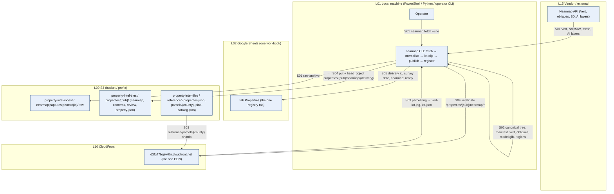

## N02 — Vyanet capture, drone or plane (planned, supplemental)

**Summary.** Keeps the working Segment 1–5 machinery but as an optional layer: one `capture` CLI (ingest, validate, publish, register), the existing clip Lambda for the parcel GLB, renders only if a property has no Nearmap obliques. `parcels_ref` and `type` are set by the CLI, never by hand.

| Step | Layer | Script / function | Trigger | Input → Output | Source | Status |
|---|---|---|---|---|---|---|
| S01 | Vendor → Local | Terra export (OBJ + orthomosaic) → `capture ingest <folder> <id>` — the five gates, tiles, manifest | operator CLI | export → staging | design; keeps P01 S02 | planned |
| S02 | Local → S3 | `capture publish <id> --type drone|plane --parcels <county>` → `captures/{id}/tiles`, `model`, registry entry **with** `parcels_ref` + `type` | S01 | staging → serving + `reference/captures.json` | design; replaces P01 S03–S08 and P10 S03–S05 (no hand edits) | planned |
| S03 | Local | `capture verify <id>` — byte-compare + coverage report | S02 | pass / fail | design; keeps P01 S09 | planned |
| S04 | API GW → Lambda → S3 | `plane-parcel-clip` (kept) → `captures/{id}/parcels/{taxlot}/clipped.glb`, called by publish (N09) when a capture covers the property | N09 | GLB | design; keeps P05 | planned (kept) |
| S05 | Local → Sheets | `capture register --hub <hub>` → registry row: capture id, `capture: ready` | S02 | row updated | design | planned |

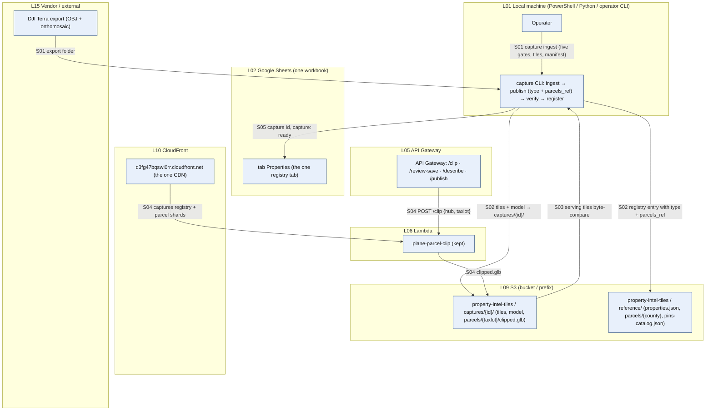

## N03 — Technician photos (planned)

**Summary.** The transport that was never solved: technicians upload straight to the ingest bucket through a small intake page (presigned POST). A Lambda normalizes each photo (orientation resolved, heading per `GPSImgDirectionRef`) and writes `cameras.json` + stills under the property. No Zoho, no git.

| Step | Layer | Script / function | Trigger | Input → Output | Source | Status |
|---|---|---|---|---|---|---|
| S01 | Technician → Pages | `photo-intake.html?hub=…` — pick photos, camera names | field visit | photos in the browser | design; replaces P24 S01–S04 (Zoho / SurveySparrow closed) | planned |
| S02 | Pages → S3 ingest | presigned POST (from the intake Lambda) → `property-intel-ingest/photos/{hub}/raw/*.jpg` | S01 | raw with GPS EXIF (never served) | design; keeps invariant 10 | planned |
| S03 | S3 → Lambda | `photo-normalize` (S3 event) — `exif_transpose` → Orientation 1, heading branch per photo (T vs M), GPS → camera location, resize | S02 | normalized JPG + location list | design; keeps invariants 8–9 | planned |
| S04 | Lambda → S3 → CloudFront | write `properties/{hub}/cameras/cam-NN.jpg` + `cameras.json` (`{name, lat, lng, heading, photo}`), invalidate | S03 | serving | design; replaces P18 S02–S03, git `data/cameras/` | planned |
| S05 | Lambda → Sheets | registry row `photos: ready (N cameras)` | S04 | row updated | design | planned |

```mermaid
flowchart TB
  classDef planned fill:#e8f0fb,stroke:#2a4d7f,color:#111;
  classDef anchor fill:none,stroke:none,color:transparent,font-size:1px;
  subgraph L01["L01 Local machine (PowerShell / Python / operator CLI)"]
    direction LR
    A01[" "]:::anchor
    HUMAN_technician["Technician (phone)"]:::planned
  end
  subgraph L02["L02 Google Sheets (one workbook)"]
    direction LR
    A02[" "]:::anchor
    SH_properties["tab Properties (the one registry tab)"]:::planned
  end
  subgraph L06["L06 Lambda"]
    direction LR
    A06[" "]:::anchor
    LM_photos["photo-normalize Lambda (S3 event: orientation, heading per photo, cameras.json)"]:::planned
  end
  subgraph L09["L09 S3 (bucket / prefix)"]
    direction LR
    A09[" "]:::anchor
    S3_ingest["property-intel-ingest / nearmap|captures|photos/{id}/raw"]:::planned
    S3_props["property-intel-tiles / properties/{hub}/ (nearmap, cameras, review, property.json)"]:::planned
  end
  subgraph L10["L10 CloudFront"]
    direction LR
    A10[" "]:::anchor
    CF_tiles["d3fg47bqswi0rr.cloudfront.net (the one CDN)"]:::planned
  end
  subgraph L12["L12 GitHub (code only)"]
    direction LR
    A12[" "]:::anchor
    GH_intake["photo-intake.html (Pages)"]:::planned
  end
  %% Upload
  HUMAN_technician -->|"S01 photos + camera names"| GH_intake
  GH_intake -->|"S02 presigned POST raw JPGs (GPS EXIF kept private)"| S3_ingest
  %% Normalize
  S3_ingest -->|"S03 S3 event per photo"| LM_photos
  LM_photos -->|"S04 cam-NN.jpg + cameras.json"| S3_props
  LM_photos -->|"S04 invalidate"| CF_tiles
  LM_photos -->|"S05 photos: ready"| SH_properties
  A01 ~~~ A02 ~~~ A06 ~~~ A09 ~~~ A10 ~~~ A12
```

## N04 — GIS parcels (planned)

**Summary.** Segment 2 as it is, promoted to the *only* parcel geometry. The browser grid on GitHub and its S3 copy are retired; the viewer and the review app query the same sharded index the Lambdas use.

| Step | Layer | Script / function | Trigger | Input → Output | Source | Status |
|---|---|---|---|---|---|---|
| S01 | Vendor → Local | `parcels fetch <county>` — county GIS download (Deschutes portal, Lane FeatureServer, …) | operator CLI, on county add / refresh | GeoJSON | design; keeps P02 S01 | planned |
| S02 | Local → S3 → CloudFront | `parcels publish <county>` — shards + index last, backup, invalidate, probe | S01 | `reference/parcels/{county}/index.json` + `shards/` | design; keeps P02 S04–S07 | planned |
| S03 | CloudFront → everything | one reader library (`parcels.js` in the browser, `eligibility_check.find_parcel` in Python) used by N01, N02, N05, N06–N08, N11 | on demand | taxlot + ring | design; retires P03 entirely | planned |

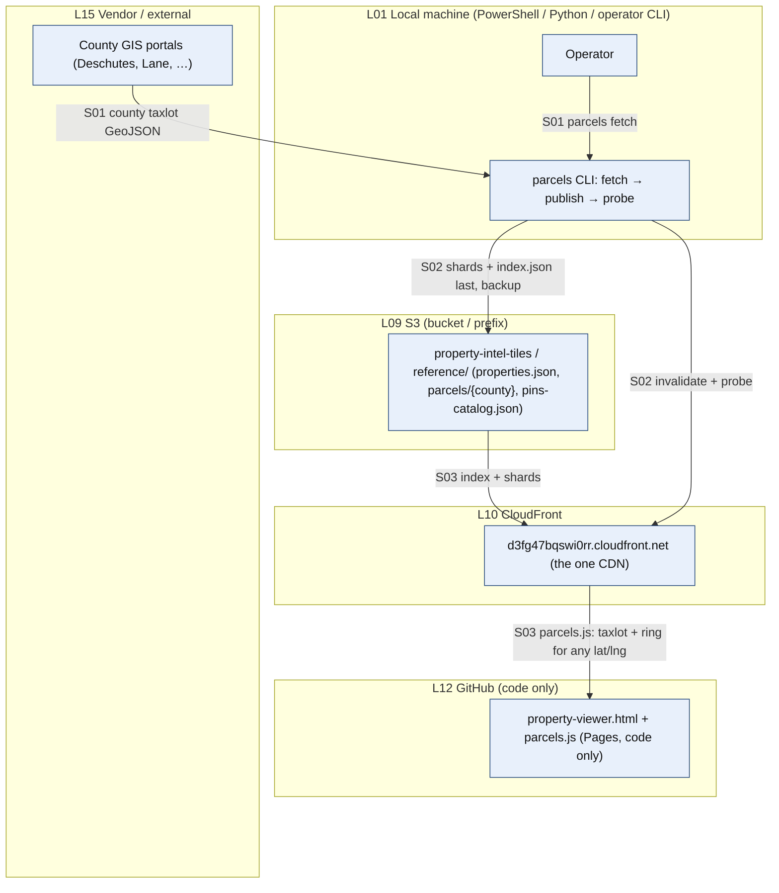

## N05 — Property registry & intake (planned)

**Summary.** One tab, one Apps Script module, one JSON. A row is a property; columns are identity + one status cell per source + review flags + links. Intake resolves geocode, taxlot and hub id once, through one Lambda, and mirrors the row to `reference/properties.json`.

| Step | Layer | Script / function | Trigger | Input → Output | Source | Status |
|---|---|---|---|---|---|---|
| S01 | human → Sheets | add a row: `site_no`, name, address, account type, HOA | manual | row | design; replaces the five tabs (R1) | planned |
| S02 | Apps Script → API GW → Lambda → Google + CloudFront | `registry.intake(row)` → `POST /intake` → `property-intake` Lambda: geocode, `find_parcel` (N04), county, `hub = hash(site_no)` | menu "Intake selected rows" (or onEdit) | address → lat/lng, taxlot, county, hub | design; replaces P04 as intake, P08 S01–S03, P09 S01–S03 | planned |
| S03 | Lambda → S3 | upsert `reference/properties.json[hub]` (identity + coords + taxlot + source flags) | S02 | registry JSON | design; replaces index files on GitHub + records | planned |
| S04 | Apps Script → Sheets | write back lat/lng, taxlot, hub, status `intake: ok` | S02 | cells | design | planned |
| S05 | Apps Script → Sheets | links: review app `?hub=`, viewer `?hub=`; source flags update from N01/N02/N03 registers | S03 | links | design; replaces FR/WF/Intel links | planned |

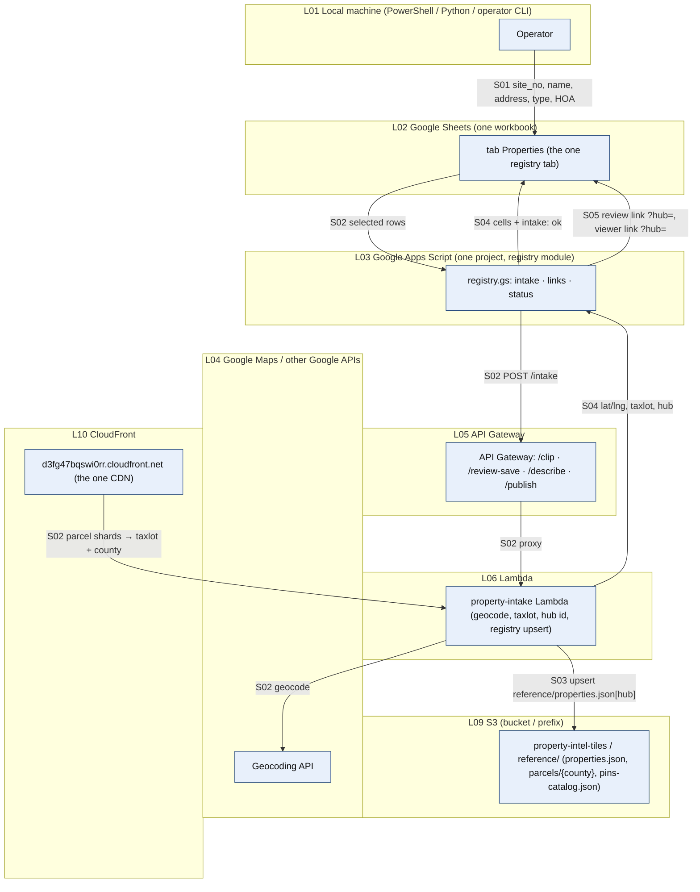

## N06 — Region review (planned)

**Summary.** First stop of the one review app. Loads the Nearmap nadir and the vendor regions, lets the reviewer correct them, saves through one small review API that writes to S3 (no Apps Script SigV4, no GitHub).

| Step | Layer | Script / function | Trigger | Input → Output | Source | Status |
|---|---|---|---|---|---|---|
| S01 | human → Pages | open `review.html?hub=…` from the registry link (stop 1: Regions) | reviewer | page | design; replaces nearmap-review `?mode=regions` | planned |
| S02 | CloudFront → page | `properties/{hub}/nearmap/{delivery}/vert.jpg`, `ai/original/regions.json`, `ai/edits/regions.json` (if any), parcel ring (N04) | S01 | overlays | design; keeps P19 S10 loads | planned |
| S03 | page | edit polygons / classes | S02 | working FeatureCollection | design | planned |
| S04 | page → API GW → Lambda → S3 | Save → `POST /review-save {hub, kind:'regions'}` → `review-api` validates → `properties/{hub}/review/regions.json` (no-cache) | reviewer Save | S3 object | design; replaces P19 S11 (`nmSavePins_` SigV4 from Apps Script) | planned |
| S05 | Lambda → S3 + Sheets | registry `regions: reviewed` (JSON + row) | S04 | flags | design | planned |

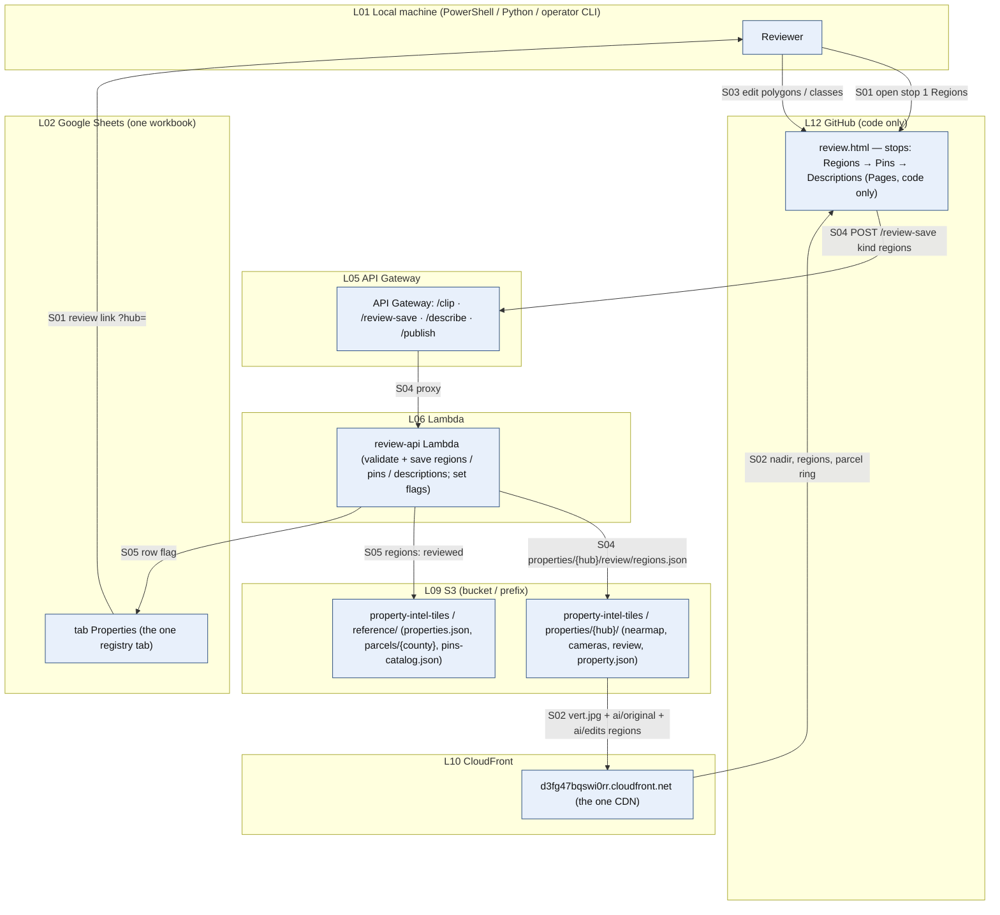

## N07 — Pin placement (planned)

**Summary.** Second stop. The catalog lives in S3; an optional AI proposal (restricted vocabulary, validated in code) seeds the pins; the reviewer places, moves, adds and approves on the Nearmap nadir with obliques beside it. One save path, one pins file. The critique log becomes revision history inside `pins.json`.

| Step | Layer | Script / function | Trigger | Input → Output | Source | Status |
|---|---|---|---|---|---|---|
| S01 | CloudFront → page | `reference/pins-catalog.json` (roles, account types, analyses) | stop 2 opens | vocabulary | design; keeps the catalog, moves it off GitHub | planned |
| S02 | page → API GW → Lambda → Bedrock | "Propose pins" → `POST /describe {hub, task:'pins'}` → `describe` Lambda: nadir + obliques + reviewed regions + KB → restricted vocabulary → validator (out-of-vocabulary and off-parcel refused in code) | reviewer (optional) | proposed pins | design; replaces P11 S03–S07, P08 S10, P09 Pass 1, sandbox | planned |
| S03 | page | reviewer places / moves / adds / deletes pins; each change appended to `history[]` | S02 | pins | design; replaces element-review + critique web app + Nadir Fixes rerun loop (P12) | planned |
| S04 | page → API GW → Lambda → S3 | Save → `POST /review-save {hub, kind:'pins'}` → `properties/{hub}/review/pins.json` (`element[]`, `concern[]` placeholder, `history[]`) | reviewer Save | S3 object | design | planned |
| S05 | Lambda → S3 + Sheets | `pins: approved` when the reviewer ticks Approve | S04 | flags | design; replaces `Elements Reviewed` columns | planned |

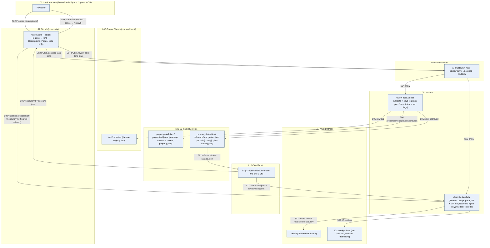

## N08 — Descriptive analysis (planned)

**Summary.** Third stop. Two Bedrock halves (FR, WF) whose inputs are *only* the Nearmap nadir + obliques, the reviewed regions and the approved pins. The reviewer edits and approves the text in place. Output is one `descriptions.json`.

| Step | Layer | Script / function | Trigger | Input → Output | Source | Status |
|---|---|---|---|---|---|---|
| S01 | CloudFront → Lambda | inputs gathered: `vert.jpg`, `north/east/south/west.jpg`, `review/regions.json`, `review/pins.json` (approved) — nothing from captures or photos | stop 3 "Generate" (gate: pins approved) | prompt inputs | design rule R5; replaces P11 S12, P08 S13, P19 S13 | planned |
| S02 | Lambda → Bedrock | FR half: concerns (concern-pin vocabulary, validated), considerations, recommendations | S01 | FR block | design | planned |
| S03 | Lambda → Bedrock | WF half: same shape with the wildfire vocabulary and KB query | S02 | WF block | design | planned |
| S04 | page | reviewer edits text, accepts / removes concern pins, ticks Approve | S03 | final text | design; replaces the Pass 2 columns | planned |
| S05 | page → API GW → Lambda → S3 + Sheets | Save → `properties/{hub}/review/descriptions.json`; registry `descriptions: approved` | S04 | S3 object + flags | design | planned |

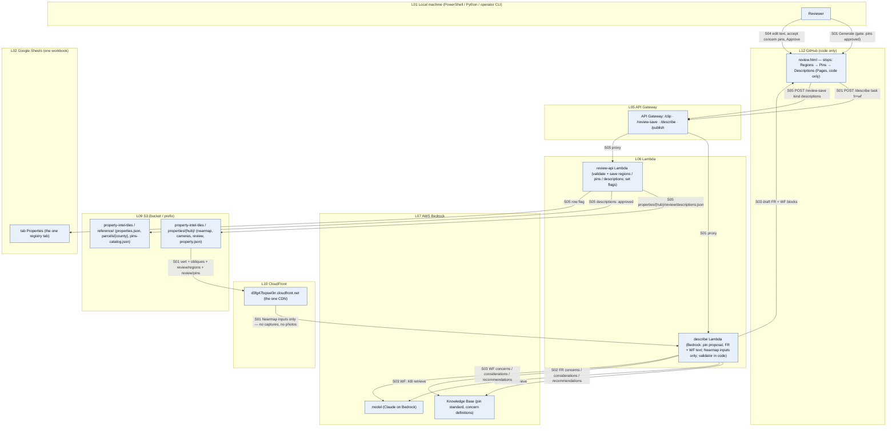

## N09 — Publish property record (planned)

**Summary.** The one writer. Reads what the sources and the review left under `properties/{hub}/`, assembles `property.json`, invalidates, flips the registry to published. Triggered from the registry row or automatically when all flags are set. Nothing is copied to GitHub.

| Step | Layer | Script / function | Trigger | Input → Output | Source | Status |
|---|---|---|---|---|---|---|
| S01 | CloudFront + S3 → Lambda | `publish` Lambda gathers: registry identity, Nearmap manifest, capture refs (+ `clipped.glb` via N02 S04 if a capture covers the taxlot), `cameras.json`, `review/regions.json`, `review/pins.json`, `review/descriptions.json`, parcel ring | menu "Publish" or all-flags auto | inputs | design rule R3; replaces P15, P16, P17, P18 | planned |
| S02 | Lambda → S3 | write `properties/{hub}/property.json` (identity, sources, imagery URLs, mesh URL, regions, pins, descriptions, cameras, parcel, hoa) + `reference/properties.json[hub].published` | S01 | the record | design | planned |
| S03 | Lambda → CloudFront | invalidate `/properties/{hub}/property.json` | S02 | fresh CDN | design | planned |
| S04 | Lambda → Sheets | registry row: `published <date>`, viewer link `property-viewer.html?hub=` | S03 | cells | design | planned |

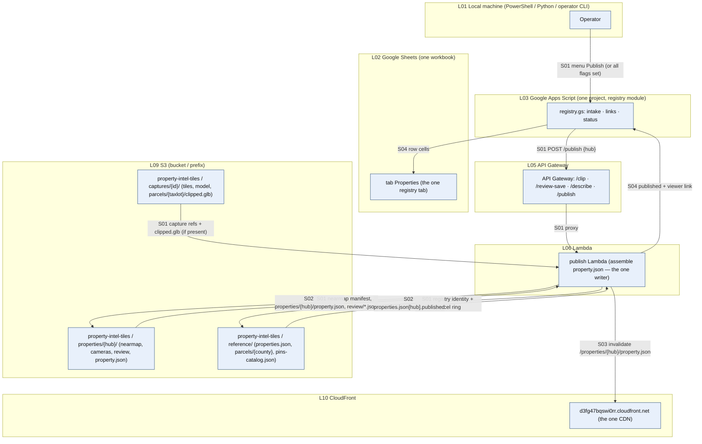

## N10 — CHEKT live link (planned, kept)

**Summary.** The gateway stays as is. The only change: the hub → CHEKT site mapping comes from the registry (`site_no` = CHEKT `account_reference_id`) instead of a hand-edited `PROPERTY_MAP` env.

| Step | Layer | Script / function | Trigger | Input → Output | Source | Status |
|---|---|---|---|---|---|---|
| S01 | CloudFront → Lambda | gateway reads `reference/properties.json` (hub → site_no) instead of `PROPERTY_MAP` | request | site id | design; replaces P23 S03 env map | planned |
| S02 | Lambda → CHEKT → viewer | `/live`, `/clips` as today (passcode, CORS, rate-limit handling) | viewer request | cameras + clips | keeps P23 S02–S07 | planned (kept) |

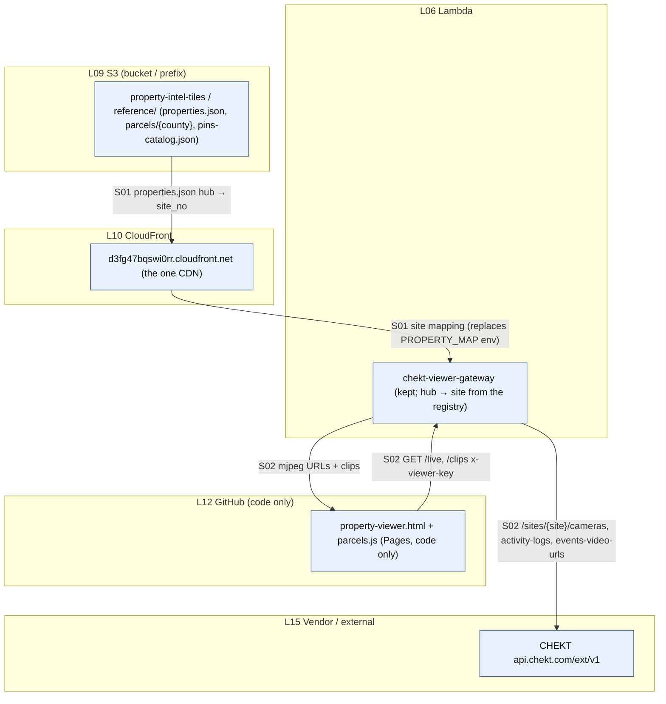

## N11 — Property viewer (planned)

**Summary.** One page. Loads one JSON. Shows a tab for every block that exists in it: 3D (Nearmap mesh; Vyanet GLB if present), Imagery (nadir + 4 obliques; Vyanet renders if present), Regions, Pins, FR / WF descriptions, Cameras + Live, Parcel + neighbours (HOA from the registry).

| Step | Layer | Script / function | Trigger | Input → Output | Source | Status |
|---|---|---|---|---|---|---|
| S01 | CloudFront → page | `property-viewer.html?hub=` → `properties/{hub}/property.json` | responder opens link | record | design rule R7; replaces P22 S01–S03 (index + per-view files) | planned |
| S02 | CloudFront → page | mesh `model.glb`, `vert.jpg`, obliques, camera stills — URLs from the record | S01 | media | design | planned |
| S03 | CloudFront → page | parcel ring + neighbours via `parcels.js` (N04) | S01 | lot lines | design; replaces the GitHub grid fetch | planned |
| S04 | page | tabs render from the record's blocks; pins + regions overlay the nadir; descriptions beside | S02 | UI | design | planned |
| S05 | page → Lambda | Cameras + Live tab → gateway `/live`, `/clips` (N10) | tab open | video | keeps P22 S04 | planned |
| S06 | CloudFront → page | Community view: HOA members from `reference/properties.json` filtered by `hoa` | HOA link | community map | design; replaces `data/hoa/` + hoa-viewer | planned |

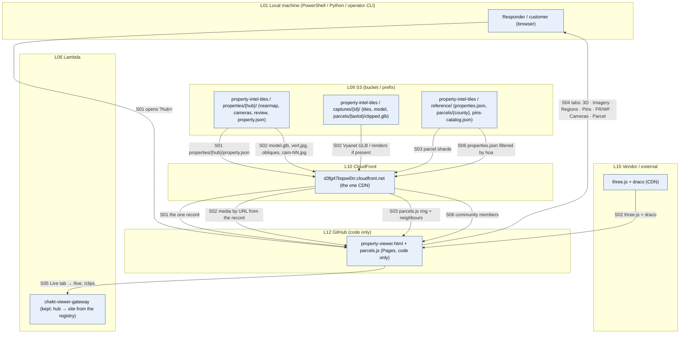

## N12 — Ops (planned)

**Summary.** One deploy script per component with SHA-tagged images (the render deploy is the template), a smoke test per component, and the two shared vocabularies (pin catalog, KB documents) maintained in S3 with a changelog entry per change.

| Step | Layer | Script / function | Trigger | Input → Output | Source | Status |
|---|---|---|---|---|---|---|
| S01 | Local → Lambda / Pages | `deploy <component>` for `intake`, `review-api`, `describe`, `publish`, `photo-normalize`, `clip`, `chekt-gateway`; viewer + review pages via git push | manual, after a change | code → running | design; generalizes P30 S01 to every component; retires the "paste into the editor" step for everything except `registry.gs` | planned |
| S02 | Local → CloudFront | `smoke <component>` — one known property end to end (the row-3 oracle pattern) | after deploy | pass / fail | design; keeps P31 S05 | planned |
| S03 | Local → S3 | `catalog publish` / `kb sync` → `reference/pins-catalog.json`, KB data source; CHANGELOG entry | manual | vocabularies | design; moves the catalog off GitHub, defines the KB ingest that P21 lacked | planned |
| S04 | Lambda → CloudWatch | every Lambda logs request shape + outcome; one dashboard | side effect | logs | design | planned |

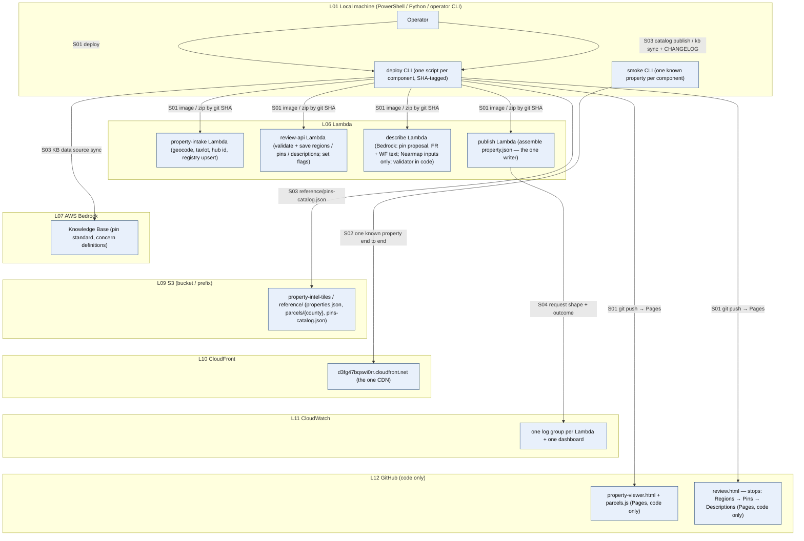

---

## What this does not settle (open design questions)

| # | Question | Why it matters |
|---|---|---|
| Q1 | Does the Sheet stay as the operator console, or does the review app grow an admin list and the Sheet goes away? | R1 keeps the Sheet because the team knows it; removing it removes Apps Script entirely (one less codebase). |
| Q2 | Nearmap licence: are derived products (lot clips, pins on their nadir, descriptions from their imagery) allowed to be served to third parties? | R5 makes Nearmap the only description source; if the licence forbids serving derivatives the whole Review stage moves to Vyanet imagery. |
| Q3 | Golf and HOA/community as separate products or as tabs of the one viewer? | R7 assumes community is a filter over the registry; golf is left out. |
| Q4 | Where the review API authenticates (Cognito, passcode like the gateway, or Google sign-in from the Sheet)? | Today the critique web app runs as the sheet owner; the planned `review-api` Lambda needs its own gate. |
| Q5 | Migration order: registry first (N05) so every existing property gets a hub id, then N09/N11 reading today's records, then the sources one by one. | Lets the current maps keep serving while each column is replaced. |
